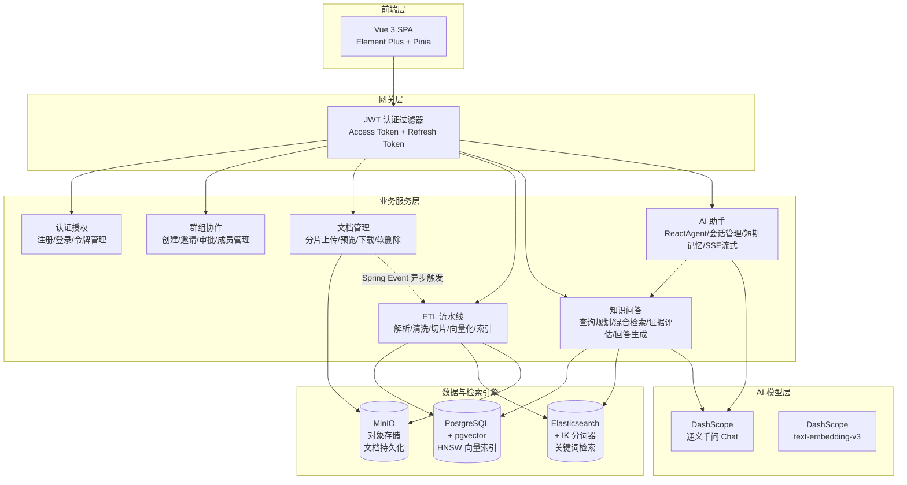

<div align="center">


</div>

<br/>

<h1 align="center">
  <picture>
    <source media="(prefers-color-scheme: dark)" srcset="https://img.shields.io/badge/答镜AskLens_知识库平台-4A90D9?style=for-the-badge&logo=data:image/svg+xml;base64,PHN2ZyB3aWR0aD0iMjQiIGhlaWdodD0iMjQiIHZpZXdCb3g9IjAgMCAyNCAyNCIgZmlsbD0ibm9uZSI+PGNpcmNsZSBjeD0iMTIiIGN5PSIxMiIgcj0iOSIgc3Ryb2tlPSJ3aGl0ZSIgc3Ryb2tlLXdpZHRoPSIxLjUiLz48Y2lyY2xlIGN4PSIxMiIgY3k9IjEyIiByPSI0IiBzdHJva2U9IndoaXRlIiBzdHJva2Utd2lkdGg9IjEuNSIvPjwvc3ZnPg==&logoColor=white&labelColor=2a6cb6"/>
    
  </picture>
</h1>

<p align="center">
  <strong>融合 RAG 与 AI Agent 技术的企业级智能知识平台</strong>
</p>

<p align="center">
  让每一次提问都有据可查 —— 文档上传 · 智能解析 · 混合检索 · AI 对话 · 引用溯源
</p>

<p align="center">
  <a href="#-核心亮点">核心亮点</a> ·
  <a href="#-系统架构">系统架构</a> ·
  <a href="#-功能模块">功能模块</a> ·
  <a href="#-技术栈">技术栈</a> ·
  <a href="#-快速开始">快速开始</a> ·
  <a href="#-API-概览">API 概览</a> ·
  <a href="#-项目结构">项目结构</a>
</p>

<br/>

---

> **关于本项目**：AskLens（答镜）是融合 RAG 与 AI Agent 的企业级智能知识平台。

---

## ✨ 为什么选择 AskLens？

> **AskLens（答镜）** —— 以「问答之镜」为意象：每一次提问都能在私有知识库中得到清晰、可溯源的映照，**让每一次提问都有据可查**。

**AskLens** 不是另一个"套壳 ChatGPT"。它是一个从底层构建的 **RAG（检索增强生成）知识库平台**，将企业私有文档与大语言模型深度融合，解决 LLM 在垂直领域应用中的三大核心痛点：

| 痛点 | AskLens 的解决方案 |
|------|-----------------|
| 🔮 **幻觉编造** | 混合检索 + 证据评估 + 结构化输出，确保回答基于真实文档，无法回答时主动拒答 |
| 📚 **知识割裂** | 自动文档解析 → 切片 → 向量化 → 索引，打通从文件到知识的全链路 |
| 🧠 **无记忆对话** | ReactAgent + 三级短期记忆压缩，支持跨轮次的上下文感知对话 |

<br/>

## 🔥 核心亮点

<table>
<tr>
<td width="50%">

### 🎯 RAG 全链路闭环

从文档上传到 AI 回答，构建了完整的 **RAG 流水线**：

```
文档上传 → 智能解析 → 文本切片
    ↓
向量嵌入（PGvector HNSW） + 关键词索引（Elasticsearch IK）
    ↓
用户提问 → 查询规划（LLM） → 混合检索（RRF 融合）
    ↓
证据评估（四级充分度） → LLM 生成 → 引用溯源
```

**不是简单的"搜索 + GPT 包装"**，而是自研了查询规划、RRF 融合排序、四级证据评估等关键环节。

</td>
<td width="50%">

### 🤖 AI Agent 对话引擎

基于 **Spring AI Alibaba ReactAgent** 图执行引擎，支持：

- **双模式切换**：纯对话（CHAT）/ 知识库检索（KB_SEARCH），同一会话内动态切换
- **工具编排**：Agent 自主决定是否调用检索工具，每轮最多一次防止浪费
- **SSE 流式输出**：模型回复逐字推送到前端，零等待体验
- **短期记忆**：三级渐进压缩（会话记忆 → 紧凑摘要 → 运行时截断），在有限上下文窗口内维持长对话

</td>
</tr>
<tr>
<td width="50%">

### 🔍 混合检索架构

**向量语义检索 + 关键词全文检索** 双通道并行，RRF（Reciprocal Rank Fusion）融合排序：

- **语义匹配**：PGvector + HNSW 索引 + COSINE_DISTANCE，捕捉语义相似性
- **精确匹配**：Elasticsearch + IK 中文分词 + BM25，精准命中专业术语
- **证据增强**：类簇聚合 + 邻居窗口扩展，补充上下文避免碎片化

</td>
<td width="50%">

### 🛡️ 企业级安全体系

- **三级角色权限**：Admin / Group Owner / Member，最小权限原则
- **JWT 双令牌**：Access Token（15min）+ Refresh Token（httpOnly Cookie + 数据库 Rotation）
- **BCrypt 密码加密** + 强制修改密码
- **群组数据隔离**：向量检索和 ES 检索均附加 `groupId` 过滤，防止跨群组数据泄露
- **AOP 操作日志**：关键操作全程留痕

</td>
</tr>
</table>

<br/>

## 🏗️ 系统架构



<br/>

## 📦 功能模块

### 🔐 用户认证与群组协作

- 用户注册/登录、JWT 双令牌认证、角色权限（Admin / 普通用户）
- 创建知识库群组、邀请成员（邀请码机制）、加入申请与审批流程
- 群组内三级角色：Owner / Manager / Member，细粒度权限控制

### 📄 文档全生命周期管理

- **分片上传协议**：三阶段（init → chunk upload → complete），支持断点续传、秒传检测（SHA-256）
- **多格式解析**：PDF / DOCX / MD / TXT，自动编码检测
- **ETL 异步流水线**：Spring Event + `@Async` + `@Retryable`，7 步全自动处理
- **对象存储**：MinIO S3 兼容存储，`@ConditionalOnProperty` 按需启用

### 🧠 知识库问答（RAG Q&A）

- **LLM 查询规划**：自动判断 DIRECT / REWRITE / DECOMPOSE 策略，最多 3 条并行检索
- **RRF 双通道融合**：向量 + 关键词结果统一排序，类簇聚合 + 邻居窗口扩展
- **四级证据评估**：NONE → WEAK → PARTIAL → SUFFICIENT，证据不足时主动拒答
- **引用溯源**：每条回答附带引用片段、来源文档、相关性评分

### 🤖 AI 智能助手

- **ReactAgent 图执行引擎**："思考 → 工具调用 → 生成回复"完整链路
- **CHAT / KB_SEARCH 双模式**：纯对话 or 知识库检索，同一会话内动态切换
- **BEFORE_MODEL Hook**：模型调用前自动注入上下文（compact summary → session memory → recent messages）
- **短期记忆三级压缩**：
  - L1 会话记忆（增量 LLM 摘要，保留关键事实和决策）
  - L2 紧凑摘要（精炼的历史压缩，丢弃冗余细节）
  - L3 运行时截断（Token 超 50000 时的最后防线）
- **SSE 流式输出**：Delta 去重 + AGENT_MODEL_FINISHED 兜底

<br/>

## 🛠️ 技术栈

### 后端核心

| 层次 | 技术 | 版本 | 说明 |
|------|------|------|------|
| 语言 | **Java** | 21 | Record 语法、虚拟线程、模式匹配 |
| 框架 | **Spring Boot** | 3.5.0 | Spring MVC，Jakarta EE 9+ |
| ORM | **MyBatis-Plus** | 3.5.15 | Lambda 类型安全查询 |
| 数据库 | **PostgreSQL + pgvector** | 16+ | HNSW 向量索引，COSINE_DISTANCE |
| 搜索引擎 | **Elasticsearch** | 8.x | IK 中文分词，JDK HttpClient 直连 |
| 对象存储 | **MinIO** | latest | S3 兼容，`composeObject` 合并分片 |
| AI Chat | **Spring AI Alibaba** | 1.1.2.0 | DashScope 原生集成（通义千问） |
| AI Agent | **Spring AI Alibaba Agent** | 1.1.2.0 | ReactAgent 图执行引擎 |
| AI Embedding | **Spring AI** | 1.1.2 | OpenAI 兼容模式，512 维向量 |
| 认证 | **JJWT** | 0.12.6 | HMAC-SHA256 JWT 签发与解析 |
| 密码加密 | **Spring Security Crypto** | — | BCrypt 自适应哈希 |
| 文档解析 | **Apache PDFBox / POI** | 2.0.31 / 5.2.5 | PDF + DOCX 文本提取 |
| 重试框架 | **Spring Retry** | — | `@Retryable` + `@Recover` 声明式重试 |
| API 文档 | **Knife4j + SpringDoc** | 4.5.0 | `/doc.html` 增强 UI，在线调试 |

### 前端核心

| 层次 | 技术 | 版本 |
|------|------|------|
| 语言 | **TypeScript** | 6.0 |
| 框架 | **Vue 3** (Composition API) | 3.5 |
| 构建 | **Vite** | 8.0 |
| 路由 | **Vue Router** | 5.0 |
| 状态管理 | **Pinia** | 3.0 |
| UI 组件 | **Element Plus** | 2.14 |
| HTTP 客户端 | **Axios** | 1.16 |
| Markdown | **marked** | 18.0 |

### 基础设施

| 组件 | 用途 |
|------|------|
| **PostgreSQL + pgvector** | 关系型主存储 + HNSW 向量索引（512 维，COSINE_DISTANCE） |
| **Elasticsearch 8.x** | IK 中文分词 + BM25 关键词检索 + 两阶段 bool/rescore 打分 |
| **MinIO** | S3 兼容对象存储，分片合并（composeObject），条件装配 |
| **DashScope** | 通义千问 Chat 模型 + text-embedding-v3 Embedding 模型 |

<br/>

## 🚀 快速开始

### 环境要求

| 组件 | 版本要求 | 说明 |
|------|---------|------|
| **JDK** | 21 | Record 语法、虚拟线程 |
| **Node.js** | ≥ 20.19 | 前端构建 |
| **PostgreSQL** | 16+ | 需安装 `pgvector` 扩展 |
| **Elasticsearch** | 8.x | 需安装 IK 中文分词器插件 |
| **MinIO** | latest | 对象存储（可按需启用） |
| **DashScope API Key** | — | LLM Chat + Embedding 共用 |

### 1️⃣ 初始化中间件

<details>
<summary><b>PostgreSQL + pgvector</b></summary>

```bash
# 安装 pgvector 扩展
psql -h <host> -U <user> -d <database> -c "CREATE EXTENSION IF NOT EXISTS vector;"

# 执行建表脚本
psql -h <host> -U <user> -d <database> -f sql/schema.sql
```
</details>

<details>
<summary><b>MinIO（Docker）</b></summary>

```bash
docker run -d --name minio \
  -p 9000:9000 -p 9001:9001 \
  -e MINIO_ROOT_USER=minioadmin \
  -e MINIO_ROOT_PASSWORD=minioadmin \
  minio/minio server /data --console-address ":9001"

# 访问 http://localhost:9001 创建 Bucket（默认：asklens-documents）
```
</details>

<details>
<summary><b>Elasticsearch + IK 分词器</b></summary>

```bash
docker run -d --name elasticsearch \
  -p 9200:9200 -p 9300:9300 \
  -e "discovery.type=single-node" \
  -e "xpack.security.enabled=false" \
  elasticsearch:8.x

# 安装 IK 分词器
docker exec -it elasticsearch bin/elasticsearch-plugin install \
  https://github.com/medcl/elasticsearch-analysis-ik/releases/download/v8.x/elasticsearch-analysis-ik-8.x.zip
docker restart elasticsearch
```
</details>

### 2️⃣ 配置环境

编辑 `AskLens-backend/src/main/resources/application-local.yml`，填写数据库、中间件和 LLM 配置：

```yaml
# 数据库
spring.datasource.url: jdbc:postgresql://localhost:5432/asklens
spring.datasource.username: your_username
spring.datasource.password: your_password

# LLM
spring.ai.dashscope.api-key: ${DASHSCOPE_API_KEY}
spring.ai.openai.api-key: ${DASHSCOPE_API_KEY}  # 与 DashScope 共用 Key

# 对象存储（可选）
storage.minio.endpoint: http://localhost:9000
storage.minio.access-key: minioadmin
storage.minio.secret-key: minioadmin

# Elasticsearch
elasticsearch.host: localhost
elasticsearch.port: 9200
```

### 3️⃣ 启动后端

```bash
# 设置 JDK 21
export JAVA_HOME="/path/to/jdk-21"

cd AskLens-backend

# 编译
./mvnw clean compile

# 启动（默认 local 环境，端口 10001）
./mvnw spring-boot:run

# API 文档：http://localhost:10001/doc.html
```

### 4️⃣ 启动前端

```bash
cd AskLens-frontend

npm install
npm run dev

# 访问：http://127.0.0.1:3000
```

### 🔑 默认账户

开发环境（`--spring.profiles.active=dev`）自动创建管理员账户：

| 用户名 | 密码 | 角色 |
|--------|------|------|
| `admin` | `admin123` | 系统管理员 |

<br/>

## 📡 API 概览

### 认证 · `/api/auth`

| 方法 | 路径 | 说明 |
|------|------|------|
| POST | `/api/auth/register` | 用户注册 |
| POST | `/api/auth/login` | 用户登录（返回 Access + Refresh Token） |
| POST | `/api/auth/refresh` | 刷新令牌（Cookie 中的 Refresh Token） |
| POST | `/api/auth/logout` | 登出（清除 Refresh Token） |
| GET | `/api/auth/me` | 获取当前用户信息 |

### 群组协作 · `/api/groups`

| 方法 | 路径 | 说明 |
|------|------|------|
| POST | `/api/groups` | 创建群组 |
| GET | `/api/groups` | 查询可见群组列表 |
| POST | `/api/groups/{id}/invitations` | 创建邀请 |
| POST | `/api/groups/{id}/join-request` | 申请加入 |
| POST | `/api/groups/invitations/{id}/accept` | 接受邀请 |
| DELETE | `/api/groups/{id}/members/{userId}` | 移除成员 |

### 文档管理 · `/api/documents`

| 方法 | 路径 | 说明 |
|------|------|------|
| POST | `/api/documents/upload/init` | 初始化分片上传（秒传/续传检测） |
| POST | `/api/documents/upload/chunks` | 上传分片 |
| POST | `/api/documents/upload/{id}/complete` | 完成上传，触发 ETL |
| POST | `/api/documents/upload` | 小文件直接上传（≤10MB） |
| GET | `/api/documents` | 文档列表（多条件筛选） |
| GET | `/api/documents/{id}/preview` | 预览文档 |
| GET | `/api/documents/{id}/download` | 下载文档 |
| DELETE | `/api/documents/{id}` | 软删除文档 |

### 知识库问答 · `/api/qa`

| 方法 | 路径 | 说明 |
|------|------|------|
| POST | `/api/qa/ask` | 提交问题，获取 AI 回答 + 引用溯源 |

<details>
<summary><b>📋 请求/响应示例</b></summary>

**请求**：
```json
{
    "groupId": 1,
    "question": "文档上传流程是什么？上传失败后如何重试？"
}
```

**响应**：
```json
{
    "answered": true,
    "answer": "文档上传流程分为三个阶段：初始化、分片上传、完成合并。首先调用 /upload/init 初始化会话...",
    "citations": [
        {
            "documentId": 1,
            "chunkId": 15,
            "fileName": "AskLens使用手册.pdf",
            "score": 0.97
        }
    ]
}
```
</details>

### AI 助手 · `/api/assistant`

| 方法 | 路径 | 说明 |
|------|------|------|
| POST | `/api/assistant/sessions` | 创建新会话 |
| GET | `/api/assistant/sessions` | 会话列表 |
| PATCH | `/api/assistant/sessions/{id}` | 重命名会话 |
| DELETE | `/api/assistant/sessions/{id}` | 删除会话 |
| POST | `/api/assistant/chat` | 同步聊天（CHAT / KB_SEARCH） |
| POST | `/api/assistant/chat/stream` | 流式聊天（SSE，逐字推送） |
| GET | `/api/assistant/sessions/{id}/context` | 获取会话上下文（含摘要） |

<br/>

## 📁 项目结构

```
AskLens/
├── AskLens-backend/                          # Spring Boot 后端
│   └── src/main/java/com/asklens/
│       ├── auth/                           # 认证授权（JWT 双令牌）
│       ├── user/                           # 用户管理
│       ├── group/                          # 群组协作（邀请/审批/角色）
│       ├── document/                       # 文档管理（分片上传/预览/下载）
│       ├── ingestion/                      # ETL 流水线（解析/切片/向量化/索引）
│       │   └── service/pipeline/
│       │       ├── reader/                 #   文档读取器
│       │       ├── parser/                 #   多格式解析器（PDF/DOCX/MD/TXT）
│       │       └── transformer/            #   文本清洗 + 结构感知切片
│       ├── qa/                             # 知识库问答（查询规划/RRF 融合/证据评估）
│       │   └── rag/                        #   混合检索引擎
│       ├── assistant/                      # AI 助手（ReactAgent/短期记忆/SSE 流式）
│       │   ├── agent/                      #   Agent 工厂 + 知识库检索工具
│       │   ├── memory/                     #   三级短期记忆压缩
│       │   └── service/                    #   对话编排 + 会话管理
│       └── engine/                         # 基础设施（ES/PGvector/MinIO）
│
├── AskLens-frontend/                         # Vue 3 前端
│   └── src/
│       ├── api/                            # 后端 API 封装
│       ├── views/                          # 页面组件
│       │   ├── HomeView.vue                #   产品首页
│       │   ├── documents/                  #   文档管理
│       │   ├── qa/                         #   知识库问答
│       │   ├── assistant/                  #   AI 助手
│       │   ├── groups/                     #   协作小组
│       │   └── admin/                      #   用户管理
│       ├── stores/                         # Pinia 状态管理
│       └── components/                     # 公共组件
│
├── docs/                                   # 项目文档
│   ├── V1.0-项目文档.md                    #   用户认证 + 群组管理
│   ├── V2.0-项目文档.md                    #   文档上传 + ETL 流水线
│   ├── V3.0-项目文档.md                    #   知识库问答（RAG）
│   └── V4.0-项目文档.md                    #   AI 助手 Agent + 流式对话
│
└── sql/
    └── schema.sql                          # 数据库建表 DDL
```

<br/>

## 📖 版本演进

AskLens 采用**渐进式迭代**的开发方式，每个版本聚焦一个核心主题：

| 版本 | 主题 | 核心交付 |
|------|------|---------|
| **V1.0** | 🏗️ 基础设施 | 用户认证（JWT 双令牌）、群组协作（邀请/审批/角色）、项目骨架 |
| **V2.0** | 📄 文档引擎 | 分片上传（断点续传/秒传）、ETL 流水线、双路检索（向量 + 关键词） |
| **V3.0** | 🧠 RAG 问答 | 查询规划（LLM）、RRF 融合排序、四级证据评估、引用溯源 |
| **V4.0** | 🤖 AI Agent | ReactAgent 图引擎、CHAT/KB_SEARCH 双模式、短期记忆三级压缩、SSE 流式 |

> 详细的设计决策和技术文档请参阅 [`docs/`](docs/) 目录。

<br/>

## 🤝 贡献

欢迎提交 Issue 和 Pull Request！

在提交 PR 之前，请确保：
- 代码通过编译（`./mvnw clean compile`）
- 遵循项目现有的代码风格和命名规范
- 新增功能包含相应的 JavaDoc 或注释

<br/>

## 📄 License

本项目采用 [MIT](LICENSE) 开源协议。

<br/>

---

<p align="center">
  <sub>Made with ❤️ by AskLens Team · 让每一次提问都有据可查</sub>
</p>
