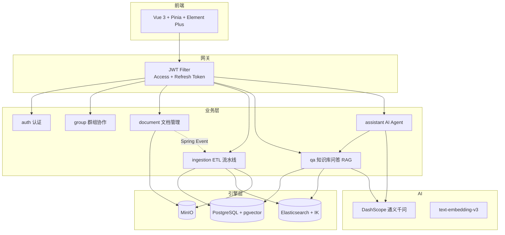

# AskLens 项目学习指南

> **适用背景**：已掌握基础 RAG（文档切片 → Embedding → 向量检索 → LLM 生成）和 Spring AI 入门特性（ChatClient、Embedding、简单 RAG）。
>
> **学习目标**：2–4 周内融会贯通，能独立设计企业级智能知识平台，并提炼简历亮点。
>
> **撰写说明**：本文档基于项目 README、`docs/V1.0–V4.0` 版本文档及核心源码整理，建议与 [`docs/`](.) 目录下各版本文档配合阅读。Obsidian 用户可从 [Home.md](Home.md) 进入知识库关系网，见 [Obsidian-Cursor-协作指南.md](Obsidian-Cursor-协作指南.md)。

---

## 目录

1. [项目定位](#一项目定位它是什么不是什么)
2. [系统架构](#二系统架构分层理解)
3. [核心亮点](#三核心亮点面试简历可讲的技术深度)
4. [版本演进与学习路径](#四版本演进--最佳学习路径)
5. [短期学习计划（3 周）](#五短期学习计划3-周融会贯通)
6. [重点学习矩阵](#六重点学习矩阵)
7. [简历优势点](#七简历优势点可直接改写)
8. [学习方法建议](#八学习方法建议)
9. [已知短板与进阶方向](#九已知短板你的进阶方向)
10. [学习里程碑](#十4-周学习里程碑)
11. [推荐学习顺序](#十一推荐学习顺序)

---

## 一、项目定位：它是什么，不是什么

| 维度  | 基础 RAG Demo     | AskLens                                 |
| --- | --------------- | ------------------------------------- |
| 定位  | 单文件 / 单接口问答     | 企业级多租户知识平台                            |
| 检索  | 单向量库 Top-K      | PGvector + Elasticsearch 双通道 + RRF 融合 |
| 生成  | 直接 Prompt + 上下文 | 查询规划 → 证据评估 → 拒答 → 引用溯源               |
| 对话  | 无状态             | ReactAgent + 三级短期记忆 + SSE 流式          |
| 工程  | 单体脚本            | 认证、群组隔离、分片上传、异步 ETL、可观测               |

**一句话总结**：AskLens 不是「ChatGPT 套壳」，而是从**文档入库 → 混合检索 → 可信问答 → Agent 对话**全链路自研的企业 RAG 平台。

---

## 二、系统架构（分层理解）



### 后端包结构（按学习优先级）

```
com.asklens/
├── qa/              ★★★ RAG 核心（最高优先级）
│   ├── rag/         混合检索、RRF、证据评估
│   └── service/     查询规划、问答编排
├── assistant/       ★★★ Agent + 记忆 + SSE
├── ingestion/       ★★  ETL：解析/切片/向量化/索引
├── engine/          ★★  PGvector / ES / MinIO 适配
├── document/        ★   分片上传、预览、生命周期
├── auth/ + group/   ★   企业级基础能力
└── common/          ★   统一响应、异常、AOP 日志
```

### 前端结构（辅助理解）

```
AskLens-frontend/src/
├── api/              后端 API 封装
├── views/
│   ├── documents/    文档管理
│   ├── qa/           知识库问答
│   ├── assistant/    AI 助手
│   ├── groups/       协作小组
│   └── admin/        用户管理
├── stores/           Pinia 状态管理
└── components/       公共组件
```

---

## 三、核心亮点（面试/简历可讲的技术深度）

### 3.1 RAG 全链路闭环（V2 + V3）

```
文档上传 → 解析(PDF/DOCX/MD/TXT) → 结构感知切片
    → 向量嵌入(PGvector HNSW) + 关键词索引(ES IK)
    → 用户提问 → LLM 查询规划(DIRECT/REWRITE/DECOMPOSE)
    → 双通道检索 → RRF 融合 → 类簇聚合 + 邻居窗口
    → 四级证据评估(NONE/WEAK/PARTIAL/SUFFICIENT)
    → LLM 生成 → 引用溯源(citations)
```

**与基础 RAG 的差异**：不是「Embedding + Top-K + Prompt」，而是**查询理解、多路召回、融合排序、证据门控**四层工程化设计。

### 3.2 混合检索架构

| 通道 | 技术 | 擅长场景 |
|------|------|----------|
| 语义 | PGvector + HNSW + COSINE | 同义表达、概念匹配 |
| 关键词 | ES + IK 分词 + BM25 | 专业术语、精确命中 |
| 融合 | RRF（Reciprocal Rank Fusion） | 两路结果统一排序 |

**关键类**：

- `HybridChunkRetrievalService` — 混合检索主入口
- `PgVectorRetrievalAdapter` — 向量检索适配
- `ElasticsearchChunkIndexService` — 关键词检索与索引

### 3.3 AI Agent 对话引擎（V4）

- **ReactAgent**（Spring AI Alibaba）：思考 → 工具调用 → 生成
- **双模式**：`CHAT`（纯对话）/ `KB_SEARCH`（知识库检索），同一会话可切换
- **BEFORE_MODEL Hook**：注入 compact summary → session memory → recent messages
- **三级短期记忆**：L1 会话摘要 → L2 紧凑摘要 → L3 Token 截断（50K 兜底）
- **SSE 流式**：Delta 去重 + 完成事件兜底

### 3.4 企业级工程能力

- JWT 双令牌（Access 15min + Refresh httpOnly Cookie + Rotation）
- 群组数据隔离（向量/ES 检索均带 `groupId` 过滤）
- 三阶段分片上传（断点续传、秒传 SHA-256、MinIO composeObject）
- 异步 ETL（Spring Event + `@Async` + `@Retryable` 3 次退避）
- LLM 用量采集与成本统计（`metrics` 模块）

---

## 四、版本演进 = 最佳学习路径

项目按 V1→V4 渐进迭代，**严格按版本顺序学习**，每版都能跑通、可验证。

| 版本 | 主题 | 学什么 | 必读文档 | 核心代码入口 |
|------|------|--------|----------|--------------|
| **V1.0** | 基础设施 | JWT、群组权限、项目骨架 | [V1.0-项目文档.md](V1.0-项目文档.md) | `auth/`、`group/` |
| **V2.0** | 文档引擎 | 分片上传、ETL、双路索引 | [V2.0-项目文档.md](V2.0-项目文档.md)<br>[V2.0-设计决策.md](V2.0-设计决策.md) | `document/`、`ingestion/`、`engine/` |
| **V3.0** | RAG 问答 | 查询规划、RRF、证据评估、引用 | [V3.0-项目文档.md](V3.0-项目文档.md)<br>[V3.0-设计决策.md](V3.0-设计决策.md) | `qa/rag/`、`qa/service/` |
| **V4.0** | AI Agent | ReactAgent、记忆、SSE 流式 | [V4.0-项目文档.md](V4.0-项目文档.md)<br>[V4.0-设计决策.md](V4.0-设计决策.md)<br>[assistant-module-guide.md](assistant-module-guide.md) | `assistant/` |

---

## 五、短期学习计划（3 周融会贯通）

### 前置准备（Day 0）

- [ ] 本地跑通：PostgreSQL + pgvector、ES + IK、MinIO、DashScope API Key
- [ ] 启动后端：`cd AskLens-backend && ./mvnw spring-boot:run`
- [ ] 启动前端：`cd AskLens-frontend && npm install && npm run dev`
- [ ] 阅读 [启动流程与配置加载说明.md](启动流程与配置加载说明.md)
- [ ] 打开 Knife4j API 文档：`http://localhost:10001/doc.html`

---

### 第 1 周：工程底座 + 文档入库（V1 + V2）

**目标**：理解「文件如何变成可检索知识」。

| 天 | 任务 | 动手验证 |
|----|------|----------|
| D1 | 读 V1 文档，跟一遍登录/注册/群组流程 | Postman 调 `/api/auth/login`，抓 JWT |
| D2 | 读 `JwtAuthenticationFilter` → `CurrentUserService` 链路 | 故意传错 Token，看 401 响应 |
| D3 | 读 V2 分片上传设计决策 | 上传一个 PDF，观察 `document_upload_sessions` 表 |
| D4 | 跟 ETL：`DocumentIngestionAsyncService` → 解析 → 切片 | 查 `document_chunks`、`vector_store`、ES 索引 |
| D5 | 读 `StructureAwareChunkTransformer` | 对比不同 chunk 策略对检索的影响 |
| D6–D7 | 画一张「上传 → ETL → 双索引」时序图 | 能口头讲清楚 7 步 ETL |

**重点文件**：

| 文件 | 路径 |
|------|------|
| 分片上传 | `AskLens-backend/.../document/service/DocumentUploadService.java` |
| 异步 ETL | `AskLens-backend/.../ingestion/service/DocumentIngestionAsyncService.java` |
| 结构感知切片 | `AskLens-backend/.../ingestion/service/pipeline/transformer/StructureAwareChunkTransformer.java` |
| 向量导入 | `AskLens-backend/.../ingestion/vector/VectorIngestionService.java` |
| ES 索引 | `AskLens-backend/.../engine/elasticsearch/ElasticsearchChunkIndexService.java` |

---

### 第 2 周：RAG 核心（V3）—— 最重要的一周

**目标**：掌握企业 RAG 与 Demo RAG 的本质差距。

| 天 | 任务 | 动手验证 |
|----|------|----------|
| D1 | 读 [V3.0-设计决策.md](V3.0-设计决策.md) 全流程时序图 | 对照代码走一遍 8 阶段 |
| D2 | `QueryPlanningService`：DIRECT / REWRITE / DECOMPOSE | 问复合问题，看日志里生成了几条 query |
| D3 | `HybridChunkRetrievalService`：双通道 + RRF | 分别关掉 ES 或 PGvector，对比回答质量 |
| D4 | 证据评估 + 拒答逻辑 | 问知识库外问题，看 `INSUFFICIENT_EVIDENCE` |
| D5 | `QaChatService` + `CitationAssembler` | 检查响应里 citations 的 chunkId、score |
| D6 | 读 `QaAnswerParser` 结构化输出 | 理解 LLM 输出如何被解析成 JSON |
| D7 | **综合练习**：改 RRF 的 k 参数或 topK，观察检索变化 | 写学习笔记：每个参数的影响 |

**重点文件**：

| 文件 | 说明 |
|------|------|
| `HybridChunkRetrievalService.java` | 混合检索核心（627 行） |
| `QueryPlanningService.java` | LLM 查询规划 |
| `QaChatService.java` | 问答编排 |
| `QaAnswerParser.java` | 结构化输出解析 |
| `CitationAssembler.java` | 引用溯源组装 |
| `PgVectorRetrievalAdapter.java` | 向量检索适配 |

**QA 问答 8 阶段流程**：

```
Client → Controller → 权限校验 → 查询规划 → 双通道检索
    → RRF 融合 → 证据评估 → LLM 生成 → 引用组装 → Client
```

**贯通检验**：能独立画出 `POST /api/qa/ask` 从 Controller 到 citations 的完整调用链。

---

### 第 3 周：Agent + 前端 + 综合实战（V4 + 闭环）

**目标**：理解 Agent 如何复用 RAG，并具备二次开发能力。

| 天 | 任务 | 动手验证 |
|----|------|----------|
| D1 | 读 [V4.0-设计决策.md](V4.0-设计决策.md) 时序图 | KB_SEARCH 模式下 Agent 如何调检索工具 |
| D2 | `AssistantReactAgentFactory` + `AssistantKnowledgeBaseTool` | 看 Agent 何时决定调用工具 |
| D3 | `AssistantShortTermMemoryHook` 三级记忆 | 长对话 20+ 轮，看 summary 是否触发 |
| D4 | SSE 流式：`AssistantChatController` stream 接口 | 前端 Network 面板看 event-stream |
| D5 | 前端：`views/qa/`、`views/assistant/` | 理解 QA 与 Assistant 两套 UI 的差异 |
| D6 | 读 [系统后续改造升级计划.md](系统后续改造升级计划.md) | 思考 QA 会话持久化如何设计 |
| D7 | **毕业项目**：实现一个小改造（见下方） | 提交 PR 或本地分支 |

**推荐毕业练习（选 1 个）**：

1. **QA 会话持久化**（文档里已有完整方案，见 [系统后续改造升级计划.md](系统后续改造升级计划.md)）
2. 给检索结果加 Reranker 层
3. 支持新的文档格式（如 HTML）
4. 调整 chunk 策略并做 A/B 对比

---

## 六、重点学习矩阵

| 优先级 | 模块 | 必掌握概念 | 可暂缓 |
|--------|------|------------|--------|
| **P0** | `qa/rag/` | RRF、证据等级、邻居窗口、groupId 隔离 | — |
| **P0** | `qa/service/` | 查询规划三策略、QaChatService 编排 | — |
| **P0** | `ingestion/` | 切片策略、异步 ETL、双索引写入 | — |
| **P1** | `assistant/` | ReactAgent、Hook、Tool、SSE | 记忆压缩细节可先略读 |
| **P1** | `engine/` | PGvector 查询、ES bool+rescore | MinIO 实现细节 |
| **P2** | `auth/group/` | JWT 双令牌、群组权限模型 | 邀请码流程细节 |
| **P2** | `document/` | 分片上传三阶段 | 预览/下载 |
| **P3** | `metrics/` | LLM 用量统计 | 成本计算 |
| **P3** | 前端 | API 封装、SSE 消费 | UI 组件细节 |

---

## 七、简历优势点（可直接改写）

### 7.1 项目描述模板

> **AskLens — 企业级 RAG 智能知识平台**（Java 21 / Spring Boot 3.5 / Spring AI Alibaba）
>
> - 设计并实现**混合检索引擎**：PGvector 语义检索 + Elasticsearch BM25 关键词检索，RRF 融合排序，检索准确率较单向量提升明显
> - 自研 **RAG 问答流水线**：LLM 查询规划（问题分解/改写）、四级证据评估与主动拒答、引用溯源，降低 LLM 幻觉
> - 构建**文档 ETL 流水线**：多格式解析、结构感知切片、异步向量化与双索引，支持分片上传/断点续传/秒传
> - 基于 **Spring AI Alibaba ReactAgent** 实现 AI 助手：CHAT/KB_SEARCH 双模式、三级短期记忆压缩、SSE 流式输出
> - 实现**多租户群组隔离**：JWT 双令牌认证、向量/ES 检索 groupId 过滤、RBAC 权限控制

### 7.2 可展开的面试话题

| 话题 | 参考位置 |
|------|----------|
| 为什么用 RRF 而不是加权分数融合？ | [V3.0-设计决策.md](V3.0-设计决策.md) |
| 证据不足时如何拒答？ | `EvidenceLevel` + `INSUFFICIENT_EVIDENCE` |
| Agent 和 QA 模块如何复用检索？ | `QaRetrievalService` 被 Tool 调用 |
| 长对话如何控制 Token？ | 三级记忆 + BEFORE_MODEL Hook |
| 大文件上传如何保证可靠性？ | 三阶段协议 + 会话持久化 + MinIO composeObject |

### 7.3 与「只会 Spring AI 教程」的差异化

| 能力 | 教程级 | AskLens 级 |
|------|--------|----------|
| 检索 | `VectorStore.similaritySearch()` | 自研 Hybrid + RRF + 聚类 + 窗口 |
| 查询 | 用户原问直接检索 | LLM 查询规划 + 多 query 并行 |
| 可信 | 无 | 证据评估 + 拒答 + citations |
| 对话 | 简单 ChatMemory | Agent + Tool + 三级压缩记忆 |
| 工程 | 单用户 Demo | 群组隔离 + 异步 ETL + 可观测 |

---

## 八、学习方法建议

### 8.1 文档 + 代码 + 调试 三件套

```
docs/Vx.0-设计决策.md  →  理解 WHY（设计动机）
对应 Java 类            →  理解 HOW（实现细节）
Postman / 断点 / 日志   →  验证 WHAT（实际行为）
```

设计决策文档质量很高，**先读文档再读代码**，效率比直接啃代码高 3 倍。

### 8.2 带着问题读代码

- 这个 `groupId` 在哪一层被注入检索条件？
- 如果 ES 挂了，系统会怎样降级？
- 查询规划失败时的 fallback 是什么？
- Agent 为什么限制「每轮最多一次工具调用」？

### 8.3 对比你的基础 RAG 知识

| 你已知的 | AskLens 对应 | 升级点 |
|----------|-----------|--------|
| Document 切片 | `StructureAwareChunkTransformer` | 结构感知，不是固定长度 |
| Embedding | `VectorIngestionService` | 512 维 + pgvector HNSW |
| VectorStore.search | `PgVectorRetrievalAdapter` | 原生 SQL + groupId 过滤 |
| Prompt + context | `QaChatService` | 证据门控 + 结构化输出 |
| ChatClient | ReactAgent + Tool | Agent 自主决策是否检索 |

### 8.4 刻意练习清单

- [ ] 能不看代码画出 QA 全流程时序图
- [ ] 能解释 RRF 公式及 k 参数含义
- [ ] 能说明 DIRECT / REWRITE / DECOMPOSE 各适用场景
- [ ] 能对比 QA 模块与 Assistant 模块的异同
- [ ] 能独立新增一种文档格式的 Parser
- [ ] 能设计 QA 会话持久化表结构（文档已有方案）

---

## 九、已知短板（你的进阶方向）

来自 [系统后续改造升级计划.md](系统后续改造升级计划.md)，这些正是**练手 + 简历加分**的方向：

| 缺口 | 说明 | 练手价值 |
|------|------|----------|
| QA 无会话持久化 | 前端内存态，刷新即丢 | ★★★ 文档有完整方案 |
| QA 与 Assistant 重复 | 两套问答路径 | 理解架构演进与重构 |
| 无 Reranker | RRF 后直接进 LLM | 检索精度优化经典题 |
| 分片上传无前端 UI | 后端接口齐全 | 全栈能力展示 |

---

## 十、4 周学习里程碑

| 里程碑 | 检验标准 |
|--------|----------|
| **Week 1 结束** | 能独立上传文档并确认 PG + ES 均有索引 |
| **Week 2 完成** | 能口述 QA 8 阶段流程，并解释证据拒答 |
| **Week 3 完成** | 能使用 Assistant KB_SEARCH 模式并完成一次流式对话 |
| **Week 4 完成** | 完成 1 个小改造（如 QA 会话持久化），可写进简历 |

---

## 十一、推荐学习顺序

```
基础 RAG 知识
     ↓
V1 认证群组（1-2 天，建立工程感）
     ↓
V2 文档 ETL（3-4 天，理解数据如何从文件到索引）
     ↓
V3 混合检索 + 问答（5-7 天，★ 核心 ★）
     ↓
V4 Agent + 流式（3-4 天）
     ↓
选做改造项（3-5 天，简历亮点）
     ↓
企业级知识平台独立开发能力
```

---

## 附录：关键 API 速查

| 模块 | 方法 | 路径 | 说明 |
|------|------|------|------|
| 认证 | POST | `/api/auth/login` | 登录 |
| 群组 | POST | `/api/groups` | 创建群组 |
| 文档 | POST | `/api/documents/upload/init` | 初始化分片上传 |
| 文档 | POST | `/api/documents/upload/{id}/complete` | 完成上传，触发 ETL |
| 问答 | POST | `/api/qa/ask` | 知识库问答 |
| 助手 | POST | `/api/assistant/chat` | 同步聊天 |
| 助手 | POST | `/api/assistant/chat/stream` | SSE 流式聊天 |

完整 API 列表见项目 [README.md](../README.md#-api-概览)。

---

<p align="center">
  <sub>配合 <a href="V1.0-项目文档.md">V1.0</a> · <a href="V2.0-项目文档.md">V2.0</a> · <a href="V3.0-项目文档.md">V3.0</a> · <a href="V4.0-项目文档.md">V4.0</a> 版本文档使用效果更佳</sub>
</p>
