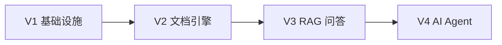

---
type: inbox
tags:
  - asklens
  - home
  - inbox
status: active
---

# 收件箱

临时笔记、待整理问题、Cursor 对话里还没归档的内容，先扔这里。

## 待整理

- [ ] 

## 已归档

（整理完成后移到对应专题笔记，或加上 `[[双链]]` 后改 `status: done`）
# Obsidian Git 推荐配置

> Vault 在 `docs/`，Git 仓库根在 `AskLens/`。必须设置 **`basePath: ".."`**，否则插件找不到 `.git`。

## 一键导入

1. 安装社区插件 **Obsidian Git**
2. 启用后关闭 Obsidian
3. 将本目录的 `obsidian-git-data.json` **复制**到：
   ```
   docs/.obsidian/plugins/obsidian-git/data.json
   ```
   （`plugins/` 目录在首次启用插件后才会生成；若没有，先在 Obsidian 里开关一次插件）
4. 重新打开 Obsidian → Settings → Obsidian Git，核对下列项

## 推荐参数说明

| 设置项 | 推荐值 | 说明 |
|--------|--------|------|
| **Vault git root (basePath)** | `..` | 指向 `AskLens/.git` |
| **Auto backup interval** | `10` 分钟 | 有改动时自动 commit |
| **Auto push interval** | `20` 分钟 | 自动 push（可关） |
| **Auto pull interval** | `15` 分钟 | 多机协作时拉远程 |
| **Pull on startup** | 开 | 启动 Obsidian 时 pull |
| **Pull before push** | 开 | push 前先 pull，减少冲突 |
| **Auto backup after file change** | 开 | 保存笔记后尽快备份 |
| **Sync method** | merge | 合并远程变更 |
| **Disable push** | 关 | 需要 push 时保持关闭 |

## Commit 消息模板

```
docs(notes): auto backup {{numFiles}} files {{date}}
```

仅备份 `docs/` 下的笔记；若 commit 里出现 `AskLens-backend/` 等代码改动，说明 basePath 未设为 `..`，或你在 Obsidian 外也改了代码——可一并提交，或在终端分开 commit。

## 保守方案（不自动 push）

若不想 Obsidian 自动 push，在 `data.json` 中改：

```json
"disablePush": true,
"autoPushInterval": 0
```

笔记仍会自动 **commit** 到本地；push 改在 Cursor 终端手动：

```powershell
cd D:\Develop\AskLens
git push
```

## 与 Cursor 协作注意

- Obsidian Git 与 Cursor 共用同一 Git 仓库，可能同时改文件 → 以 **pull before push** 降低冲突
- 大改代码时在 Cursor commit；Obsidian 侧重 `docs/` 笔记 commit
- 冲突时在 Cursor 或终端 resolve，Obsidian 里 reload vault

---

返回 [[Obsidian-Cursor-协作指南]] · [[Home]]

# AskLens 知识库

> Obsidian Vault 入口。在 Obsidian 中打开 **`docs/`** 文件夹即可；Cursor 中通过 `@docs/...` 引用这些笔记。

## 快速入口

| 用途 | 笔记 |
|------|------|
| 总览与学习路径 | [[AskLens-学习指南]] |
| RAG 原理图 | [[RAG-核心原理图]] |
| 本地启动 | [[启动流程与配置加载说明]] |
| 项目初始化 | [[project-init]] |

## 按版本阅读



| 版本 | 项目文档 | 设计决策 |
|------|----------|----------|
| V1 | [[V1.0-项目文档]] | — |
| V2 | [[V2.0-项目文档]] | [[V2.0-设计决策]] |
| V3 | [[V3.0-项目文档]] | [[V3.0-设计决策]] |
| RAG 总览 | [[RAG-核心原理图]] | 串联 V2 入库 + V3 问答 |
| V4 | [[V4.0-项目文档]] | [[V4.0-设计决策]] |

## 专题

- [[assistant-module-guide]] — Assistant / ReactAgent 模块
- [[系统后续改造升级计划]]
- [[Dashboard-笔记看板]] — Dataview 个人笔记看板
- [[Obsidian-Cursor-协作指南]] — 双工具协作说明
- [[_meta/Obsidian-Git-推荐配置]] — Obsidian Git 自动备份

## 个人笔记（新建放这里）

- [[_inbox/收件箱]] — 临时想法、待整理
- 模板目录：`_templates/`（Obsidian 中 `Ctrl/Cmd+P` → Insert template）

## 关系网建议

在 Graph View 中可尝试：

- **Filters → Tags**：按 `rag`、`ingestion`、`qa` 着色
- **Groups**：按文件夹 `_inbox` / 根目录 / `_templates` 分组
- 写笔记时用 `[[双链]]` 连到已有文档，关系网会自动生长

## Cursor 怎么用这份知识库

1. 聊天框输入 `@docs/Home.md` 或 `@docs/RAG-核心原理图.md`
2. 写代码前：`@docs/V2.0-设计决策.md` 对齐 ETL 设计
3. 踩坑后：在 `_inbox/` 新建笔记，下次 `@` 该文件让 AI 避坑
