# Argus RAG 核心原理图

> 本文档描述 Argus 项目中 **Retrieval-Augmented Generation（检索增强生成）** 的完整闭环：
> 文档如何入库、如何被检索、如何驱动大模型生成带引用的回答。
>
> 相关详细设计见 [[V2.0-设计决策]]（入库）、[[V3.0-设计决策]]（问答）、[[V4.0-设计决策]]（Agent 集成）。

**相关文档**：[[V2.0-设计决策]] · [[V3.0-设计决策]] · [[V2.0-项目文档]] · [[V3.0-项目文档]] · [[V4.0-设计决策]] · [[assistant-module-guide]] · [[Home]]

---

## 1. 一页总览

Argus 的 RAG 不是简单的「Embedding + Top-K + Prompt」，而是四层工程化设计：

| 层次 | 能力 | 核心类 |
|------|------|--------|
| **知识入库** | 分片上传 → 异步 ETL → 结构感知切片 → 双路索引 | `DocumentIngestionAsyncService`、`EtlDocumentIngestionProcessor` |
| **查询理解** | LLM 规划检索策略（DIRECT / REWRITE / DECOMPOSE） | `QueryPlanningService` |
| **多路召回** | 向量语义 + 关键词 BM25 → RRF 融合 → 类簇 + 邻居窗口 | `HybridChunkRetrievalService` |
| **证据门控** | 四级证据评估 → 拒答 / 谨慎答 → 结构化输出 + 引用溯源 | `QaChatService`、`CitationAssembler` |

### 1.1 闭环概览

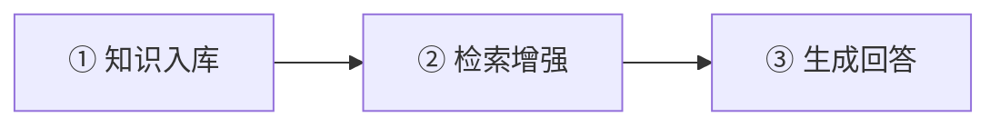

### 1.2 ① 知识入库（V2）

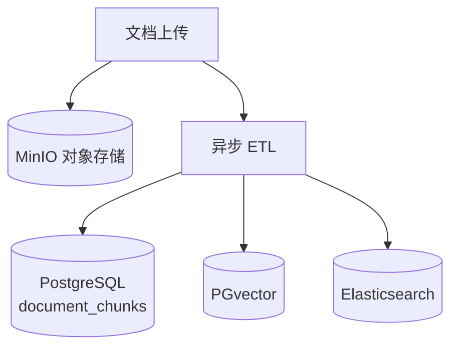

### 1.3 ② 检索增强（V3）

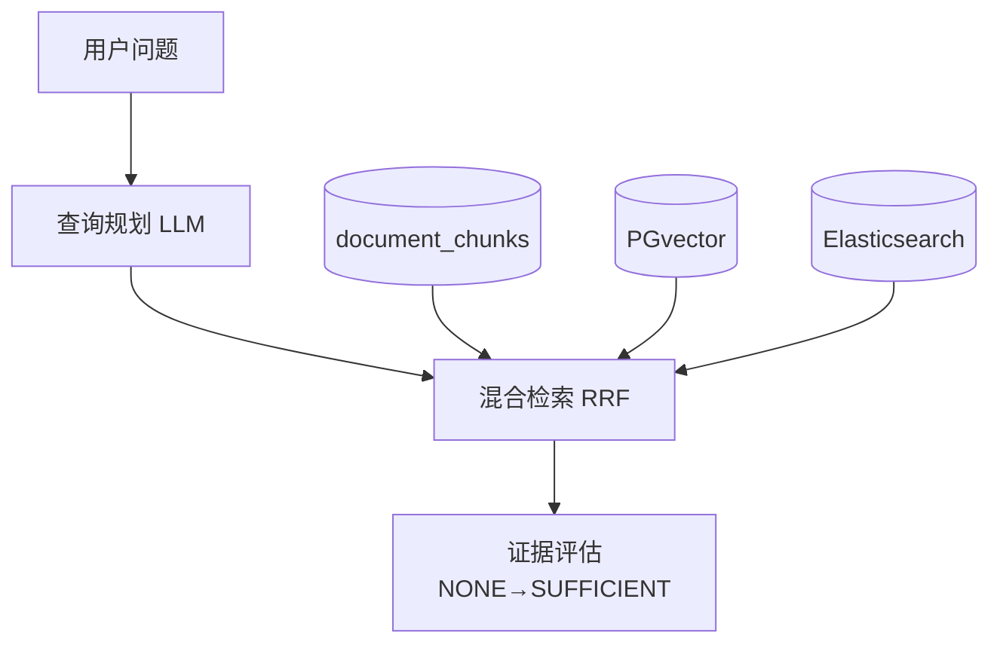

### 1.4 ③ 生成回答

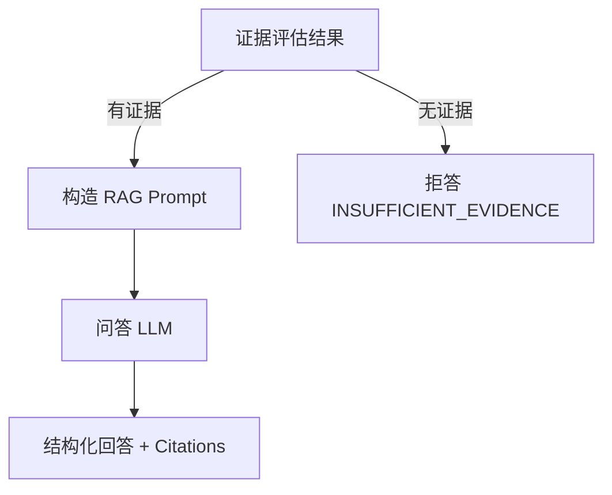

---

## 2. 系统架构与存储

**数据隔离**：所有检索均在 `groupId` 维度过滤，向量库与 ES 索引均携带 `groupId` 元数据。

### 2.1 客户端入口

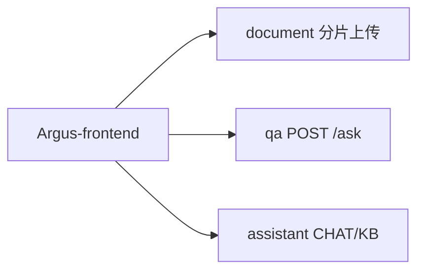

### 2.2 入库链

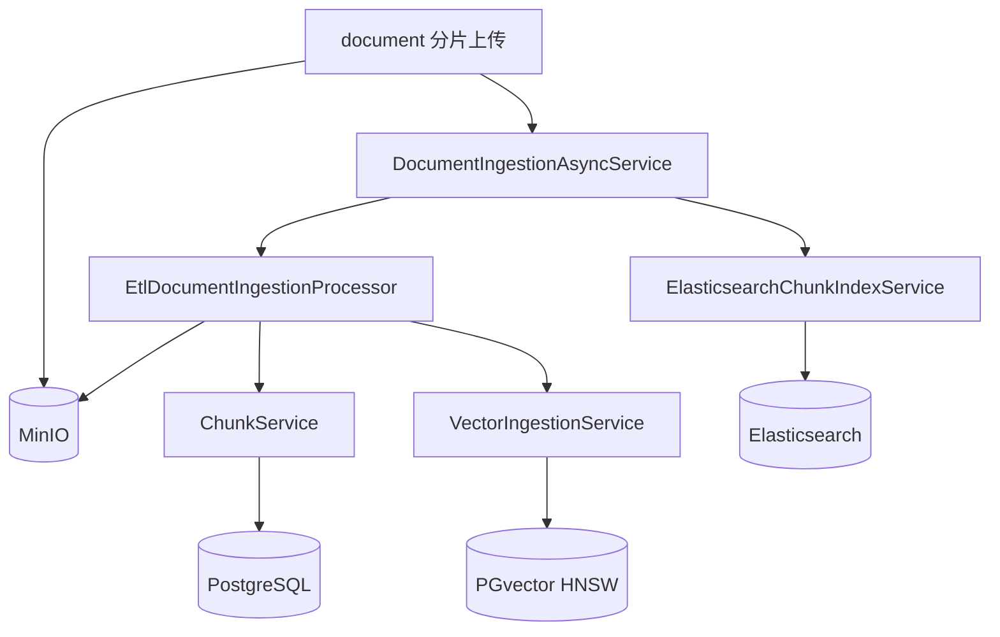

### 2.3 问答链

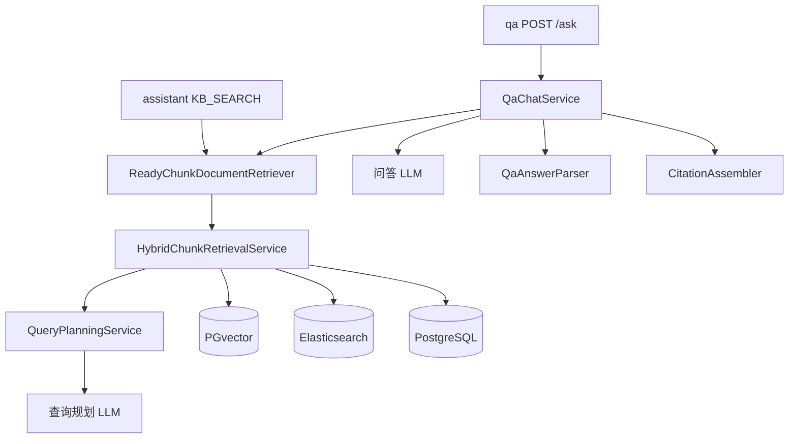

---

## 3. 知识入库：ETL 流水线

上传完成后通过 **Spring Event + @Async + AFTER_COMMIT** 触发异步 ETL，失败最多重试 3 次（2s / 4s / 8s 退避）。

### 3.1 触发与异步编排

上传事务内写入 `documents`（`status=PROCESSING`）并发布事件；**事务提交后**才由 Listener 异步执行 ETL。注意：`READY` 之前还有一步 ES 索引同步（见 3.3）。

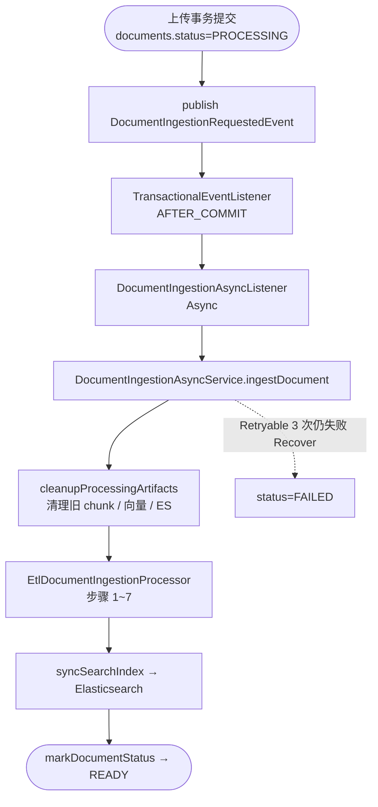

### 3.2 ETL 前半：Extract + Transform

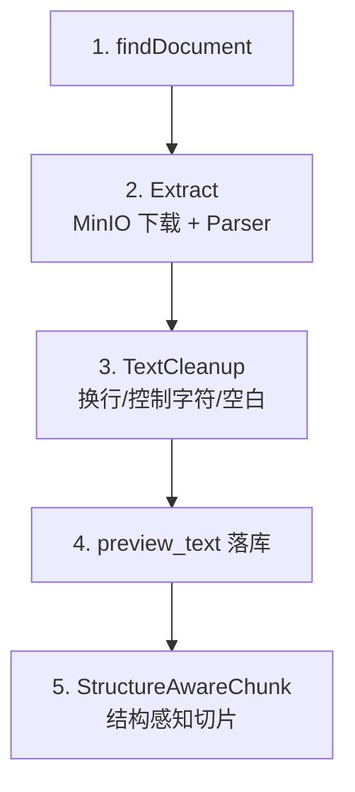

### 3.3 ETL 后半：Load + 索引同步

步骤 8、9 由 `DocumentIngestionAsyncService` 在 Processor 完成后执行。**代码执行顺序**是先 `syncSearchIndex`（原设计文档称第 9 步），再 `markDocumentStatus → READY`（原设计文档称第 8 步）。

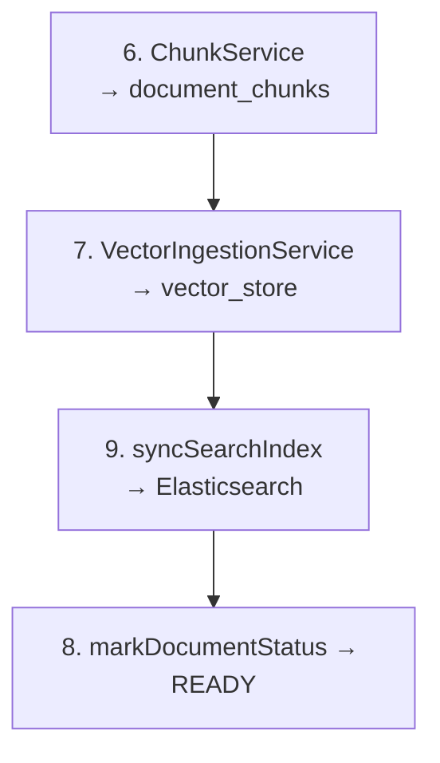

### 3.4 结构感知切片策略

按**章节**处理，不是整篇文本线性走完全部步骤：未超 `maxTokens` 的章节直接成块；仅超大章节才继续拆分。`overlap` 在最终 `buildDocuments` 阶段施加，不属于 `mergePieces`。

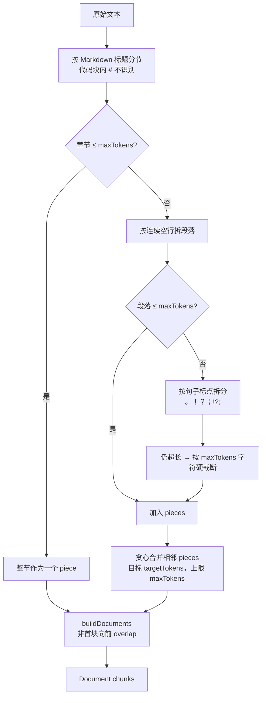

默认参数（`ingestion.chunking`）：`target-tokens=240`，`max-tokens=320`，`overlap-tokens=32`。

### 3.5 双路索引写入

| 存储 | 表/索引 | 用途 | 写入时机 |
|------|---------|------|----------|
| PostgreSQL | `document_chunks` | 切片原文、序号、元数据 | ETL 第 6 步 |
| PGvector | `vector_store` | 语义向量（COSINE + HNSW） | ETL 第 7 步 |
| Elasticsearch | `argus-chunks-*` | IK 分词 + BM25 关键词 | ETL 第 9 步 |

向量 ID 规则：`UUID(documentId + ":" + chunkIndex)`，按 `documentId` 幂等删除后重写。

---

## 4. 检索增强：混合检索引擎

核心入口：`HybridChunkRetrievalService.retrieve(groupId, question, topK=5)`。

### 4.1 阶段 A：查询规划

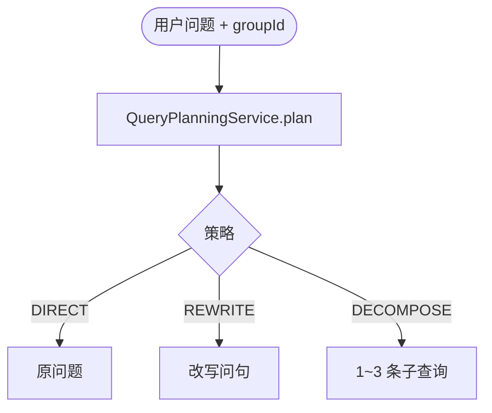

### 4.2 阶段 B：双通道召回 + RRF

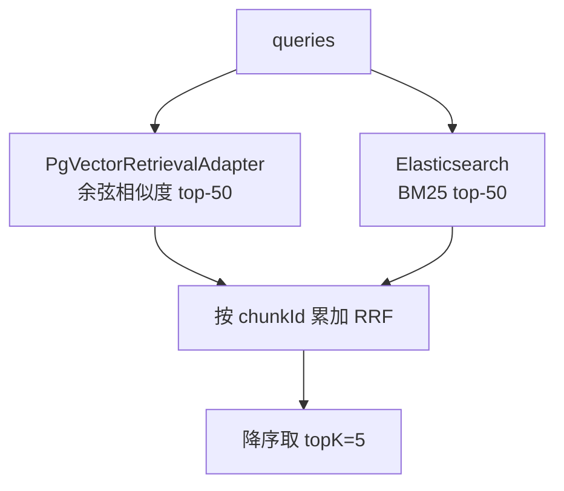

### 4.3 阶段 C：后处理与证据评估

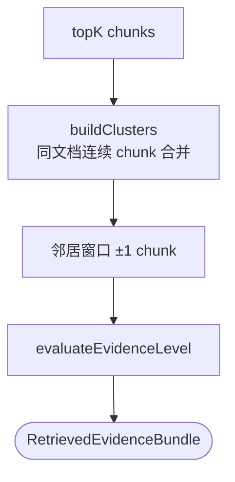

### 4.4 RRF 融合公式

对每条检索语句、每个通道的 rank `r`（从 1 开始）：

```
RRF_score(chunk) += 1 / (k + r)     # 本项目 k = 0
```

同一 chunk 在向量路、关键词路、多条 query 中多次命中时分数累加；最终用 `1 - e^(-score)` 归一化到 [0, 1)。

### 4.5 证据充分度四级门控

| 等级 | 判定条件（简化） | 对 LLM 的指导 |
|------|------------------|---------------|
| **NONE** | 无检索结果 | 必须拒答 |
| **WEAK** | 单条弱命中 | 谨慎回答，说明依据有限 |
| **PARTIAL** | 双通道或 ≥2 条证据 | 只答证据覆盖部分 |
| **SUFFICIENT** | ≥2 条且（双通道命中 或 topScore≥0.85） | 正常回答，禁止臆测 |

证据为空时，`QaChatService` 直接返回 `INSUFFICIENT_EVIDENCE`，不调用问答 LLM。

---

## 5. 问答生成：RAG Prompt → LLM → 引用

### 5.1 请求与检索

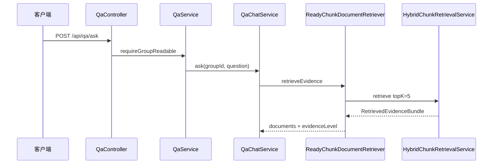

### 5.2 生成与响应

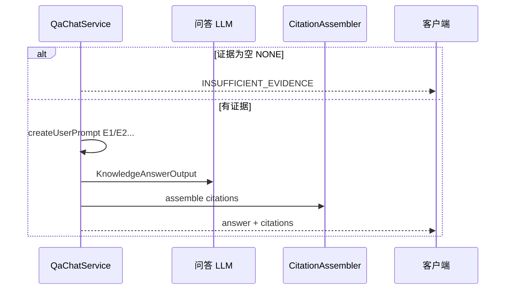

Prompt 模板：`prompts/qa/rag-context.st`，证据以 `E1`、`E2`… 编号注入上下文。

---

## 6. V4 Assistant 与 RAG 的关系

Assistant 模块提供两种模式；**KB_SEARCH** 复用同一套检索引擎，但通过 Agent Tool 按需调用：

### 6.1 CHAT 模式（无检索）

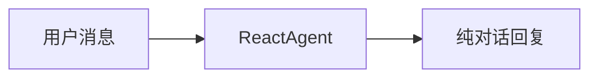

### 6.2 KB_SEARCH 模式（按需检索）

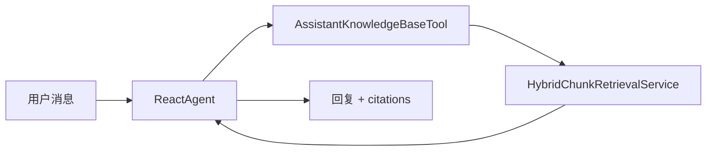

| 入口 | 路径 | 检索方式 | 生成方式 |
|------|------|----------|----------|
| 知识问答 V3 | `POST /api/qa/ask` | 固定先检索 | `QaChatService` 直接 RAG |
| AI 助手 V4 | `POST /api/assistant/chat` | Agent 决定是否调 Tool | `ReactAgent` 多轮推理 |

---

## 7. 端到端数据流（入库 → 问答）

### 7.1 上传阶段

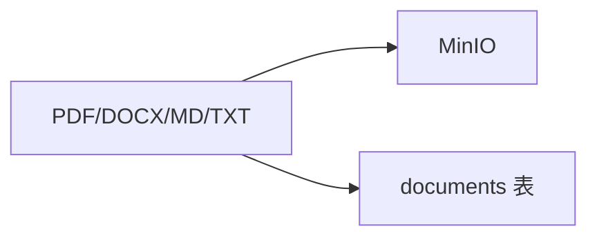

### 7.2 索引阶段

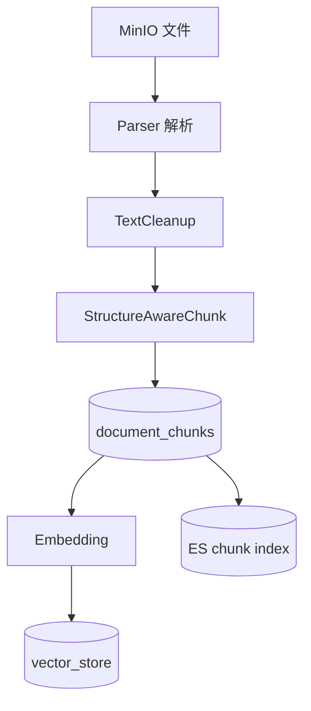

### 7.3 问答阶段

```mermaid
flowchart TB
    QST[question] --> QP2[QueryPlanning]
    QP2 --> VSEARCH[向量 search]
    QP2 --> KSEARCH[ES search]
    VSEARCH --> RRF[RRF + Cluster + Window]
    KSEARCH --> RRF
    DC[(document_chunks)] --> RRF
    RRF --> CTX[Evidence E1..En]
    CTX --> GEN[QA LLM] --> ANS[answer + citations]
```

---

## 8. 核心类索引

| 模块 | 类 | 职责 |
|------|-----|------|
| `document/` | `DocumentUploadService` | 分片上传、秒传、触发 ETL 事件 |
| `ingestion/service/` | `DocumentIngestionAsyncService` | 异步 ETL 编排、重试、状态更新 |
| `ingestion/service/` | `EtlDocumentIngestionProcessor` | Extract → Transform → Load 七步 |
| `ingestion/service/pipeline/transformer/` | `TextCleanupTransformer` | 文本清洗 |
| `ingestion/service/pipeline/transformer/` | `StructureAwareChunkTransformer` | 结构感知切片 |
| `ingestion/service/pipeline/` | `ChunkService` | 切片落库 PostgreSQL |
| `ingestion/vector/` | `VectorIngestionService` | Embedding 写入 PGvector |
| `engine/elasticsearch/` | `ElasticsearchChunkIndexService` | ES 索引读写、关键词检索 |
| `engine/pgvector/` | `PgVectorRetrievalAdapter` | 向量检索适配 |
| `qa/service/` | `QueryPlanningService` | LLM 查询规划 |
| `qa/rag/` | `HybridChunkRetrievalService` | 混合检索主引擎 |
| `qa/rag/` | `ReadyChunkDocumentRetriever` | Spring AI DocumentRetriever 适配 |
| `qa/service/` | `QaChatService` | RAG 问答编排 |
| `qa/support/` | `CitationAssembler` | 引用组装 |
| `assistant/agent/` | `AssistantKnowledgeBaseTool` | Agent 知识库检索 Tool |

---

## 9. 与「基础 RAG」对比

### 9.1 基础 RAG

```mermaid
flowchart LR
    B1[固定窗口切片] --> B2[单向量 Top-K]
    B2 --> B3[Prompt 拼接]
    B3 --> B4[LLM 生成]
```

### 9.2 Argus RAG

```mermaid
flowchart LR
    A1[结构感知切片] --> A2[双路索引]
    A2 --> A3[查询规划 + RRF]
    A3 --> A4[类簇 + 邻居窗口]
    A4 --> A5[证据门控]
    A5 --> A6[回答 + Citations]
```

| 维度 | 基础 RAG | Argus |
|------|----------|-------|
| 切片 | 固定字符窗口 | 标题 / 段落 / 句子层级 + overlap |
| 索引 | 单向量库 | PGvector + Elasticsearch 双路 |
| 检索 | 单次 embedding 相似度 | 查询规划 + 多 query + RRF 融合 |
| 上下文 | 单 chunk 文本 | 类簇合并 + 邻居窗口扩展 |
| 幻觉控制 | 无 | 四级证据评估 + 拒答策略 |
| 溯源 | 无 | citations（documentId, chunkId, score） |

---

> 本文档随 RAG 相关代码同步维护。修改 `HybridChunkRetrievalService`、`EtlDocumentIngestionProcessor` 或 `QaChatService` 时，请同步更新对应章节。
