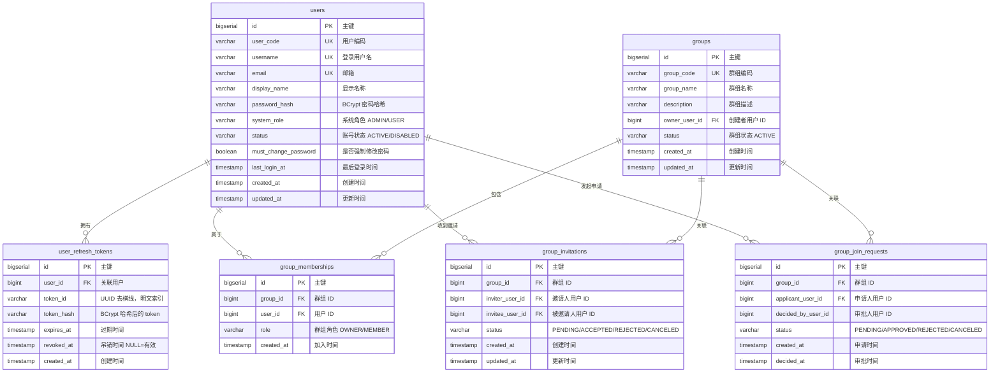
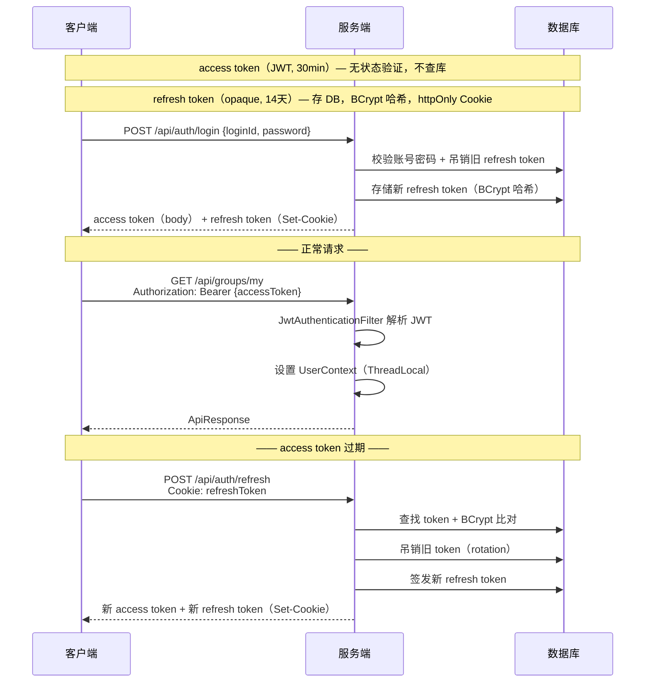
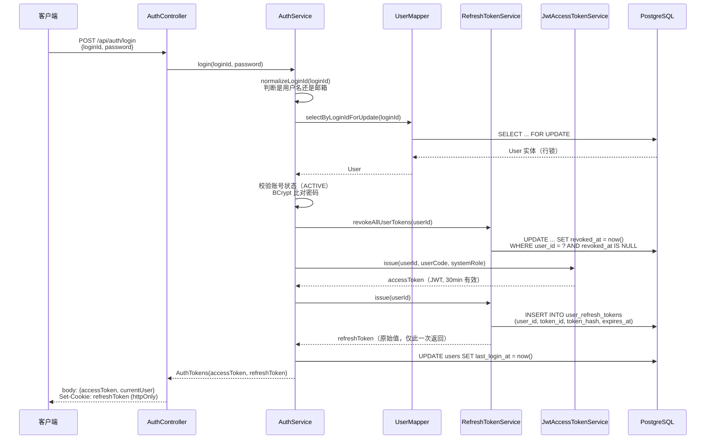
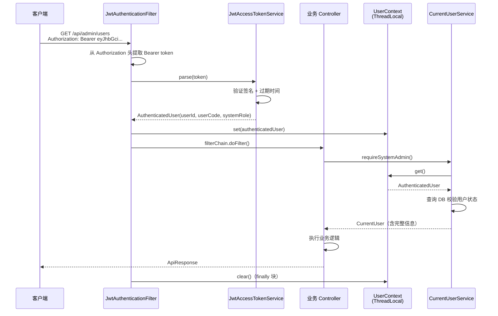
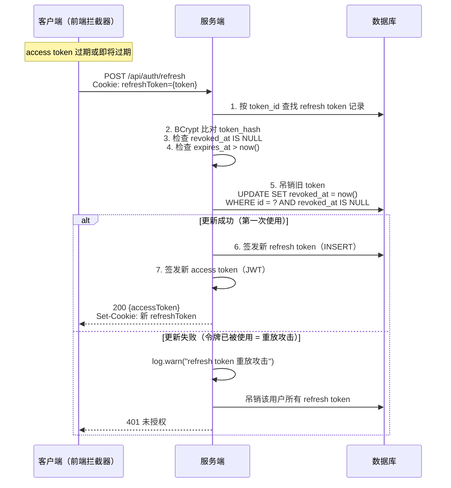
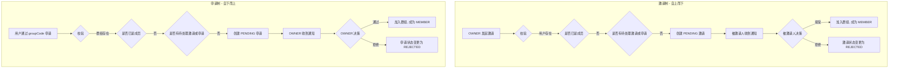
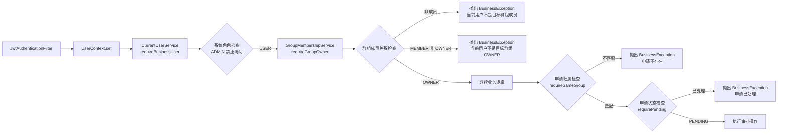

# Argus 项目文档 V1.0

> Argus 是一个 **RAG 知识库平台**的教学项目，从零搭建，逐步迭代。
> V1.0 完成了项目骨架、用户认证体系、用户管理模块以及群组成员管理模块。

---

## 一、项目概述

### 1.1 项目定位

Argus 意为"百眼巨人"，寓意平台能洞察所有文档内容。最终形态是一个支持文档上传、向量检索、大模型对话的 RAG（Retrieval-Augmented Generation）知识库平台。在这个平台上，用户可以创建自己的知识库（在系统中称为"群组"），邀请其他成员加入，上传文档，并通过 AI 对话的方式与知识库中的内容进行交互。

V1.0 作为项目的起点，聚焦于**后端基础设施搭建**、**用户体系**以及**群组成员管理**三大板块。基础设施层面，项目建立了统一的响应格式、全局异常处理机制和操作日志记录体系；用户体系层面，实现了完整的注册登录、双令牌认证、角色权限控制等功能；群组成员管理层面，实现了群组的创建、成员的邀请与加入申请、以及审批流程。这三块共同构成了后续所有业务模块的稳固底座。

### 1.2 V1.0 功能清单

| 模块 | 功能 | 状态 |
|------|------|------|
| 基础设施 | 统一响应体、全局异常处理、枚举规范 | 完成 |
| 基础设施 | Knife4j 接口文档 | 完成 |
| 基础设施 | AOP 操作日志记录（`@OperationLog`） | 完成 |
| 认证模块 | 注册 / 登录 / 登出 | 完成 |
| 认证模块 | JWT access token + Refresh Token 双令牌 | 完成 |
| 认证模块 | 令牌刷新（Rotation + 防重放攻击） | 完成 |
| 用户模块 | 修改密码 | 完成 |
| 用户模块 | 管理员 - 用户列表 / 详情 | 完成 |
| 用户模块 | 管理员 - 启用 / 禁用用户 | 完成 |
| 群组成员管理 | 创建群组 | 完成 |
| 群组成员管理 | 群组邀请 / 接受邀请 / 拒绝邀请 / 取消邀请 | 完成 |
| 群组成员管理 | 加入申请 / 审批通过 / 审批拒绝 | 完成 |
| 群组成员管理 | 移除成员 / 退出群组 | 完成 |
| 群组成员管理 | 可见群组列表查询 | 完成 |

---

## 二、技术栈

| 层次 | 技术 | 版本 | 说明 |
|------|------|------|------|
| 语言 | Java | 21 | record 语法、虚拟线程、模式匹配 |
| 框架 | Spring Boot | 3.5.0 | Jakarta EE 9+ 命名空间 |
| 构建 | Maven + mvnw | 3.9.14 | Wrapper 机制，无需预装 Maven |
| 数据库 | PostgreSQL | - | 关系型主存储，支持行锁 |
| ORM | MyBatis-Plus | 3.5.15 | Lambda 类型安全查询、自动回填主键 |
| 接口文档 | Knife4j + SpringDoc | 4.5.0 + 2.8.10 | `/doc.html` 增强 UI，支持 JWT Bearer 鉴权 |
| 认证 | JJWT | 0.12.6 | HMAC-SHA256 JWT 签发与解析 |
| 密码加密 | Spring Security Crypto | - | BCrypt 自适应哈希算法 |
| 工具 | Lombok | 1.18.34 | `@Slf4j` 日志注入，消除样板代码 |

### 依赖关系说明

整个项目的依赖选择遵循"按需引入、最小依赖"原则。`spring-boot-starter-web` 作为 REST API 的核心，内嵌了 Tomcat 容器和 Jackson 序列化库，是 HTTP 服务的基础；`spring-boot-starter-validation` 提供了 Jakarta Bean Validation 的实现，使得我们可以在 DTO 上使用 `@NotBlank`、`@Email` 等注解进行声明式参数校验，校验逻辑在进入 Controller 方法体之前就已经执行完毕，保持了业务代码的整洁。

数据库层面，项目选择了 MyBatis-Plus 而非 JPA/Hibernate。这是因为 MyBatis-Plus 在保留 SQL 灵活性的同时，通过 `LambdaQueryWrapper` 提供了类型安全的查询构建能力，避免了手写 SQL 字符串带来的字段名拼写错误和维护困难。对于复杂的查询（如登录时的 `SELECT ... FOR UPDATE` 行锁），仍然可以通过 XML 文件或注解方式编写原生 SQL，兼顾了开发效率和灵活性。

认证层面值得特别说明的是：项目**仅**引入了 `spring-security-crypto` 这个单独的密码加密模块，而没有引入 Spring Security 全家桶。这是因为 Spring Security 的过滤器链机制与项目的自定义 JWT 认证方案存在冲突——如果同时存在两套过滤器体系，调试和排错会变得非常复杂。项目通过自己编写的 `JwtAuthenticationFilter`（继承 `OncePerRequestFilter`）和 `UserContext`（基于 ThreadLocal）实现了一套轻量级的认证流程，既满足了需求，又保持了代码的透明可控。

```
spring-boot-starter-web          ← REST API 核心（内嵌 Tomcat、Jackson）
spring-boot-starter-validation   ← 请求参数校验（@Valid、@NotBlank 等）
spring-boot-starter-actuator     ← 健康检查、监控端点
mybatis-plus-spring-boot3-starter ← 数据库 ORM（Lambda 查询、分页、代码生成）
knife4j + springdoc-openapi      ← 接口文档（排除内置旧版 springdoc，显式引入 2.8.10）
jjwt (api + impl + jackson)      ← JWT 签发与解析
spring-security-crypto           ← BCrypt 密码哈希（仅 crypto，不含 Spring Security 全家桶）
lombok                           ← 编译期代码生成（@Slf4j）
postgresql                       ← JDBC 驱动（runtime scope）
```

---

## 三、项目结构

```
Argus/
├── sql/
│   └── schema.sql                         # 数据库建表 DDL
├── docs/
│   ├── project-init.md                    # 项目初始化文档（record 语法详解）
│   └── V1.0-项目文档.md                    # 本文档
└── Argus-backend/
    ├── pom.xml                            # Maven 依赖配置
    ├── mvnw / mvnw.cmd                    # Maven Wrapper
    └── src/main/
        ├── resources/
        │   ├── application.yml             # 公共配置（MyBatis-Plus、枚举处理器、JWT）
        │   ├── application-local.yml       # 本地环境（端口 10001、PG 连接）
        │   ├── application-dev.yml         # 开发环境（端口 10008）
        │   ├── logback-spring.xml          # 日志配置（控制台 + 滚动文件 + 错误分离）
        │   └── mappers/
        │       └── UserMapper.xml          # 复杂 SQL（FOR UPDATE 行锁）
        └── java/com/argus/rag/
            ├── ArgusBackendApplication.java   # 启动类（@SpringBootApplication）
            ├── common/
            │   ├── api/ApiResponse.java        # 统一响应体 {success, data, message}
            │   ├── config/OpenApiConfiguration.java  # Knife4j 配置 + JWT Bearer 认证方案
            │   ├── enums/                      # 枚举（SystemRole, UserStatus, GroupRole, GroupStatus 等）
            │   ├── exception/                  # BusinessException(400)、ForbiddenException(403)、
            │   │                                # UnauthorizedException(401)、GlobalExceptionHandler
            │   └── log/                        # @OperationLog 注解 + LogAop 切面
            ├── auth/                           # 认证授权模块
            │   ├── config/                     # AuthProperties、AuthConfiguration、
            │   │                               # DevAdminInitializer（dev 环境自动创建管理员）
            │   ├── controller/AuthController   # /api/auth/{login, register, refresh, logout, me}
            │   ├── service/                    # AuthService、PasswordHasher、PasswordPolicyValidator
            │   ├── security/                   # JwtAuthenticationFilter、JwtAccessTokenService、
            │   │                               # RefreshTokenService、AuthCookieSupport、UserContext
            │   ├── model/
            │   │   ├── dto/                    # LoginRequest、RegisterRequest
            │   │   ├── vo/                     # AuthTokensResponse、CurrentUserProfileResponse
            │   │   └── entity/UserRefreshToken # 刷新令牌持久化实体
            │   ├── mapper/UserRefreshTokenMapper  # 刷新令牌 Mapper（原子吊销 SQL）
            │   └── CurrentUserService          # 通过 UserContext（ThreadLocal）获取当前用户
            ├── user/                           # 用户管理模块
            │   ├── controller/                 # AccountController、AdminUserController
            │   ├── service/                    # AccountService、AdminUserService、UserQueryService
            │   ├── model/
            │   │   ├── dto/                    # ChangePasswordRequest、UpdateUserStatusRequest 等
            │   │   ├── vo/                     # AdminUserItemResponse
            │   │   └── entity/User             # 用户持久化实体
            │   └── mapper/UserMapper           # MyBatis-Plus BaseMapper + 自定义 XML
            └── group/                           # 群组成员管理模块（V1.0 新增）
                ├── controller/                 # GroupQueryController、GroupManagementController、
                │                               # GroupJoinRequestController、InvitationDecisionController
                ├── service/                    # GroupMembershipService、GroupManagementService、
                │                               # GroupJoinRequestService
                ├── model/
                │   ├── dto/                    # CreateGroupRequest、CreateInvitationRequest、
                │   │                            # CreateJoinRequestRequest
                │   └── vo/                     # GroupMemberResponse、OwnerJoinRequestResponse、
                │                               # MyJoinRequestResponse
                └── mapper/                     # GroupMembershipMapper、GroupJoinRequestMapper
```

模块的划分遵循了"按业务领域垂直切分"的原则。`common` 包承载跨模块共享的基础设施（响应体、异常、枚举、日志）；`auth` 包专责认证与授权的所有逻辑，包括 JWT 的签发解析、刷新令牌的生命周期管理、以及当前用户身份的获取；`user` 包管理用户自身的操作（修改密码）和管理员的用户管理功能；`group` 包则是 V1.0 中新增的最大模块，它独立承载了群组创建、成员邀请、加入申请、审批流程等一整套群组成员管理的业务逻辑。

每个业务模块内部又按照"控制器 → 服务 → 数据访问"的经典三层架构进行水平分层：`controller` 层负责接收 HTTP 请求和参数校验，`service` 层承载核心业务逻辑和事务管理，`mapper` 层封装数据库访问，`model` 层则按职责进一步细分为 `dto`（入站请求对象）、`vo`（出站响应对象）和 `entity`（数据库实体）三个子包。这种分层方式使得每一层的职责边界清晰，便于单元测试和后续的功能扩展。

---

## 四、数据库设计

### 4.1 整体 ER 图



### 4.2 users 表字段说明

`users` 表是整个用户体系的根基，存储了所有平台用户的认证凭据和基本信息。设计上遵循了"认证数据与业务数据分离"的思路：`password_hash`（BCrypt 哈希后的密码）仅用于登录验证，永远不会通过 API 返回给前端；`system_role` 控制平台级权限（管理员 vs 普通用户）；`status` 支持账号的启用与禁用，禁用后用户无法登录且所有 refresh token 会被自动吊销。

| 字段 | 类型 | 约束 | 说明 |
|------|------|------|------|
| id | BIGSERIAL | PK | 自增主键 |
| user_code | VARCHAR(64) | NOT NULL, UNIQUE | 用户编码，注册时自动生成，前端展示用 |
| username | VARCHAR(64) | NOT NULL, UNIQUE | 登录用户名 |
| email | VARCHAR(128) | NOT NULL, UNIQUE | 邮箱 |
| display_name | VARCHAR(128) | NOT NULL | 显示名称 |
| password_hash | VARCHAR(256) | NOT NULL | BCrypt 哈希 |
| system_role | VARCHAR(16) | NOT NULL, DEFAULT 'USER' | 系统角色：ADMIN / USER |
| status | VARCHAR(16) | NOT NULL, DEFAULT 'ACTIVE' | 账号状态：ACTIVE / DISABLED |
| must_change_password | BOOLEAN | NOT NULL, DEFAULT FALSE | 是否下次登录强制改密码 |
| last_login_at | TIMESTAMP | - | 最后登录时间 |
| created_at | TIMESTAMP | NOT NULL, DEFAULT now() | 创建时间 |
| updated_at | TIMESTAMP | NOT NULL, DEFAULT now() | 更新时间 |

### 4.3 user_refresh_tokens 表字段说明

`user_refresh_tokens` 表用于持久化 refresh token。这里有一个重要的安全设计：数据库中存储的是 token 的 BCrypt 哈希值（`token_hash`），而非明文 token。这意味着即使数据库发生泄露，攻击者也无法直接使用这些哈希值伪造 refresh token。`token_id` 字段（UUID 去横线）作为明文索引，用于在刷新时快速定位记录，然后通过 BCrypt 的 `matches()` 方法比对前端传来的原始 token 与数据库中的哈希值。

`revoked_at` 字段是实现令牌吊销的核心：NULL 表示令牌有效，非 NULL 表示已吊销。配合乐观锁更新（`UPDATE ... WHERE revoked_at IS NULL`）可以防止并发刷新时的竞态条件——两次并发的刷新请求中，只有先执行的那次能够成功更新，另一次会因为影响行数为 0 而失败，从而检测到重放攻击。

**索引设计**：
- `uq_users_username` / `uq_users_email` — 唯一约束索引，用于登录时按用户名或邮箱查找用户
- `idx_refresh_token_token_id` — 单列索引，按 token_id 快速查找
- `idx_refresh_token_user_active` — 复合索引 `(user_id, revoked_at, expires_at)`，用于吊销用户所有令牌和清理过期令牌

| 字段 | 类型 | 约束 | 说明 |
|------|------|------|------|
| id | BIGSERIAL | PK | 自增主键 |
| user_id | BIGINT | NOT NULL, FK | 关联 users.id |
| token_id | VARCHAR(64) | NOT NULL, INDEX | UUID 去横线，明文索引 |
| token_hash | VARCHAR(256) | NOT NULL | BCrypt 哈希后的 token |
| expires_at | TIMESTAMP | NOT NULL | 过期时间 |
| revoked_at | TIMESTAMP | - | 吊销时间，NULL = 有效 |
| created_at | TIMESTAMP | NOT NULL, DEFAULT now() | 创建时间 |

### 4.4 groups 表字段说明

`groups` 表存储群组的基本信息。群组是知识库在系统中的概念映射——每一个群组对应一个独立的知识库空间，拥有独立的成员体系和文档集合。`group_code` 是一个通过 UUID 生成的不可变唯一编码（格式如 `group-xxx`），用于对外暴露的加入标识，用户可以通过 group_code 来申请加入某个知识库。`owner_user_id` 记录群组的创建者，创建者在 `group_memberships` 表中自动获得 OWNER 角色。

| 字段 | 类型 | 约束 | 说明 |
|------|------|------|------|
| id | BIGSERIAL | PK | 自增主键 |
| group_code | VARCHAR(80) | NOT NULL, UNIQUE | 群组编码，对外展示 |
| group_name | VARCHAR(128) | NOT NULL | 群组名称 |
| description | VARCHAR(512) | - | 群组描述 |
| owner_user_id | BIGINT | NOT NULL, FK | 创建者用户 ID |
| status | VARCHAR(16) | NOT NULL, DEFAULT 'ACTIVE' | 群组状态 |
| created_at | TIMESTAMP | NOT NULL, DEFAULT now() | 创建时间 |
| updated_at | TIMESTAMP | NOT NULL, DEFAULT now() | 更新时间 |

### 4.5 group_memberships 表字段说明

`group_memberships` 是用户与群组之间的多对多关联表。每一行记录表示一个用户在一个群组中的成员关系。`role` 字段区分了群组内的两种角色：OWNER（所有者，拥有管理权限）和 MEMBER（普通成员）。同一个用户可以同时属于多个群组，在同一个群组内只存在一条活跃的成员记录。

| 字段 | 类型 | 约束 | 说明 |
|------|------|------|------|
| id | BIGSERIAL | PK | 自增主键 |
| group_id | BIGINT | NOT NULL, FK | 群组 ID |
| user_id | BIGINT | NOT NULL, FK | 用户 ID |
| role | VARCHAR(16) | NOT NULL | 群组角色：OWNER / MEMBER |
| created_at | TIMESTAMP | NOT NULL, DEFAULT now() | 加入时间 |

### 4.6 group_invitations 表字段说明

`group_invitations` 表管理群组邀请的完整生命周期。邀请由群组 OWNER 发起，指定被邀请人（`invitee_user_id`）。被邀请人可以选择接受或拒绝，邀请人也可以取消尚未处理的邀请。状态流转为：PENDING → ACCEPTED / REJECTED / CANCELED。所有状态变更通过乐观锁（`WHERE status = 'PENDING'`）来保证并发安全。

| 字段 | 类型 | 约束 | 说明 |
|------|------|------|------|
| id | BIGSERIAL | PK | 自增主键 |
| group_id | BIGINT | NOT NULL, FK | 群组 ID |
| inviter_user_id | BIGINT | NOT NULL, FK | 邀请人用户 ID |
| invitee_user_id | BIGINT | NOT NULL, FK | 被邀请人用户 ID |
| status | VARCHAR(16) | NOT NULL | PENDING / ACCEPTED / REJECTED / CANCELED |
| created_at | TIMESTAMP | NOT NULL, DEFAULT now() | 创建时间 |
| updated_at | TIMESTAMP | NOT NULL, DEFAULT now() | 更新时间 |

### 4.7 group_join_requests 表字段说明

`group_join_requests` 表管理用户主动申请加入群组的流程。与邀请（Owner 发起）相反，加入申请由普通用户通过群组编码发起。群组 OWNER 可以审批通过（用户自动获得 MEMBER 角色）或拒绝。同样使用乐观锁保证并发安全。`decided_by_user_id` 记录审批人的用户 ID，用于审计追溯。

| 字段 | 类型 | 约束 | 说明 |
|------|------|------|------|
| id | BIGSERIAL | PK | 自增主键 |
| group_id | BIGINT | NOT NULL, FK | 群组 ID |
| applicant_user_id | BIGINT | NOT NULL, FK | 申请人用户 ID |
| decided_by_user_id | BIGINT | - | 审批人用户 ID |
| status | VARCHAR(16) | NOT NULL | PENDING / APPROVED / REJECTED / CANCELED |
| created_at | TIMESTAMP | NOT NULL, DEFAULT now() | 申请时间 |
| decided_at | TIMESTAMP | - | 审批时间 |

---

## 五、核心设计决策

### 5.1 不使用 JdbcTemplate，统一使用 MyBatis-Plus

V1.0 最初用 `JdbcTemplate` 手写 SQL，后期全部改造为 MyBatis-Plus。这个决策的核心动机是**类型安全**和**可维护性**：手写 SQL 字符串意味着字段名变更时编译器无法检测到错误，只能在运行时暴露；而 MyBatis-Plus 的 `LambdaQueryWrapper` 基于 Java lambda 表达式引用实体字段，字段名变更会在编译期直接报错。

| 对比维度 | JdbcTemplate | MyBatis-Plus |
|---------|-------------|--------------|
| 查询方式 | 手写 SQL 字符串 | `LambdaQueryWrapper` 类型安全 |
| 结果映射 | RowMapper 手动映射 | 实体自动映射 |
| 插入回填 ID | `RETURNING id`（PG 特有） | `insert` 自动回填 |
| 复杂 SQL | 内嵌字符串 | XML 文件或注解分离 |
| 枚举处理 | `status.name()` 手动 | `EnumTypeHandler` 自动 |

值得注意的是，群组成员管理模块（`group`）的 Mapper 采用了**注解 SQL** 的方式，而非 XML 文件。这是因为群组相关的 SQL 语句相对独立，每个方法的 SQL 较短，直接写在 `@Select` / `@Insert` / `@Update` 注解中比维护额外的 XML 文件更加直观和便于管理。当 SQL 语句很长或涉及动态条件拼接时，XML 文件仍然是更好的选择。

### 5.2 双令牌认证机制

系统采用 **access token + refresh token** 双令牌方案，这是现代 Web 应用中广泛采用的安全实践。其核心思想是：将"身份证明"和"会话续期"这两个职责分离到不同的令牌中，使得即便 access token 泄露，攻击者也只能在很短的窗口期内（30 分钟）使用它；而 refresh token 虽然有效期长（14 天），但每次使用都会触发 rotation（旧令牌吊销、新令牌签发），任何重放旧令牌的行为都会被检测到。



**access token** 是一个 JWT，采用 HMAC-SHA256 签名，有效期为 30 分钟（可通过 `ddrag.auth.jwt.expiration` 配置）。由于 JWT 本身包含了用户 ID、角色等基本信息，服务端无需查询数据库即可完成认证，这使得每次请求的认证开销极低。access token 通过 HTTP 的 `Authorization: Bearer <token>` 头传输，前端存储于内存中。

**refresh token** 是一个不透明的随机字符串（UUID 去横线），有效期为 14 天。与 access token 不同，refresh token 在服务器端有对应的数据库记录，存储的是其 BCrypt 哈希值而非明文。refresh token 通过 httpOnly Cookie 传输，JavaScript 无法读取，从根本上防止了 XSS 攻击窃取 refresh token 的可能。

**令牌 rotation** 是系统的一个关键安全特性：每次使用 refresh token 获取新的 access token 时，旧的 refresh token 会被立即吊销，同时签发一个新的 refresh token。这意味着 refresh token 是一次性使用的——如果攻击者窃取了一个 refresh token 并在合法用户之前使用它，合法用户持有的旧 token 就会失效，下次刷新时会触发"重放攻击"检测，系统会记录警告日志。

**单设备登录** 策略通过在登录时吊销该用户所有未过期的 refresh token 来实现。这意味着同一账号在新设备上登录时，旧设备上的会话会立即失效。

### 5.3 请求级用户上下文（ThreadLocal）

V1.0 的一个重要架构演进是将认证信息的传递方式从"方法参数透传 `HttpServletRequest`"改为"基于 ThreadLocal 的 `UserContext`"。每个 HTTP 请求由 Tomcat 线程池中的一个线程处理，`JwtAuthenticationFilter` 在请求进入时从 Authorization 头解析 JWT，将用户信息存入当前线程的 `ThreadLocal`，请求结束时在 `finally` 块中清理。

这种方式的优势在于：业务代码的任意层级都可以通过 `UserContext.get()` 获取当前用户信息，无需在方法签名中层层传递 `HttpServletRequest`，使得 Service 层的方法签名更干净，也更方便在非 Controller 层（如 AOP 切面、工具类）中访问用户上下文。

```java
// JwtAuthenticationFilter（请求入口）
AuthenticatedUser authenticatedUser = parseJwt(token);
UserContext.set(authenticatedUser);
try {
    filterChain.doFilter(request, response);
} finally {
    UserContext.clear(); // 防止内存泄漏和线程池复用的数据污染
}

// 业务代码任意位置
CurrentUserService.CurrentUser user = currentUserService.requireBusinessUser();
// 无需传参，内部通过 UserContext.get() 获取
```

### 5.4 全局异常处理

项目建立了三层异常体系，每一层对应一个 HTTP 状态码，语义清晰：

- `BusinessException` → 400 BAD_REQUEST：业务规则校验失败（如"用户不存在"、"密码错误"）
- `UnauthorizedException` → 401 UNAUTHORIZED：认证失败（如"未登录"、"令牌过期"）
- `ForbiddenException` → 403 FORBIDDEN：权限不足（如"非管理员"、"非群组 OWNER"）

所有异常由 `GlobalExceptionHandler`（`@RestControllerAdvice`）统一捕获并转换为标准的 `ApiResponse` 格式。此外，`MethodArgumentNotValidException`（Jakarta Bean Validation 校验失败）和 `HttpMessageNotReadableException`（请求体格式错误）也被映射到 400，`MaxUploadSizeExceededException` 被映射到 413，未预期的 `Exception` 被映射到 500 并记录 error 级别日志。

```java
// 业务代码直接抛出自定义异常
throw new BusinessException("用户不存在");          // → 400
throw new UnauthorizedException("当前请求未登录");   // → 401
throw new ForbiddenException("当前用户不是系统管理员");  // → 403

// GlobalExceptionHandler 统一转换
@ExceptionHandler(BusinessException.class)
@ResponseStatus(HttpStatus.BAD_REQUEST)
public ApiResponse<Void> handleBusinessException(BusinessException ex) {
    return new ApiResponse<>(false, null, ex.getMessage());
}
```

### 5.5 统一响应体

所有控制器方法的返回值都通过 `ApiResponse<T>` 包装，确保前端接收到一致的 JSON 结构。`ApiResponse` 是一个 Java record，使用 `@JsonInclude(JsonInclude.Include.NON_NULL)` 注解使得 null 字段在序列化时被自动省略，减少响应体积。

```java
public record ApiResponse<T>(boolean success, T data, String message) {
    public static <T> ApiResponse<T> success(T data) {
        return new ApiResponse<>(true, data, "操作成功");
    }
}

// 成功示例
ApiResponse.success(userList)
// → {"success": true, "data": [...], "message": "操作成功"}

// 失败示例（由 GlobalExceptionHandler 构造）
new ApiResponse<>(false, null, "用户不存在")
// → {"success": false, "data": null, "message": "用户不存在"}
```

### 5.6 枚举数据库映射

所有枚举在数据库中存储为 `VARCHAR` 类型的 `.name()` 值（如 `"ADMIN"`、`"ACTIVE"`、`"PENDING"` 等）。MyBatis-Plus 通过全局配置的 `EnumTypeHandler` 自动完成 Java 枚举与数据库字符串之间的转换：

```yaml
mybatis-plus:
  configuration:
    default-enum-type-handler: org.apache.ibatis.type.EnumTypeHandler
```

这样做的好处是：数据库中的枚举值对人类可读（直接看数据表就能知道状态含义），同时避免了使用 `ordinal()` 数字带来的枚举顺序依赖问题——如果将来在枚举中间插入一个新值，`ordinal()` 数字会发生偏移，而 `name()` 字符串永远不变。

项目目前定义了 9 个枚举类：

| 枚举 | 值 | 用途 |
|------|------|------|
| `SystemRole` | ADMIN, USER | 平台级角色 |
| `UserStatus` | ACTIVE, DISABLED | 账号状态 |
| `GroupRole` | OWNER, MEMBER | 群组内角色 |
| `GroupStatus` | ACTIVE | 群组状态 |
| `GroupJoinRequestStatus` | PENDING, APPROVED, REJECTED, CANCELED | 加入申请状态 |
| `GroupInvitationStatus` | PENDING, ACCEPTED, REJECTED, CANCELED | 邀请状态 |
| `DocumentStatus` | UPLOADED, PROCESSING, READY, FAILED | 文档处理状态（V1.1+） |
| `IngestionJobStatus` | PENDING, RUNNING, SUCCEEDED, FAILED, CANCELLED | 摄入任务状态（V1.1+） |
| `IngestionJobType` | INGEST_DOCUMENT | 摄入任务类型（V1.1+） |

### 5.7 操作日志 AOP

项目通过自定义 `@OperationLog` 注解和 `LogAop` 切面实现了控制器方法的自动操作日志记录。`LogAop` 使用 `@Around` 环绕通知，在方法执行前后记录类名、方法名、执行耗时，成功时记录 info 级别日志，异常时记录 error 级别日志。

这个设计使得日志记录逻辑与业务代码完全解耦——开发者只需要在 Controller 类或方法上添加 `@OperationLog` 注解即可启用日志记录，无需在业务方法中手动编写 `log.info(...)` 语句。目前所有控制器都通过类级别的 `@OperationLog` 注解启用了该功能。

### 5.8 系统管理员与业务用户的隔离

系统设计了一个重要的权限边界：**系统管理员（ADMIN）不能访问普通业务区域**。`CurrentUserService.requireBusinessUser()` 方法在检测到当前用户为 ADMIN 角色时会直接抛出 `ForbiddenException`。这意味着管理员只能使用 `/api/admin/*` 路径下的管理功能（用户列表、用户状态管理等），而不能参与群组操作（加入群组、申请审批等）。

这个设计的出发点是职责分离：管理员负责平台运维和用户管理，不应该拥有业务数据的访问权。如果需要让管理员同时作为普通用户参与业务，应该为其另外创建一个 USER 角色的账号。

---

## 六、API 接口文档

### 6.1 认证模块 — `/api/auth`

认证模块负责用户身份的生命周期管理：注册、登录、令牌刷新、登出和当前用户信息查询。所有接口中，仅 `/api/auth/me` 需要认证（携带 Bearer token），其余接口为公开接口。

| 方法 | 路径 | 认证 | 说明 |
|------|------|------|------|
| POST | `/api/auth/register` | 否 | 注册新用户 |
| POST | `/api/auth/login` | 否 | 登录，返回 accessToken + Cookie 下发 refreshToken |
| POST | `/api/auth/refresh` | 否 | 从 Cookie 读取 refreshToken，刷新双令牌 |
| POST | `/api/auth/logout` | 否 | 吊销 refreshToken，清除 Cookie |
| GET | `/api/auth/me` | 是 | 获取当前用户信息 |

**登录接口示例**：

```
POST /api/auth/login
Content-Type: application/json

{"loginId": "admin", "password": "Admin@123456"}

Response 200:
{
  "success": true,
  "data": {
    "accessToken": "eyJhbGciOi...",
    "currentUser": {
      "userId": 1,
      "userCode": "admin",
      "displayName": "管理员",
      "systemRole": "ADMIN",
      "mustChangePassword": false
    }
  },
  "message": "操作成功"
}
```

**登录接口** 支持使用用户名或邮箱作为 `loginId`，系统会自动判断输入是用户名还是邮箱并采用相应的查询策略。登录成功后，access token 在响应 body 中返回，refresh token 通过 `Set-Cookie` 头以 httpOnly Cookie 的形式下发。同时，系统会吊销该用户所有旧的 refresh token（实现单设备登录），并更新 `last_login_at` 字段。

**注册接口** 要求提供用户名、邮箱、显示名称和密码。用户名和邮箱会经过唯一性校验，密码会经过强度校验（详见 7.1 节）。注册成功后用户默认获得 USER 角色和 ACTIVE 状态。

**刷新接口** 从请求的 Cookie 中提取 refresh token，经过 BCrypt 比对验证后，吊销旧 token 并签发新的 token pair。这个接口通常由前端 HTTP 拦截器在收到 401 响应时自动调用，对用户是无感的。

**登出接口** 吊销当前的 refresh token 并清除 Cookie。注意登出只吊销当前设备的会话（通过 Cookie 中的 token_id 精确匹配），不会影响其他设备的登录状态。

### 6.2 账户模块 — `/api/account`

| 方法 | 路径 | 认证 | 说明 |
|------|------|------|------|
| POST | `/api/account/change-password` | 是 | 修改当前用户密码 |

**修改密码接口** 需要提供当前密码和新密码。系统会先验证当前密码是否正确，然后对新密码进行强度校验，校验通过后更新密码哈希。为了安全起见，密码修改成功后系统会**吊销该用户所有的 refresh token**，这意味着该用户在所有设备上的登录会话都会被清除，需要用新密码重新登录。

### 6.3 管理员模块 — `/api/admin/users`

管理员模块的所有接口都需要 ADMIN 角色，通过 `CurrentUserService.requireSystemAdmin()` 进行权限校验。

| 方法 | 路径 | 认证 | 权限 | 说明 |
|------|------|------|------|------|
| GET | `/api/admin/users` | 是 | ADMIN | 用户列表 |
| GET | `/api/admin/users/{userId}` | 是 | ADMIN | 用户详情 |
| PATCH | `/api/admin/users/{userId}/status` | 是 | ADMIN | 启用/禁用用户 |

**用户列表接口** 返回所有用户，按 ID 升序排列。**用户详情接口** 通过路径参数 `userId` 查询单个用户的完整信息。**状态管理接口** 支持将用户状态切换为 ACTIVE 或 DISABLED——当用户被禁用时，系统会自动吊销其所有 refresh token，使其立即登出。

### 6.4 群组查询模块 — `/api/groups`

| 方法 | 路径 | 认证 | 说明 |
|------|------|------|------|
| GET | `/api/groups/my` | 是 | 查询当前用户可见的群组列表 |

**可见群组列表** 是群组模块的核心查询接口，返回三部分数据：用户拥有的群组（OWNER 角色）、用户加入的群组（MEMBER 角色，但不包括已拥有的）、以及用户收到的待处理邀请。这三个列表共同构成了用户"可见"的群组全景。前端通常使用此接口渲染"我的群组"页面，分别展示三个区域的群组卡片。

响应结构：

```json
{
  "success": true,
  "data": {
    "ownedGroups": [
      {"groupId": 1, "groupCode": "group-xxx", "groupName": "我的知识库"}
    ],
    "joinedGroups": [
      {"groupId": 2, "groupCode": "group-yyy", "groupName": "项目文档库"}
    ],
    "pendingInvitations": [
      {
        "invitationId": 10,
        "groupId": 3,
        "groupName": "设计规范库",
        "inviterUserId": 5,
        "inviterDisplayName": "张三",
        "status": "PENDING"
      }
    ]
  },
  "message": "操作成功"
}
```

### 6.5 群组管理模块 — `/api/groups`

群组管理模块负责群组的创建、成员的邀请、移除和退出。除"创建群组"外，所有操作都需要相应的群组角色权限（OWNER 或 MEMBER）。

| 方法 | 路径 | 认证 | 权限 | 说明 |
|------|------|------|------|------|
| POST | `/api/groups` | 是 | USER | 创建新群组 |
| POST | `/api/groups/{groupId}/invitations` | 是 | OWNER | 邀请用户加入群组 |
| GET | `/api/groups/{groupId}/members` | 是 | OWNER | 查看群组成员列表 |
| DELETE | `/api/groups/{groupId}/members/{userId}` | 是 | OWNER | 移除群组成员 |
| POST | `/api/groups/{groupId}/leave` | 是 | MEMBER | 退出群组 |

**创建群组** 时，创建者自动成为群组的 OWNER，并被添加到 `group_memberships` 表中。系统会生成一个基于 UUID 的唯一 `group_code`（格式为 `group-` + 32 位十六进制字符），作为该群组的外部标识。

**邀请用户** 接口由 OWNER 调用，指定被邀请用户的 ID。系统会校验：被邀请用户是否存在、是否已经是群组成员、是否已有待处理的邀请或加入申请。所有校验通过后，创建一条 `PENDING` 状态的邀请记录。

**查看成员列表** 返回群组内所有成员的基本信息（用户 ID、编码、显示名称、群组角色）。

**移除成员** 允许 OWNER 将指定成员从群组中移除，但不能移除 OWNER 自己（包括不能移除其他 OWNER——虽然当前设计每个群组只有一个 OWNER）。

**退出群组** 允许 MEMBER 主动离开群组。OWNER 不能通过此接口退出自己的群组——如果 OWNER 需要离开，应该先将 OWNER 角色转让给其他成员，或者直接删除群组（该功能暂未实现）。

### 6.6 加入申请模块 — `/api/groups`

加入申请模块提供了一种**自下而上**的成员加入方式：用户通过群组编码（group_code）主动申请加入，由 OWNER 进行审批。这与邀请机制（自上而下）形成了互补。

| 方法 | 路径 | 认证 | 权限 | 说明 |
|------|------|------|------|------|
| POST | `/api/groups/join-requests` | 是 | USER | 提交加入申请 |
| GET | `/api/groups/join-requests/my` | 是 | USER | 查看我的申请列表 |
| GET | `/api/groups/{groupId}/join-requests` | 是 | OWNER | 查看群组的待处理申请 |
| POST | `/api/groups/{groupId}/join-requests/{requestId}/approve` | 是 | OWNER | 审批通过申请 |
| POST | `/api/groups/{groupId}/join-requests/{requestId}/reject` | 是 | OWNER | 拒绝申请 |

**提交加入申请** 时，用户提供群组编码（`groupCode`）。系统会校验：群组是否存在且活跃、用户是否已经是该群组成员、是否已有待处理的邀请、是否已有待处理的加入申请。校验通过后创建一条 `PENDING` 状态的申请记录。这个接口的设计避免了用户重复提交申请，也避免了邀请和申请同时存在导致的状态冲突。

**审批通过** 操作会执行两个数据库变更：将申请状态更新为 `APPROVED`，同时在 `group_memberships` 表中插入一条 MEMBER 角色的记录。这两个操作在同一事务中执行，保证数据一致性。

**审批拒绝** 操作仅更新申请状态为 `REJECTED`，不会产生其他副作用。

### 6.7 邀请决策模块 — `/api/invitations`

邀请决策模块处理被邀请人对邀请的响应（接受或拒绝），以及邀请人对已发出邀请的取消。

| 方法 | 路径 | 认证 | 权限 | 说明 |
|------|------|------|------|------|
| POST | `/api/invitations/{invitationId}/accept` | 是 | 被邀请人 | 接受群组邀请 |
| POST | `/api/invitations/{invitationId}/reject` | 是 | 被邀请人 | 拒绝群组邀请 |
| POST | `/api/invitations/{invitationId}/cancel` | 是 | 邀请人（OWNER） | 取消已发出的邀请 |

**接受邀请** 操作会校验操作者是否为邀请的接收人（`inviteeUserId`），验证通过后将邀请状态更新为 `ACCEPTED`，并在 `group_memberships` 表中插入一条 MEMBER 记录。同时会再次校验该用户是否已经是群组成员，防止并发操作导致重复加入。

**拒绝邀请** 仅更新邀请状态为 `REJECTED`。

**取消邀请** 由邀请人（群组 OWNER）执行，将邀请状态从 `PENDING` 更新为 `CANCELED`。这个接口用于邀请人主动撤销尚未被处理的邀请。

---

## 七、认证流程详解

### 7.1 登录流程

登录是整个认证体系的入口，涉及多个步骤的串联执行。以下是完整的登录流程：



登录流程中有几个值得关注的细节：

**用户名或邮箱登录**：`loginId` 可以是用户名或邮箱，系统通过 `normalizeLoginId()` 方法判断输入是否包含 `@` 符号来决定查询策略。如果包含 `@`，则按邮箱查询；否则按用户名查询。这使得用户无需记忆自己是用什么方式注册的。

**行锁（FOR UPDATE）**：登录查询使用了 `SELECT ... FOR UPDATE` 行级锁。这看似多余（登录只是读取用户记录），但实际上是为了防止并发场景下的竞态条件——例如，同一账号在两台设备上同时登录，吊销操作的顺序需要由数据库的行锁来保证串行化。

**登录即吊销**：每次成功登录都会吊销该用户所有未过期的旧 refresh token。这是"单设备登录"策略的具体实现——新登录会使得旧设备上的会话立即失效。

### 7.2 请求认证流程

每个需要认证的 HTTP 请求都会经过 `JwtAuthenticationFilter` 的处理。这个过滤器继承自 `OncePerRequestFilter`，保证每个请求只被过滤一次。



关键设计点是 `UserContext` 的 ThreadLocal 机制。每个 HTTP 请求由 Tomcat 线程池中的一个线程处理，ThreadLocal 将用户信息绑定到当前线程上，业务代码的任意层级都可以通过 `CurrentUserService` 获取当前用户，而无需在方法签名中层层传递。请求结束后，`finally` 块中的 `UserContext.clear()` 保证了 ThreadLocal 的清空，防止线程池复用时发生数据串扰。

`CurrentUserService` 在获取用户上下文后，还会额外查询数据库来校验用户是否存在、账号是否处于活跃状态。这个设计确保了即使 JWT 中的用户信息是有效的，如果用户在 JWT 签发后被禁用或删除，请求仍然会被拒绝。

### 7.3 令牌刷新流程

令牌刷新是"无感登录体验"的关键。前端在 access token 过期前或收到 401 响应后，自动调用刷新接口获取新的 token pair。



**rotation + 重放检测** 是此流程的安全核心。刷新操作使用乐观锁更新 `revoked_at` 字段（`WHERE revoked_at IS NULL`），保证同一 token 只能被使用一次。如果攻击者窃取了 refresh token 并在合法用户之前使用它，那么：

1. 攻击者先使用 → token 被吊销，新 token 签发给攻击者
2. 合法用户再使用 → 发现 token 已经被吊销（`revoked_at` 不为 NULL），更新影响行数为 0
3. 系统检测到这种情况（旧 token 已被使用却还有人尝试使用它），判定为重放攻击，记录 warning 日志，并吊销该用户的所有 refresh token（强制所有设备重新登录）

这个机制确保了即便 refresh token 泄露，攻击者也最多只能使用一次，而且会在短时间内被检测到。

---

## 八、群组成员管理业务流程

### 8.1 群组创建与成员加入的两种路径

系统提供了两种成员加入群组的方式，分别适用于不同的场景：

**路径一：邀请制（自上而下）**。群组 OWNER 通过用户 ID 直接邀请目标用户。被邀请人会在"我的群组"页面看到待处理的邀请，可以选择接受或拒绝。这种方式适用于已知目标用户身份、主动组建团队的场景。

**路径二：申请制（自下而上）**。用户通过群组编码（`groupCode`）搜索并申请加入某个知识库。OWNER 在群组管理页面看到待处理的申请，可以选择通过或拒绝。这种方式适用于用户通过分享的群组编码自行发现和加入知识库的场景。



### 8.2 权限校验链路

群组成员管理模块的权限校验采用了多层防御的设计。以"审批加入申请"为例，权限校验链路如下：



每一层校验失败都会抛出带有中文错误消息的 `BusinessException`，由 `GlobalExceptionHandler` 转换为前端可直接展示的提示信息。

---

## 九、运行指南

### 9.1 环境要求

- **JDK 21**（路径：`D:\Develop\DevelopTool\StudyEnvironment\PhpWebStudy-Data\app\openjdk-21.0.9`）
- **PostgreSQL**（已创建数据库 `dd_rag`）
- **Maven**（可选，项目自带 `mvnw` wrapper）

### 9.2 数据库初始化

```bash
# 连接 PostgreSQL，执行建表脚本
psql -h 192.168.200.130 -U root -d dd_rag -f sql/schema.sql
```

### 9.3 编译与启动

```bash
# 设置 JDK 21
export JAVA_HOME="D:\Develop\DevelopTool\StudyEnvironment\PhpWebStudy-Data\app\openjdk-21.0.9"

# 编译
cd Argus-backend
./mvnw clean compile

# 启动（默认 local 环境，端口 10001）
./mvnw spring-boot:run

# 或启动 dev 环境（端口 10008，含管理员自动初始化）
./mvnw spring-boot:run -Dspring-boot.run.profiles=dev
```

### 9.4 接口文档

启动后访问：`http://localhost:10001/doc.html`

Knife4j 提供了增强版的 Swagger UI，支持在线调试、JWT Bearer 鉴权（在页面右上角的 Authorize 按钮中填入 access token）、以及接口分组展示。

### 9.5 测试账号

| 环境 | 账号 | 密码 | 角色 |
|------|------|------|------|
| dev | admin | Admin@123456 | ADMIN（自动初始化） |
| local | 手动注册 | - | 首个注册为 USER |

### 9.6 多环境配置

| 文件 | 端口 | 数据库 | 说明 |
|------|------|------|------|
| `application-local.yml` | 10001 | 192.168.200.130:5433/dd_rag | 本地开发（默认） |
| `application-dev.yml` | 10008 | 10.10.14.14:5432/ivs | 开发服务器 |

### 9.7 日志查看

项目使用 Logback 作为日志框架，配置文件为 `logback-spring.xml`。日志输出分为三类：

- **控制台**：所有级别日志实时输出，方便本地开发调试
- **滚动文件**（`logs/argus.log`）：INFO 及以上级别，按天滚动，保留 30 天
- **错误文件**（`logs/argus-error.log`）：ERROR 级别单独输出，便于监控和告警

---

## 十、后续版本规划

| 版本 | 计划内容 |
|------|---------|
| V1.1 | 文档上传、异步摄入任务、文档切片与向量化存储 |
| V1.2 | 向量检索、RAG 对话接口、大模型集成 |
| V1.3 | 前端管理台（群组管理、文档管理、对话界面） |
| V1.4 | 权限细化、操作审计日志、性能优化 |

---

> 本文档随项目代码同步更新，每次版本迭代后需同步修订架构图、API 列表和数据库设计章节。
