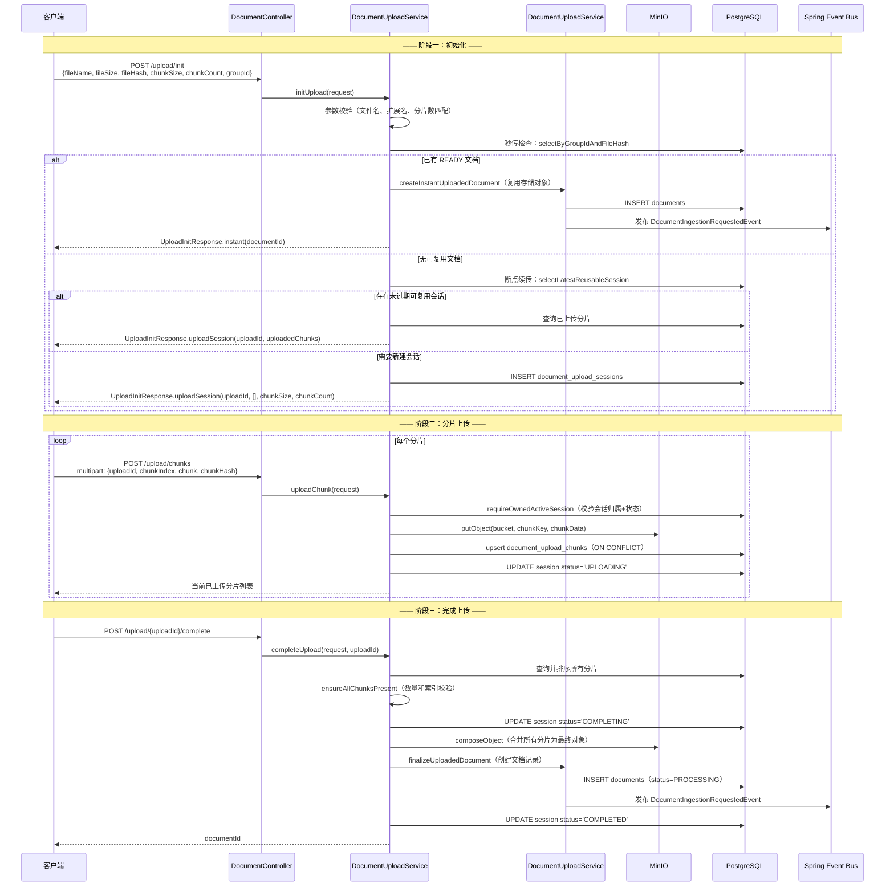
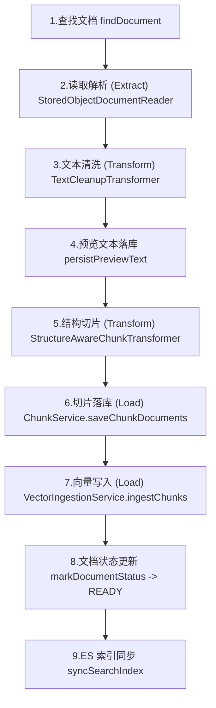
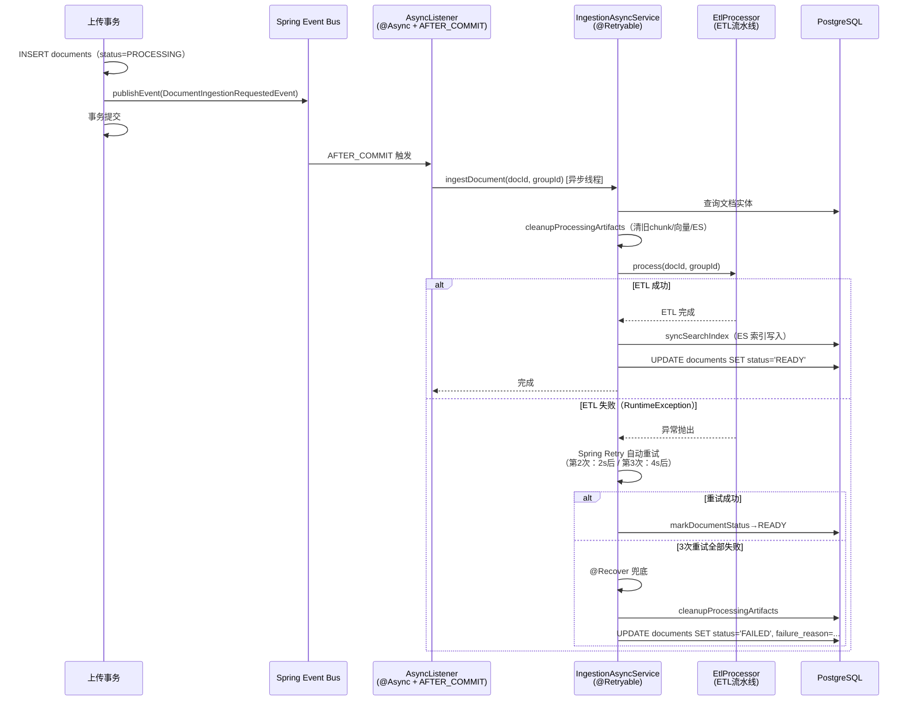
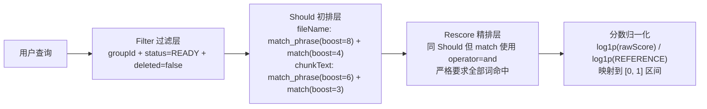

# Argus V2.0 核心设计决策

> 本文档是 [V2.0-项目文档.md](V2.0-项目文档.md) 的补充，详细阐述 V2.0 的 7 项核心设计决策及其背后的工程考量。
> 建议先阅读主文档了解项目全貌，再深入本文档理解每个决策的 WHY。

**相关文档**：[[V2.0-项目文档]] · [[V3.0-设计决策#5.0 问答接口全流程]] · [[RAG-核心原理图#3. 知识入库：ETL 流水线]] · [[RAG-核心原理图#3.4 结构感知切片策略]] · [[V3.0-项目文档]] · [[Home]]

---

## 1. 三阶段分片上传协议

V2.0 的文档上传支持两种模式：**直接上传**（`POST /api/documents/upload`，≤10MB，适用于小文件）和**分片上传**（init → chunk upload → complete，≤256MB，适用于大文件）。

### 为什么设计三阶段分片上传

这个设计决策源于五个现实问题，其中前三个是单次大文件 HTTP 上传的固有问题，后两个是业务场景的实际需求：

| 问题 | 单次上传的困境 | 分片上传的解决方式 |
|------|--------------|------------------|
| **网络不可靠** | 上传到 90% 时网络断开，整个文件必须重新上传 | 每个分片独立上传，断网只影响当前分片，重传 10MB 而非整个 256MB |
| **内存溢出风险** | 服务端需要将整个请求体加载到内存（Spring Boot 默认 `spring.servlet.multipart.max-file-size=1MB`），大文件直接 OOM | 每个分片 ≤10MB，服务端内存压力可控，multipart 表单字段级接收 |
| **无断点续传** | HTTP 请求是原子的——要么全部成功，要么全部失败，不存在"从 50% 继续"的概念 | 会话状态持久化到数据库，客户端可查询 `GET /upload/{uploadId}` 获取已完成分片列表，只上传缺失的分片 |
| **文件去重（秒传）** | 同一个文件被多个用户反复上传，浪费存储和 ETL 算力 | init 阶段通过 `(groupId, fileHash)` 哈希查重，已有 READY 文档时直接复用存储对象，零传输量完成上传 |
| **并发上传安全** | 同一个文件被同一用户并发上传两次，可能产生两份存储对象和重复文档记录 | init 阶段检测到相同哈希的未过期会话时，返回已有会话 ID，两个并发上传最终合并到同一个会话 |

**为什么不直接用云服务商的分片上传 API（如 S3 Multipart Upload）？** MinIO 的 `composeObject` API 允许在服务端将多个已有对象合并为一个新对象，无需下载分片再上传。相比 S3 Multipart Upload 的 `CreateMultipartUpload → UploadPart → CompleteMultipartUpload` 三步，项目选择了自己管理会话和分片元数据（存入 `document_upload_sessions` 和 `document_upload_chunks` 表），因为：

1. **秒传和断点续传需要跨请求的状态记忆**——MinIO 的 Multipart Upload 的 uploadId 有过期时间且不提供"按文件哈希查找已有 upload"的能力，无法独立实现秒传逻辑
2. **会话信息对业务层可见**——将上传会话存在数据库中，可以在上传全过程中进行权限校验（校验会话归属的 userId 和 groupId），云厂商的 uploadId 不具备这些业务上下文
3. **MinIO 的 `composeObject` 是服务端合并**——不需要客户端参与，也不需要服务端下载再上传，合并操作在 MinIO 内部完成，带宽消耗为零

### 客户端正常调用流程

以下是一个 50MB PDF 文件的完整上传示例。客户端选择 5MB 的分片大小，共 10 个分片：

**第一步：初始化上传会话**

客户端首先计算文件的 SHA-256 哈希，然后调用 init 接口声明上传意图。服务端在此阶段进行参数校验（文件名长度 ≤255、扩展名 `txt/md/pdf/docx`、分片数 = ceil(fileSize/chunkSize)）、秒传检查和断点续传会话查询。

```
POST /api/documents/upload/init
Content-Type: application/json

{
  "fileName": "技术方案.pdf",
  "fileSize": 52428800,
  "fileHash": "e3b0c44298fc1c149afbf4c8996fb924...",
  "chunkSize": 5242880,
  "chunkCount": 10,
  "groupId": 1
}

Response 200:
{
  "success": true,
  "data": {
    "type": "UPLOAD_SESSION",
    "uploadId": "a1b2c3d4e5f67890abcdef1234567890",
    "uploadedChunks": [],
    "chunkSize": 5242880,
    "chunkCount": 10
  },
  "message": "操作成功"
}
```

`type` 字段有三种可能：`INSTANT`（秒传，已有 `documentId`）、`UPLOAD_SESSION`（正常上传或断点续传）。客户端根据 `type` 决定下一步动作。

**第二步：并发上传分片**

客户端将文件切分为 10 个 5MB 分片，可以使用多个 HTTP 连接并发上传（推荐 3-6 个并发连接）。每片上传携带分片序号和哈希，服务端对每片进行：校验会话状态（`INIT` 或 `UPLOADING`）和归属（`uploaderUserId` 匹配）→ 上传 MinIO → 数据库 upsert 分片记录 → 更新会话状态为 `UPLOADING`。

```
POST /api/documents/upload/chunks
Content-Type: multipart/form-data

uploadId: a1b2c3d4e5f67890abcdef1234567890
chunkIndex: 0
chunkHash: sha256_of_chunk_0
chunk: <binary data of chunk 0>

Response 200:
{
  "success": true,
  "data": {
    "status": "UPLOADING",
    "uploadedChunks": [0],
    "uploadedCount": 1,
    "totalCount": 10
  },
  "message": "操作成功"
}
```

`uploadedChunks` 数组始终返回当前会话中已成功上传的所有分片序号。客户端应记录每次响应的 `uploadedChunks`，在全部提交后通过 `GET /api/documents/upload/{uploadId}` 确认是否所有分片都已到位，再进入完成阶段。

**第三步：完成上传**

当 `uploadedCount == totalCount` 后调用：

```
POST /api/documents/upload/a1b2c3d4e5f67890abcdef1234567890/complete

Response 200:
{
  "success": true,
  "data": 42,
  "message": "操作成功"
}
```

服务端在此阶段执行：校验所有分片数量正确且序号 0 到 chunkCount-1 连续 → 更新会话状态为 `COMPLETING` → 调用 MinIO `composeObject` 服务端合并所有分片为最终对象 → 委托 `DocumentUploadService.finalizeUploadedDocument()` 创建 `documents` 记录（状态为 `PROCESSING`）→ 发布异步 ETL 事件 → 更新会话状态为 `COMPLETED`。如果合并或文档创建失败，系统在 catch 块中尝试删除已合并的临时对象进行补偿。

### 协议自身的容错设计

协议在每个阶段都考虑了失败恢复：

**中间断开重连**：网络断开导致部分分片未上传 → 重新调用 `POST /upload/init`，服务端检测到相同 `(groupId, userId, fileHash)` 的未过期会话 → 返回已有 `uploadId` 和 `uploadedChunks: [0, 1, 3]` → 客户端从分片 2 开始继续上传。

**分片上传幂等**：分片上传响应超时（客户端不确定服务端是否收到）→ 安全地重新上传同一个分片，数据库 `ON CONFLICT (upload_id, chunk_index) DO UPDATE` 保证不会产生重复记录。

**会话过期**：24 小时内未完成上传的会话在 `selectLatestReusableSession` 查询中被 `expires_at > now()` 条件自动过滤 → 再次调用 init 时会创建全新的会话，旧会话的分片数据后续可通过定时任务清理。

**完成阶段失败**：如果合并或文档创建失败，MinIO 上已合并的临时对象会在 catch 块中被尝试删除，防止留下无主存储文件。文档元数据未入库（事务回滚），用户可以重新发起上传。



### 阶段一：初始化（`POST /upload/init`）

初始化是一个"决策"阶段，按优先级依次尝试三种策略：

1. **秒传**：使用 `(groupId, fileHash)` 查询是否已有 READY 状态的文档。如果存在，直接调用 `DocumentUploadService.createInstantUploadedDocument()` 复用已有的存储对象创建一条新的文档记录，无需任何实际上传。这本质上是一个"文件指针的复制"，而非文件内容的复制。

2. **断点续传**：如果不存在 READY 文档，查询是否有当前用户在同一群组内创建的、相同哈希的未过期会话。如果存在，返回该会话的 `uploadId` 和已完成的分片索引列表，客户端可以跳过已上传的分片，只上传缺失的部分。

3. **新建会话**：以上两种都不满足时，创建一个新的上传会话（`uploadId` 为 UUID 去横线），`expires_at` 设为 24 小时后。

### 阶段二：分片上传（`POST /upload/chunks`）

客户端可以并发上传多个分片。服务端对每个分片执行：校验会话状态和归属 → 上传 MinIO → upsert 分片记录。`ON CONFLICT (upload_id, chunk_index) DO UPDATE` 保证了分片上传的幂等性——同一个分片可以安全地重复上传，不会产生重复记录。

### 阶段三：完成上传（`POST /upload/{uploadId}/complete`）

这是最关键的阶段，需要保证原子性。流程为：校验所有分片数量正确且索引连续 → 调用 MinIO `composeObject` 服务端合并分片 → 委托 `DocumentUploadService.finalizeUploadedDocument()` 创建 `documents` 记录（状态为 PROCESSING）→ 发布异步 ETL 事件 → 标记会话为 COMPLETED。如果合并或文档创建失败，系统会尝试删除已合并的临时对象进行补偿清理。

---

## 2. 文档摄入 ETL 流水线设计

摄入流水线是整个 V2.0 中逻辑最复杂的模块，它负责将一份原始文档（存储在 MinIO 上的二进制文件）转化为可供检索的文本切片（存储在 PGvector 和 Elasticsearch 上的索引数据）。

### ETL 的触发：Spring Event 事件驱动

ETL 流水线不是由上传接口直接调用的——上传接口只负责将文件写入 MinIO 并将文档元数据写入数据库，然后通过 **Spring 事件机制** 异步触发 ETL。这种设计将"上传"和"处理"解耦为两个独立的执行单元，上传请求可以快速返回响应，ETL 在后台异步执行。

**事件发布的四个入口**：无论通过哪种方式上传文档，最终都会通过 `ApplicationEventPublisher` 发布 `DocumentIngestionRequestedEvent` 事件：

```java
// DocumentUploadService.java — 上传完成后的发布事件方法
private void publishIngestionRequestedEvent(Long documentId, Long groupId) {
    applicationEventPublisher.publishEvent(
        new DocumentIngestionRequestedEvent(documentId, groupId)
    );
}
```

事件发布被以下 **四个调用路径** 触发，覆盖了所有文档上传场景：

| 调用来源 | 触发场景 | 调用链 |
|---------|---------|--------|
| `DocumentUploadService.createInstantUploadedDocument()` | 秒传（相同哈希文件复用存储对象） | `DocumentUploadService.initUpload()` 检测到已有 READY 文档 → `createInstantUploadedDocument()` → `persistAndFinalizeUploadedDocument()` → 发布事件 |
| `DocumentUploadService.finalizeUploadedDocument()` | 分片上传完成合并 | `DocumentUploadService.completeUpload()` 合并分片后 → `finalizeUploadedDocument()` → `persistAndFinalizeUploadedDocument()` → 发布事件 |
| `DocumentUploadService.uploadDocument()` | 小文件直接上传 | `DocumentController` 接收文件 → `uploadDocument()` → `persistAndFinalizeUploadedDocument()` → 发布事件 |
| `DocumentDeleteService.retryFailedDocumentIngestion()` | 对 FAILED 文档手动重试 | `DocumentController` 接收重试请求 → `retryFailedDocumentIngestion()` 重置状态 → 发布事件 |

以上四个路径中，前三个最终都汇聚到 `DocumentUploadService` 中的同一个方法 `persistAndFinalizeUploadedDocument()`——它负责将文档元数据 INSERT 到 `documents` 表，然后**在同一个事务内**调用 `applicationEventPublisher.publishEvent()` 发布 `DocumentIngestionRequestedEvent` 事件。第四个路径（重试）由 `DocumentDeleteService` 在重置文档状态后直接发布事件。

**为什么使用事件而不是直接调用？** 如果在 `persistAndFinalizeUploadedDocument()` 中直接调用 ETL 方法，会导致：
1. ETL 的耗时（解析文档 + 切片 + 向量化 + ES 索引，可能数秒到数十秒）会阻塞上传请求的 HTTP 响应，客户端一直等待直到 ETL 完成
2. ETL 失败会回滚整个事务，导致已成功上传的文档元数据也被丢弃

使用 Spring Event 的 `@TransactionalEventListener(AFTER_COMMIT)` 机制，事件监听器只在**事务成功提交后**才执行。这意味着：文档元数据先落库并提交事务 → HTTP 响应立即返回给客户端 → ETL 在后台异步线程中执行。即使 ETL 失败，文档记录已经存在（状态会被标记为 FAILED），用户可以手动重试。

**事件的完整传递链路**：

```
DocumentUploadService.publishIngestionRequestedEvent()
  → ApplicationEventPublisher.publishEvent(new DocumentIngestionRequestedEvent(docId, groupId))
    → [事务提交]
      → DocumentIngestionAsyncListener.handle(event)    ← @TransactionalEventListener(AFTER_COMMIT) + @Async
        → DocumentIngestionAsyncService.ingestDocument(docId, groupId)  ← @Retryable(3次, 退避2s/4s/8s)
          → EtlDocumentIngestionProcessor.process(docId, groupId)       ← 9步ETL流水线
```

事件载体 `DocumentIngestionRequestedEvent` 是一个 Java `record`，只携带两个字段：

```java
// DocumentIngestionRequestedEvent.java
public record DocumentIngestionRequestedEvent(Long documentId, Long groupId) {}
```

监听器 `DocumentIngestionAsyncListener` 通过 `@Async` 注解运行在 Spring 管理的独立线程池中（不会阻塞 Tomcat 的请求处理线程），通过 `@TransactionalEventListener(phase = TransactionPhase.AFTER_COMMIT)` 确保只在数据库事务成功提交后才触发：

```java
// DocumentIngestionAsyncListener.java:42-46
@Async
@TransactionalEventListener(phase = TransactionPhase.AFTER_COMMIT)
public void handle(DocumentIngestionRequestedEvent event) {
    documentIngestionAsyncService.ingestDocument(event.documentId(), event.groupId());
}
```

### ETL 流水线的 9 个步骤

收到事件后，`DocumentIngestionAsyncService.ingestDocument()` 作为入口驱动以下 9 步流水线：



整个流水线由 `EtlDocumentIngestionProcessor.process(documentId, groupId)` 串联执行第 1-7 步，第 8-9 步由 `DocumentIngestionAsyncService.ingestDocument()` 本身完成。每一步完成后输出 INFO 级别日志，任何一步失败都会中断流水线并向上抛出 `RuntimeException`，触发 Spring Retry 的重试机制（详见第 3 节）。

### Extract：文档读取与解析

`StoredObjectDocumentReader` 封装了"从 MinIO 下载 → 检测编码 → 解析文档"的完整流程。它接收一个 `DocumentEntity`，从实体的 `storageBucket` 和 `storageObjectKey` 字段定位 MinIO 上的文件，下载后根据 `fileExt` 字段通过 `DocumentParserFactory` 选择对应的解析器。

`DocumentParserFactory` 采用**策略模式**，维护一个 `extension → parser` 的映射表。默认注册了四种解析器：

| 扩展名 | 解析器 | 实现 |
|--------|--------|------|
| txt | TxtDocumentParser | 直接读取文本，自动检测编码 |
| md | MdDocumentParser | 保留 Markdown 结构信息 |
| pdf | PdfDocumentParser | Apache PDFBox 提取文本 |
| docx | DocxDocumentParser | Apache POI 提取文本 |

`TextDecodingSupport` 在读取字节流时自动检测字符编码（UTF-8 / GBK / ISO-8859-1 等），避免中文文档因编码问题出现乱码。

### Transform：文本清洗

`TextCleanupTransformer` 对解析出的原始文本进行三级清洗：

1. **换行符统一**：`\r\n` 和 `\r` 统一转换为 `\n`
2. **控制字符移除**：过滤 ASCII 控制字符（`\x00-\x08`、`\x0B`、`\x0C`、`\x0E-\x1F`）
3. **空白压缩**：行内多个连续空格/制表符合并为单个空格，连续三个以上空行压缩为两个（保留段落分隔）
4. **代码块保护**：识别 Markdown 代码块分隔符（三个及以上连续的 `` ` `` 或 `~`），块内文本原样保留不做清洗

清洗后的文本被合并并截取前 200 个字符写入 `documents.preview_text` 字段，作为文档列表页的预览内容。

### Transform：结构感知切片

`StructureAwareChunkTransformer` 是切片策略的核心。它的设计目标是：**在满足 token 预算约束的前提下，尽可能保持语义完整性**。切片流程分为四个层级：

1. **按标题边界分节**：识别 Markdown ATX 标题（`#` ~ `######`），将文档按标题拆分为章节。代码块内的 `#` 行不会被误识别为标题。

2. **按段落边界分片**：对超过 `maxTokens`（默认 320）的章节，先按连续空行（段落分隔符）拆分为段落。

3. **按句子边界分片**：对超过 `maxTokens` 的段落，按中英文句子标点（`。！？；!?;`）进一步拆分。

4. **按字符数硬截断**：对仍然超长的片段，按 `maxTokens * CHARS_PER_TOKEN` 固定步长强制截断。

5. **贪心合并**：将拆分后的片段从相邻位置开始合并，目标是将每个切片填充到 `targetTokens`（默认 240），但不超过 `maxTokens`。相邻切片之间保留 `overlapTokens`（默认 32）的重叠区间，防止语义在切片边界处断裂。

切片参数通过 `ChunkingProperties`（`@ConfigurationProperties(prefix = "ingestion.chunking")`）配置，支持按环境调整：

```yaml
ingestion:
  chunking:
    target-tokens: 240     # 目标切片大小（贪心合并的上限）
    max-tokens: 320        # 最大切片大小（硬截断的触发点）
    overlap-tokens: 32     # 相邻切片的字符重叠区间
```

### Load：切片持久化与主键回填

`ChunkService.saveChunkDocuments()` 负责将 Spring AI `Document` 切片列表转换为 `DocumentChunkEntity` 并持久化到数据库。处理流程为：校验参数 → 构建实体列表（生成摘要、计算字符位置、序列化元数据 JSON）→ 删除旧切片 → 按 PostgreSQL 参数上限（65535）分批 INSERT → 从数据库反查自增主键并按 `chunkIndex` 回填到内存实体。

主键回填是一个关键步骤——后续的 `VectorIngestionService` 需要切片的数据库 ID 来生成向量的稳定标识（`UUID.nameUUIDFromBytes(documentId + ":" + chunkIndex)`），如果切片没有落库 ID，向量写入必须失败（这是一个显式的防御式校验）。

### Load：向量写入与 ES 索引同步

`VectorIngestionService.ingestChunks()` 将切片批量写入 PGvector。流程为：校验切片已落库（`chunk.getId() != null`）→ 按文档维度幂等删除旧向量（`DELETE WHERE documentId = ?`）→ 将切片转换为 Spring AI `Document`（含 ID、文本、元数据）→ 按 `addBatchSize`（默认 9）分批调用 `vectorStore.add()`。

`ElasticsearchChunkIndexService.indexReadyChunks()` 在 ETL 成功后将切片同步到 ES 关键词索引。它使用 `PUT /index/_doc/{chunkId}` 逐条写入，相同 `chunkId` 天然幂等覆盖。

---

## 3. 异步执行与重试机制

V2.0 的文档摄入采用了**Spring Event + @Async + 数据库事务提交后触发**的异步模式，核心链路为：

```
DocumentUploadService.uploadDocument()
  → 事务提交
    → @TransactionalEventListener(AFTER_COMMIT)
      → @Async 线程池
        → DocumentIngestionAsyncService.ingestDocument()
          → @Retryable（最多3次，退避2s/4s/8s）
            → @Recover（全部失败后的兜底）
```



**为什么使用 `@TransactionalEventListener(AFTER_COMMIT)` 而非 `@EventListener`？** 这是为了避免"文档记录尚未提交到数据库就开始 ETL"的竞态条件。`AFTER_COMMIT` 阶段保证当 ETL 处理器查询 `documents` 表时，上传事务已经提交，文档记录对异步线程可见。

**为什么使用 Spring Retry 而非手写重试循环？** `@Retryable` 注解以声明式的方式定义了重试策略，`@Recover` 注解提供了清晰的兜底路径。这种模式比嵌入业务逻辑中的 `for` 循环重试更易于测试和维护。

**中间产物清理** 是重试正确性的保障。每次 `ingestDocument()` 开始时都会尝试删除该文档 ID 下的旧 chunk 记录、旧向量数据和旧 ES 索引。清理失败不会中断流程（仅记录 WARN 日志），因为旧数据的存在不会影响新数据的写入（向量写入前也会幂等删除）。

---

## 4. 多提供者 LLM 配置

V2.0 最重要的基础设施升级是采用**多提供者分离配置**的 LLM 集成方案。通过在 `application.yml` 中配置 `spring.ai.model.chat` 和 `spring.ai.model.embedding` 两个属性，将 Chat 模型和 Embedding 模型分配给不同的提供者：

```yaml
spring:
  ai:
    model:
      chat: dashscope        # Chat 使用 DashScope 原生 API
      embedding: openai       # Embedding 使用 OpenAI 兼容模式
    dashscope:
      api-key: ${DASHSCOPE_API_KEY}
      chat:
        options:
          model: qwen-plus
    openai:
      api-key: ${OPENAI_API_KEY}
      base-url: https://dashscope.aliyuncs.com/compatible-mode
      embedding:
        options:
          dimensions: 512
          model: text-embedding-v3
          truncate: true
```

这个设计解决了两个实际问题：

1. **DashScope 原生 API 的优势在 Chat**：DashScope 的 Chat API 提供了更丰富的参数控制（如温度、top_p、流式输出等），使用原生集成可以充分利用这些特性。

2. **OpenAI 兼容模式的优势在 Embedding**：DashScope 的 text-embedding-v3 模型提供了与 OpenAI 兼容的 API 端点（`/compatible-mode`），而 Spring AI 的 OpenAI embedding 客户端对 embedding 请求的批量处理、维度指定、截断策略等已有成熟实现。复用这套实现避免了重复造轮子。

**Embedding 维度与 PGvector 的对齐**：`dimensions: 512` 同时配置在 OpenAI embedding 选项和 PGvector 向量存储选项中（`spring.ai.vectorstore.pgvector.dimensions=512`）。这两个配置必须一致——embedding 模型输出的向量维度决定了 PGvector 表结构中的向量列定义。不一致会导致写入失败。

---

## 5. 双路检索架构

V2.0 的检索模块实现了**向量语义检索**和**关键词全文检索**两路独立的召回通道，虽然当前版本尚未实现结果融合，但两路通道各自的实现已经完备。

### 向量语义检索（PgVectorRetrievalAdapter）

封装了 Spring AI `VectorStore` 接口的 `similaritySearch()` 方法。在基本的向量相似度搜索之上，增加了两层安全保障：

1. **FilterExpression 过滤**：通过 `new FilterExpressionBuilder().eq("groupId", groupId).build()` 在 PGvector 查询层面添加 groupId 过滤条件，确保只检索当前群组内的切片。

2. **防御式二次校验**：返回结果中的每条记录都会在 `toVectorHit()` 方法中再次校验 `groupId` 是否与请求一致。这是一种防御式编程——即使向量数据库因 Bug 返回了跨群组数据，业务层也会立即检测到并抛出异常，将"数据泄露"转化为"服务报错"。

3. **元数据类型兼容**：`requireLong()` 和 `requireInteger()` 方法同时兼容 `Number` 和 `String` 两种元数据类型，适配不同 PGvector 驱动版本可能产生的类型差异。

### 关键词全文检索（ElasticsearchChunkIndexService）

`ElasticsearchChunkIndexService` 同时承担了**索引管理**和**关键词检索**两大职责，通过 JDK 原生 `HttpClient` 直接调用 ES REST API，无任何第三方 ES 客户端依赖。

**索引管理**：在首次写入或查询时通过双重检查锁定（DCL）模式确保索引存在。索引使用自定义的 IK 中文分词器配置：
- `ddrag_ik_index` —— 索引端使用 `ik_max_word`（最大切分），提高召回覆盖率
- `ddrag_ik_search` —— 查询端使用 `ik_smart`（智能切分），提高精确度

**两阶段打分策略**：



- **Filter 层**：`term` 查询精确过滤，保证安全性和数据范围
- **Should 初排层**：4 个打分维度（文件名短语/分词 + 内容短语/分词），权重递减
- **Rescore 精排层**：用更严格的 `operator=and` 对初排结果二次打分，修正位置偏差
- **分数归一化**：`min(1.0, log1p(rawScore) / log1p(100))` —— 将 BM25 无上限的原始分数压缩到 [0, 1] 区间

**降级策略**：ES 不可用时（连接超时、索引不存在等），`search()` 方法不会抛出异常，而是记录 WARN 日志后返回空列表。这是为了保证服务的整体可用性——即使 ES 宕机，向量检索链路仍然可以正常工作。

---

## 6. MinIO 对象存储集成

V2.0 引入了 MinIO 作为文档文件的持久化存储。`ObjectStorageService` 接口定义了五个核心操作：`putObject`（上传）、`getObject`（下载为流）、`deleteObject`（删除）、`composeObject`（服务端合并分片）、`getDefaultBucket()`（获取默认桶名）。`MinioStorageService` 是其在 MinIO 上的实现。

```java
// ObjectStorageService 接口（简化）
public interface ObjectStorageService {
    void putObject(String bucket, String objectKey, InputStream stream, long size, String contentType);
    InputStream getObject(String bucket, String objectKey);
    void deleteObject(String bucket, String objectKey);
    void composeObject(String bucket, String targetKey, List<String> sourceKeys, String contentType);
    String getDefaultBucket();
}
```

**条件装配**：`MinioStorageService` 使用 `@ConditionalOnProperty("storage.minio.endpoint")` 进行条件装配。只有在配置文件中设置了 MinIO endpoint 时，Bean 才会被创建。这使得项目可以在没有 MinIO 的环境下（如仅运行认证和群组相关的测试）正常启动。

**Object Key 命名规范**：遵循 `groups/{groupId}/users/{userId}/{uuid}.{ext}` 的层级结构，便于按群组和用户进行存储空间管理和审计。

**分片合并**的实现利用了 MinIO 的 `composeObject` API——该操作在 MinIO 服务端完成，无需下载分片后再上传，节省了大量带宽和时间。

---

## 7. 分片补偿与失败恢复

V2.0 在多个层面实现了失败场景的补偿处理：

**上传链路补偿**：`DocumentUploadService.uploadDocument()` 在上传文件到 MinIO 成功后、文档元数据入库失败时，会调用 `compensateUploadedObject()` 删除已上传的对象存储文件，同时清理可能已写入的外部索引（向量和 ES）。补偿清理的异常会被附加到原始异常（`addSuppressed`）上，不会吞噬原始错误。

**ETL 重试前清理**：`DocumentIngestionAsyncService.cleanupProcessingArtifacts()`（位于 `ingestion.service` 包）在每次 ETL 执行前清理该文档 ID 下的旧 chunk、旧向量、旧 ES 索引。每项清理失败时仅记录 WARN 日志，不中断其他项的清理。这种"尽力而为"的清理策略平衡了正确性和鲁棒性。

**合并失败补偿**：`DocumentUploadService.completeUpload()` 在分片合并或文档持久化失败时，在 `catch` 块中尝试删除已合并的临时对象，防止留下无主存储文件。

**过期会话处理**：上传会话在 24 小时后自动过期，数据库查询中通过 `expires_at > now()` 条件过滤。过期的上传会话及其关联的分片数据可以通过定时任务清理（该任务暂未实现，属于运维优化范畴）。

---

> 本文档随项目代码同步更新，每次版本迭代后需同步修订设计决策的细节和架构图。
