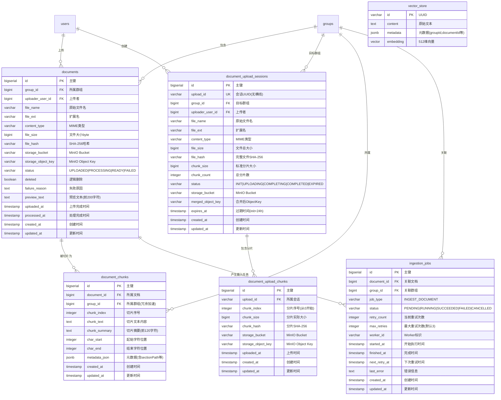

# Argus 项目文档 V2.0

> Argus 是一个 **RAG 知识库平台** 的教学项目，从零搭建，逐步迭代。
> V2.0 在 V1.0（用户认证 + 群组管理）的基础上，新增了**文档上传与管理**、**文档摄入 ETL 流水线**、**多提供者 LLM 配置**以及**向量/关键词双路检索**四大核心板块。

**相关文档**：[[V2.0-设计决策]] · [[V1.0-项目文档]] · [[V3.0-项目文档]] · [[RAG-核心原理图#3. 知识入库：ETL 流水线]] · [[启动流程与配置加载说明]] · [[Home]]

---

## 一、项目概述

### 1.1 V2.0 定位

V1.0 建立起了用户认证体系和群组成员管理的稳固底座。V2.0 在此之上向上延伸，打通了"文档上传 → 异步摄入 → 向量/关键词索引 → 双路检索"的完整数据链路。这意味着平台的核心闭环——**用户将文档放入知识库，系统自动解析和索引，后续可通过语义和关键词进行检索**——在 V2.0 阶段已经成型。

V2.0 同时完成了一次重要的基础设施升级：从 Spring AI 迁移到 **Spring AI Alibaba**，并采用了 **Chat / Embedding 分离提供者** 的多模型配置方案，为下一阶段的 RAG 对话做好了准备。

### 1.2 V2.0 新增功能清单

| 模块 | 功能 | 状态 |
|------|------|------|
| 文档上传 | 分片上传协议（init → chunk upload → complete） | 完成 |
| 文档上传 | 秒传检测（SHA-256 哈希查重） | 完成 |
| 文档上传 | 断点续传（会话复用，24h 有效期） | 完成 |
| 文档上传 | 小文件直接上传（≤10MB，无需分片） | 完成 |
| 文档管理 | 文档列表查询（按群组、状态、文件名、上传者筛选） | 完成 |
| 文档管理 | 文档预览（前 200 字符） | 完成 |
| 文档管理 | 文档下载（代理 MinIO 流式返回） | 完成 |
| 文档管理 | 文档软删除（连带清理向量 + ES 索引） | 完成 |
| 文档管理 | 失败文档重新处理（retry-ingestion） | 完成 |
| 文档摄入 | 多格式文档解析（PDF、DOCX、MD、TXT） | 完成 |
| 文档摄入 | 字符编码自动检测 | 完成 |
| 文档摄入 | 文本清洗（控制字符过滤、冗余空白压缩、代码块保护） | 完成 |
| 文档摄入 | 结构感知切片（标题边界 + 段落边界 + token 预算控制） | 完成 |
| 文档摄入 | 切片元数据持久化（charStart/charEnd/sectionPath/chunkStrategy） | 完成 |
| 文档摄入 | 向量化写入 PGvector（text-embedding-v3, 512 维, COSINE_DISTANCE） | 完成 |
| 文档摄入 | 关键词索引写入 Elasticsearch（IK 中文分词, 两阶段打分） | 完成 |
| 文档摄入 | 异步 Worker 调度（Spring Event + 数据库轮询 + 原子状态机） | 完成 |
| 文档摄入 | 失败重试与兜底恢复（Spring Retry, 3 次退避, @Recover） | 完成 |
| 文档摄入 | 中间产物清理（旧 chunk / 向量 / ES 索引） | 完成 |
| 检索召回 | 向量语义检索（HNSW 索引, COSINE_DISTANCE, groupId 过滤） | 完成 |
| 检索召回 | 关键词全文检索（IK 分词, bool 初排 + rescore 精排, 分数归一化） | 完成 |
| 检索召回 | 搜索结果降级（ES 不可用时返回空列表，不中断服务） | 完成 |
| 基础设施 | Spring AI Alibaba 迁移（DashScope 原生 + OpenAI 兼容模式） | 完成 |
| 基础设施 | 多提供者 LLM 配置（spring.ai.model.chat / embedding 分离） | 完成 |
| 基础设施 | MinIO 对象存储集成（@ConditionalOnProperty 按需启用） | 完成 |
| 基础设施 | PGvector 向量存储（HNSW 索引, 512 维, 自动建表） | 完成 |
| 基础设施 | Elasticsearch 关键词索引（IK 分词器, JDK HttpClient 直连） | 完成 |

---

## 二、技术栈

### 2.1 完整技术栈

| 层次 | 技术 | 版本 | 说明 |
|------|------|------|------|
| 语言 | Java | 21 | record 语法、虚拟线程、模式匹配 |
| 框架 | Spring Boot | 3.5.0 | Jakarta EE 9+ 命名空间 |
| 构建 | Maven + mvnw | 3.9.14 | Wrapper 机制，无需预装 Maven |
| 数据库 | PostgreSQL | - | 关系型主存储，支持行锁、JSONB、pgvector 扩展 |
| ORM | MyBatis-Plus | 3.5.15 | Lambda 类型安全查询、自动回填主键、EnumTypeHandler |
| 接口文档 | Knife4j + SpringDoc | 4.5.0 + 2.8.10 | `/doc.html` 增强 UI，JWT Bearer 鉴权 |
| 认证 | JJWT | 0.12.6 | HMAC-SHA256 JWT 签发与解析 |
| 密码加密 | Spring Security Crypto | - | BCrypt 自适应哈希算法 |
| AI 框架 | Spring AI Alibaba | 1.1.2.0 | DashScope 原生集成，Chat 模型调用 |
| AI 框架 | Spring AI | 1.1.2 | 向量存储抽象、OpenAI 兼容 Embedding 客户端 |
| 对象存储 | MinIO | - | S3 兼容，本地化部署，`composeObject` 合并分片 |
| 向量数据库 | PGvector | - | PostgreSQL 向量扩展，HNSW 近似最近邻索引 |
| 搜索引擎 | Elasticsearch | - | IK 中文分词器，两阶段 bool + rescore 打分 |
| 文档解析 | Apache PDFBox | - | PDF 文本提取 |
| 文档解析 | Apache POI | - | DOCX 文本提取 |
| 重试框架 | Spring Retry | - | `@Retryable` + `@Recover` 注解驱动重试 |
| 工具 | Lombok | 1.18.34 | `@Slf4j`、`@Data`，消除样板代码 |

### 2.2 依赖关系说明

V2.0 的依赖选择延续了 V1.0"按需引入、最小依赖"的原则。以下是 V2.0 新增依赖的选用考量：

**AI 框架方面**，项目在 Spring AI 与 Spring AI Alibaba 之间选择了后者。Spring AI Alibaba 并不是 Spring AI 的"增强版"——两者定位不同。Spring AI 提供了通用的 AI 集成抽象层（`VectorStore` 接口、`Document` 模型、`EmbeddingClient` 等），而 Spring AI Alibaba 在复用这些抽象的基础上，额外提供了阿里云 DashScope 的原生集成和更符合国内开发习惯的自动配置。项目同时引入了两个 BOM（版本对齐至 1.1.2），利用 Spring AI 的向量存储抽象来驱动 PGvector，利用 Spring AI Alibaba 的 DashScope starter 来调用 Chat 模型。

**Embedding 模型**没有使用 DashScope 原生 API，而是通过 DashScope 的 OpenAI 兼容接口（`https://dashscope.aliyuncs.com/compatible-mode`）调用。这是因为 Spring AI 的 OpenAI embedding 客户端已经非常成熟，通过 `spring.ai.model.embedding=openai` 将 Chat 和 Embedding 分离到不同的提供者，可以同时享受 DashScope 国内低延迟链路和 Spring AI 的稳定客户端实现。

**对象存储**选择了 MinIO 而非云厂商的 OSS/S3 服务。这是因为项目定位为教学项目，需要开发者能够在本地环境完整运行所有服务。MinIO 提供与 S3 完全兼容的 API，后续迁移到云 S3 时只需修改 endpoint 配置，代码无需任何变动。`MinioStorageService` 通过 `@ConditionalOnProperty("storage.minio.endpoint")` 条件装配，未配置时不会注册 Bean，不会影响仅需数据库功能的场景。

**搜索引擎**选择了 Elasticsearch 而非继续用 PostgreSQL 的全文检索。PGvector 的向量检索解决了语义匹配问题，但对于精确的关键词匹配（如文件名搜索、专业术语精确命中），基于 BM25 算法的全文检索引擎仍有不可替代的优势。项目采用了**零第三方客户端依赖**的策略——通过 JDK 自带的 `HttpClient` 直接调用 ES 的 REST API，避免了 ES Java 客户端版本冲突和依赖膨胀的问题。

**重试机制**引入了 Spring Retry，通过 `@Retryable` 注解以声明式的方式对 ETL 流程进行重试。这比手写 `for` 循环重试更加简洁，且 `@Recover` 注解提供了优雅的兜底处理路径。

```
spring-boot-starter-web                    ← REST API 核心（V1.0 已有）
mybatis-plus-spring-boot3-starter          ← 数据库 ORM（V1.0 已有）
spring-ai-alibaba-starter-dashscope        ← DashScope Chat 模型（V2.0 新增）
spring-ai-starter-model-openai             ← OpenAI 兼容 Embedding（V2.0 新增）
spring-ai-starter-vector-store-pgvector    ← PGvector 向量存储自动配置（V2.0 新增）
spring-retry                               ← 声明式重试（V2.0 新增）
minio                                      ← S3 兼容对象存储（V2.0 新增）
pdfbox + poi + poi-ooxml                   ← 多格式文档解析（V2.0 新增）
```

---

## 三、项目结构（V2.0 完整视图）

```
Argus/
├── sql/
│   └── schema.sql                               # 数据库建表 DDL（10 张表）
├── docs/
│   ├── project-init.md                          # 项目初始化文档
│   ├── V1.0-项目文档.md                          # V1.0 技术文档
│   └── V2.0-项目文档.md                          # 本文档
└── Argus-backend/
    ├── pom.xml                                  # Maven 依赖配置
    ├── mvnw / mvnw.cmd                          # Maven Wrapper
    └── src/main/
        ├── resources/
        │   ├── application.yml                   # 公共配置（MyBatis-Plus、枚举处理器）
        │   ├── application-local.yml             # 本地环境（端口 10001、PG、MinIO、ES）
        │   ├── application-dev.yml               # 开发环境（端口 10008、DashScope + OpenAI）
        │   ├── logback-spring.xml                # 日志配置
        │   ├── mappers/                          # 通用 Mapper XML
        │   │   ├── UserMapper.xml
        │   │   ├── GroupMembershipMapper.xml
        │   │   └── GroupJoinRequestMapper.xml
        │   ├── document/                         # 文档模块 Mapper XML
        │   │   ├── DocumentMapper.xml
        │   │   ├── DocumentUploadSessionMapper.xml
        │   │   └── DocumentUploadChunkMapper.xml
        │   └── ingestion/                        # 摄入模块 Mapper XML
        │       ├── DocumentChunkMapper.xml
        │       └── IngestionJobMapper.xml
        └── java/com/argus/rag/
            ├── ArgusBackendApplication.java      # 启动类
            ├── common/                           # 共享基础设施（V1.0 已有）
            │   ├── api/ApiResponse.java
            │   ├── config/OpenApiConfiguration.java
            │   ├── enums/                        # 枚举（含 V2.0 新增的 DocumentStatus、
            │   │                                  # IngestionJobStatus、IngestionJobType）
            │   ├── exception/                    # 全局异常处理
            │   └── log/                          # @OperationLog AOP
            ├── auth/                             # 认证授权模块（V1.0 已有）
            │   ├── config/                       # AuthProperties、AuthConfiguration
            │   ├── controller/AuthController     # /api/auth/*
            │   ├── service/                      # AuthService、PasswordHasher
            │   ├── security/                     # JWT Filter、Token Service、UserContext
            │   ├── model/                        # dto/vo/entity
            │   ├── mapper/UserRefreshTokenMapper
            │   └── CurrentUserService
            ├── user/                             # 用户管理模块（V1.0 已有）
            ├── group/                             # 群组成员管理（V1.0 已有）
            │
            ├── engine/                           # ───── V2.0 新增：检索引擎与对象存储模块 ─────
            │   ├── elasticsearch/
            │   │   └── ElasticsearchChunkIndexService   # IK 分词关键词检索 + 索引管理
            │   ├── pgvector/
            │   │   └── PgVectorRetrievalAdapter         # 向量语义检索适配器
            │   └── storage/
            │       ├── ObjectStorageService      # 对象存储接口（put/get/delete/compose）
            │       └── MinioStorageService       # MinIO 实现（@ConditionalOnProperty）
            │
            ├── document/                         # ───── V2.0 新增：文档模块 ─────
            │   ├── controller/DocumentController # /api/documents/*（10 个端点）
            │   ├── service/
            │   │   ├── DocumentUploadService     # 文档上传（直接上传 + 分片上传：init/chunk/complete + 秒传/续传）
            │   │   ├── DocumentQueryService      # 文档列表查询
            │   │   ├── DocumentDeleteService     # 文档软删除 + 失败文档重处理
            │   │   ├── DocumentPreviewService    # 文档预览
            │   │   ├── DocumentDownloadService   # 文档下载
            │   │   ├── DocumentIngestionAsyncListener   # Spring Event 监听（@Async + AFTER_COMMIT）
            │   │   └── DocumentIngestionRequestedEvent  # 摄入事件 record
            │   ├── mapper/
            │   │   ├── DocumentMapper            # BaseMapper + 可读文档查询 + 逻辑删除
            │   │   ├── DocumentUploadSessionMapper # 上传会话 CRUD + 可复用会话查询
            │   │   └── DocumentUploadChunkMapper   # 分片 upsert（ON CONFLICT）
            │   └── model/
            │       ├── dto/                      # UploadInitRequest、UploadChunkRequest 等
            │       ├── vo/                       # DocumentListItemVO、UploadInitResponse 等
            │       └── entity/                   # DocumentEntity、UploadSession、UploadChunk
            │
            ├── ingestion/                        # ───── V2.0 新增：摄入流水线模块 ─────
            │   ├── mapper/
            │   │   ├── DocumentChunkMapper       # 切片 CRUD + 就绪切片关联查询
            │   │   └── IngestionJobMapper        # 任务原子状态切换
            │   ├── model/entity/
            │   │   ├── DocumentChunkEntity       # 文档切片实体
            │   │   └── IngestionJobEntity        # 摄入任务实体
            │   ├── service/
            │   │   ├── DocumentIngestionProcessor        # 摄入处理接口
            │   │   ├── EtlDocumentIngestionProcessor     # ETL 实现（7 步流水线）
            │   │   ├── DocumentIngestionAsyncService     # ETL 异步执行（@Retryable + @Recover）
            │   │   └── pipeline/
            │   │       ├── ChunkService                  # 切片持久化与主键回填
            │   │       ├── reader/StoredObjectDocumentReader    # 从 MinIO 读取并解析文档
            │   │       ├── parser/
            │   │       │   ├── DocumentParserFactory     # 策略工厂（扩展名 → 解析器）
            │   │       │   ├── DocumentParser            # 解析器接口
            │   │       │   ├── PdfDocumentParser         # PDFBox 实现
            │   │       │   ├── DocxDocumentParser        # POI 实现
            │   │       │   ├── TxtDocumentParser         # 纯文本实现
            │   │       │   ├── MdDocumentParser          # Markdown 实现
            │   │       │   └── TextDecodingSupport       # 字符编码自动检测
            │   │       └── transformer/
            │   │           ├── ChunkingProperties        # 切片参数配置（@ConfigurationProperties）
            │   │           ├── TextCleanupTransformer    # 文本清洗（控制字符、空白压缩）
            │   │           └── StructureAwareChunkTransformer  # 结构感知切片（标题+段落+句子）
            │   ├── vector/VectorIngestionService # 向量化写入（批量 embedding + 幂等删除）
            │   └── config/DocumentIngestionConfiguration  # ETL 流水线 Bean 装配
            │
            └── engine/                           # ───── V2.0 新增（已合并至上层）：检索引擎与对象存储模块 ─────
```

V2.0 新增了 3 个顶级模块：`engine`（检索引擎 + 对象存储）、`document`（文档生命周期管理）、`ingestion`（ETL 摄入流水线）。这些模块的划分遵循了与 V1.0 相同的"按业务领域垂直切分"原则，内部同样按"控制器 → 服务 → 数据访问"三层架构水平分层。

`document` 模块是 V2.0 中最大的模块，它独立承载了文档上传（直接上传 + 分片上传）、文档管理（列表/预览/下载/删除/重处理）以及异步 ETL 触发的完整生命周期。V4.0 重构时将原来的 `DocumentService`（798 行）按功能拆分为 5 个独立服务：`DocumentUploadService`（上传）、`DocumentQueryService`（查询）、`DocumentDeleteService`（删除与重处理）、`DocumentPreviewService`（预览）、`DocumentDownloadService`（下载）。`ingestion` 模块专责对文档内容的处理——解析、清洗、切片、向量化和关键词索引写入——它与 `document` 模块通过 Spring Event 机制解耦，两者之间没有直接的代码依赖，只有事件消息的传递。`DocumentIngestionAsyncService` 也从 `document.service` 迁移至 `ingestion.service`。`engine` 模块统一封装了向量检索、ES 关键词检索和 MinIO 对象存储，对外提供一致的检索与存储能力。

---

## 四、数据库设计（V2.0 新增）

V2.0 新增 7 张业务表，加上 V1.0 已有的 3 张（`users`、`user_refresh_tokens`、`groups`、`group_memberships`、`group_invitations`、`group_join_requests`），以及 PGvector 自动管理的 `vector_store` 表，项目数据库共包含 10 张业务表 + 1 张向量表。

### 4.1 整体 ER 图（V2.0 扩展）



### 4.2 documents 表字段说明

`documents` 表是文档模块的核心表，存储了所有上传文档的元数据和生命周期状态。设计上区分了"业务字段"和"存储字段"：`file_name`、`file_ext`、`content_type`、`file_size` 等是文档的业务属性，对用户可见；`storage_bucket`、`storage_object_key` 是对象存储的内部寻址信息，仅服务端使用，永远不通过 API 直接暴露。

`file_hash` 字段（SHA-256）是实现秒传和去重的关键——同一个群组内，相同哈希的 READY 文档不会占用双倍的存储空间，新上传会直接复用已有的存储对象。`deleted` 字段实现逻辑删除，删除操作不会立即清除数据和文件，而是在数据库中标记为已删除并从检索结果中排除。

`preview_text` 字段存储文档前 200 个字符的文本内容，在 ETL 流程的"文本清洗"阶段写入，用于文档列表页的快速预览，避免每次都从对象存储下载完整文件。

| 字段 | 类型 | 约束 | 说明 |
|------|------|------|------|
| id | BIGSERIAL | PK | 自增主键 |
| group_id | BIGINT | NOT NULL, FK | 所属群组 ID |
| uploader_user_id | BIGINT | NOT NULL, FK | 上传者用户 ID |
| file_name | VARCHAR(512) | NOT NULL | 原始文件名（经路径清洗） |
| file_ext | VARCHAR(32) | NOT NULL | 文件扩展名（小写，不含点） |
| content_type | VARCHAR(128) | NOT NULL | MIME 类型，默认 application/octet-stream |
| file_size | BIGINT | NOT NULL | 文件大小（字节） |
| file_hash | VARCHAR(128) | - | SHA-256 文件哈希 |
| storage_bucket | VARCHAR(128) | NOT NULL | MinIO Bucket 名称 |
| storage_object_key | VARCHAR(512) | NOT NULL | MinIO Object Key |
| status | VARCHAR(16) | NOT NULL, DEFAULT 'UPLOADED' | 处理状态：UPLOADED / PROCESSING / READY / FAILED |
| deleted | BOOLEAN | NOT NULL, DEFAULT FALSE | 逻辑删除标记 |
| failure_reason | TEXT | - | 处理失败原因（截断至 512 字符） |
| preview_text | TEXT | - | 文档预览文本（前 200 字符） |
| uploaded_at | TIMESTAMP | - | 上传完成时间 |
| processed_at | TIMESTAMP | - | 处理完成时间 |
| created_at | TIMESTAMP | NOT NULL, DEFAULT now() | 创建时间 |
| updated_at | TIMESTAMP | NOT NULL, DEFAULT now() | 更新时间 |

**索引设计**：
- `idx_documents_group_deleted (group_id, deleted)` —— 按群组查询文档列表（最频繁使用的查询路径）
- `idx_documents_group_hash (group_id, file_hash) WHERE status='READY' AND deleted=false` —— 部分索引，仅对 READY 文档生效，秒传查重的核心
- `idx_documents_status (status, deleted)` —— 查询处理中或失败的文档
- `idx_documents_uploader (uploader_user_id)` —— 按上传者筛选

### 4.3 document_upload_sessions 表字段说明

`document_upload_sessions` 表管理分片上传会话的完整生命周期。每个会话记录了一个文件上传过程中的全部元信息——从初始化时的文件基本信息，到上传完成后的合并对象路径。会话通过 `upload_id`（UUID 去横线）唯一标识，客户端在整个上传流程中使用这个 ID 来关联分片和查询进度。

`status` 字段控制会话的状态流转：`INIT`（已初始化，等待分片上传）→ `UPLOADING`（分片上传中）→ `COMPLETING`（分片合并中）→ `COMPLETED`（已完成）。`EXPIRED` 是一个隐式状态——会话的 `expires_at` 字段在创建时被设为 24 小时后，过期的会话在"可复用会话"查询中会被 `expires_at > now()` 条件自动过滤。

| 字段 | 类型 | 约束 | 说明 |
|------|------|------|------|
| id | BIGSERIAL | PK | 自增主键 |
| upload_id | VARCHAR(64) | NOT NULL, UNIQUE | 上传会话 UUID（无横线） |
| group_id | BIGINT | NOT NULL, FK | 目标群组 ID |
| uploader_user_id | BIGINT | NOT NULL, FK | 上传者用户 ID |
| file_name | VARCHAR(512) | NOT NULL | 原始文件名 |
| file_ext | VARCHAR(32) | NOT NULL | 文件扩展名 |
| content_type | VARCHAR(128) | NOT NULL | MIME 类型 |
| file_size | BIGINT | NOT NULL | 文件总大小（字节） |
| file_hash | VARCHAR(128) | NOT NULL | 完整文件 SHA-256 哈希 |
| chunk_size | BIGINT | NOT NULL | 每个分片的标准大小（最大 10MB） |
| chunk_count | INTEGER | NOT NULL | 总分片数（由 fileSize/chunkSize 向上取整） |
| status | VARCHAR(16) | NOT NULL, DEFAULT 'INIT' | INIT / UPLOADING / COMPLETING / COMPLETED |
| storage_bucket | VARCHAR(128) | NOT NULL | MinIO Bucket 名称 |
| merged_object_key | VARCHAR(512) | - | 合并后的最终 Object Key（完成后写入） |
| expires_at | TIMESTAMP | NOT NULL | 会话过期时间（init 后 24h） |
| created_at | TIMESTAMP | NOT NULL, DEFAULT now() | 创建时间 |
| updated_at | TIMESTAMP | NOT NULL, DEFAULT now() | 更新时间 |

**索引设计**：
- `idx_upload_session_reusable (group_id, uploader_user_id, file_hash, status, expires_at)` —— 断点续传会话复用查询，按群组+上传者+文件哈希查找可复用的未过期会话

### 4.4 document_upload_chunks 表字段说明

`document_upload_chunks` 表记录每个上传会话中的分片元数据。该表使用了 PostgreSQL 的 `ON CONFLICT ... DO UPDATE`（upsert）语法，以 `(upload_id, chunk_index)` 为唯一约束——当客户端重新上传同一个分片时，旧记录会被覆盖而非插入重复行。这为分片上传提供了天然的幂等性。

每个分片被独立上传到 MinIO，拥有自己的 Object Key（格式为 `uploads/{groupId}/{uploadId}/chunks/{chunkIndex}`）。在"完成上传"阶段，所有分片通过 MinIO 的 `composeObject` API 在服务端合并为一个完整文件，无需下载再上传。

| 字段 | 类型 | 约束 | 说明 |
|------|------|------|------|
| id | BIGSERIAL | PK | 自增主键 |
| upload_id | VARCHAR(64) | NOT NULL, FK | 所属上传会话 |
| chunk_index | INTEGER | NOT NULL | 分片序号（从 0 开始） |
| chunk_size | BIGINT | NOT NULL | 分片实际大小（字节） |
| chunk_hash | VARCHAR(128) | NOT NULL | 分片 SHA-256 哈希 |
| storage_bucket | VARCHAR(128) | NOT NULL | MinIO Bucket |
| storage_object_key | VARCHAR(512) | NOT NULL | MinIO Object Key |
| uploaded_at | TIMESTAMP | - | 分片上传完成时间 |
| created_at | TIMESTAMP | NOT NULL, DEFAULT now() | 创建时间 |
| updated_at | TIMESTAMP | NOT NULL, DEFAULT now() | 更新时间 |

**约束**：`UNIQUE (upload_id, chunk_index)` —— 保证同一会话中分片序号唯一，同时也是 upsert 的冲突检测键。

### 4.5 document_chunks 表字段说明

`document_chunks` 表存储文档经 ETL 流水线处理后产出的文本切片，是向量检索和关键词检索的**最小召回单元**。每个切片包含原文中的一段文本、在原文中的字符位置范围、以及结构化的元数据（JSONB 格式）。

设计上一个重要的考量是 `group_id` 冗余——虽然可以通过 `documents` 表 JOIN 获取群组信息，但在联合查询中（如 `selectReadyActiveChunksByDocumentId`），冗余的 `group_id` 避免了额外的 JOIN，同时为向量检索的 `FilterExpression` 提供了直接的过滤字段，提升了检索的安全性。

`metadata_json` 采用 PostgreSQL 的 JSONB 类型，支持高效的 JSON 路径查询。其中包含的结构化信息（`sectionPath`、`chunkStrategy`、`charStart` 等）为后续的引用溯源和结果展示提供了丰富的上下文。

| 字段 | 类型 | 约束 | 说明 |
|------|------|------|------|
| id | BIGSERIAL | PK | 自增主键 |
| document_id | BIGINT | NOT NULL, FK | 所属文档 ID |
| group_id | BIGINT | NOT NULL, FK | 所属群组 ID（冗余，用于检索过滤） |
| chunk_index | INTEGER | NOT NULL | 切片在文档中的序号（从 0 开始） |
| chunk_text | TEXT | NOT NULL | 切片文本内容 |
| chunk_summary | TEXT | - | 切片摘要（前 120 字符，超长加 "..."） |
| char_start | INTEGER | NOT NULL | 切片在原文中的起始字符位置 |
| char_end | INTEGER | NOT NULL | 切片在原文中的结束字符位置 |
| metadata_json | JSONB | - | 结构化元数据（sectionPath, chunkStrategy 等） |
| created_at | TIMESTAMP | NOT NULL, DEFAULT now() | 创建时间 |
| updated_at | TIMESTAMP | NOT NULL, DEFAULT now() | 更新时间 |

**索引设计**：
- `idx_chunk_document (document_id)` —— 按文档 ID 查询所有切片
- `idx_chunk_group (group_id)` —— 按群组查询切片（用于检索过滤）

### 4.6 ingestion_jobs 表字段说明

`ingestion_jobs` 表是异步 Worker 调度机制的核心。它将文档摄入的异步执行建模为一个有限状态机：任务从 PENDING 状态被 Worker 通过原子 SQL 认领为 RUNNING，执行成功后标记为 SUCCEEDED，执行失败后进入 FAILED 状态（重试次数未达上限时会重置为 PENDING 并设置 `next_retry_at`）。

`claimRunning` SQL 的原子性是通过 `WHERE status = PENDING AND (next_retry_at IS NULL OR next_retry_at <= now)` 条件实现的——多个 Worker 并发认领时，只有第一个执行成功的 Worker 能拿到更新权（影响行数为 1），其他 Worker 的影响行数为 0。这是一种**无锁并发控制**，完全依赖数据库的行锁机制，无需引入分布式锁。

| 字段 | 类型 | 约束 | 说明 |
|------|------|------|------|
| id | BIGSERIAL | PK | 自增主键 |
| document_id | BIGINT | NOT NULL, FK | 关联的文档 ID |
| group_id | BIGINT | NOT NULL, FK | 关联的群组 ID |
| job_type | VARCHAR(32) | NOT NULL, DEFAULT 'INGEST_DOCUMENT' | 任务类型 |
| status | VARCHAR(16) | NOT NULL, DEFAULT 'PENDING' | PENDING / RUNNING / SUCCEEDED / FAILED / CANCELLED |
| retry_count | INTEGER | NOT NULL, DEFAULT 0 | 当前重试次数 |
| max_retries | INTEGER | NOT NULL, DEFAULT 3 | 最大重试次数 |
| worker_id | VARCHAR(128) | - | 执行该任务的 Worker 标识 |
| started_at | TIMESTAMP | - | 任务开始执行时间 |
| finished_at | TIMESTAMP | - | 任务完成时间 |
| next_retry_at | TIMESTAMP | - | 下次重试时间（NULL = 无需重试） |
| last_error | TEXT | - | 最近一次失败的错误信息 |
| created_at | TIMESTAMP | NOT NULL, DEFAULT now() | 创建时间 |
| updated_at | TIMESTAMP | NOT NULL, DEFAULT now() | 更新时间 |

**索引设计**：
- `idx_job_runnable (status, next_retry_at, created_at)` —— Worker 轮询可执行任务的核心索引，按状态+计划时间+创建时间排序
- `idx_job_document (document_id)` —— 按文档 ID 查询关联任务

**重要说明**：在当前 V2.0 实现中，摄入流程实际上是通过 Spring Event 的 `@Async` + `@TransactionalEventListener(AFTER_COMMIT)` 机制驱动的——上传完成发布事件，监听器异步执行。`ingestion_jobs` 表及其 Mapper 的原子状态切换方法（`claimRunning`、`markSucceeded`、`markFailed`）为 V3.0 迁移到真正的多 Worker 分布式调度做好了数据库层面的准备。当前 `DocumentIngestionAsyncService` 的重试机制是通过 Spring Retry 的 `@Retryable` 注解在内存中完成的，不依赖 `ingestion_jobs` 表。

### 4.7 vector_store 表说明

`vector_store` 表由 Spring AI PGvector 自动配置创建（`initialize-schema: true`），存储文档切片的向量嵌入。每条记录对应一个文档切片的向量化表示，`metadata` 字段（JSONB）存储了切片归属信息（`documentId`、`groupId`、`chunkId`、`chunkIndex`），这些元数据在检索阶段被 `PgVectorRetrievalAdapter` 解析为 `VectorHit` 记录。

向量索引采用 **HNSW**（Hierarchical Navigable Small World）算法，配合 `vector_cosine_ops` 运算符和 COSINE_DISTANCE 距离度量。HNSW 的参数选择是检索速度和索引构建时间的折中：`m=16`（每个节点最大 16 个连接）和 `ef_construction=200`（构建时维护 200 个候选集）在中等规模（百万级）数据集上表现良好。

```sql
CREATE EXTENSION IF NOT EXISTS vector;

CREATE TABLE IF NOT EXISTS vector_store (
    id          VARCHAR(36)  PRIMARY KEY,
    content     TEXT,
    metadata    JSONB,
    embedding   VECTOR(512)
);

CREATE INDEX idx_vector_embedding_hnsw
    ON vector_store USING hnsw (embedding vector_cosine_ops)
    WITH (m = 16, ef_construction = 200);
```

**向量 ID 生成策略**：`VectorIngestionService` 使用 `UUID.nameUUIDFromBytes(documentId + ":" + chunkIndex)` 为每个切片生成确定性的向量记录 ID。这种基于内容的 ID 策略确保了同一个切片重复写入时使用的是相同的 ID，天然支持幂等写入。

---

## 五、核心设计决策

V2.0 的 7 项核心设计决策及其工程考量详见 **[V2.0-设计决策.md](V2.0-设计决策.md)**，以下为各决策要点摘要：

| # | 决策 | 解决的问题 | 详情链接 |
|---|------|-----------|---------|
| 1 | 三阶段分片上传协议 | 大文件网络不可靠、内存溢出、无断点续传、文件去重、并发上传安全 | [1. 三阶段分片上传协议](V2.0-设计决策.md#1-三阶段分片上传协议) |
| 2 | ETL 流水线 + Spring Event 事件驱动 | 上传与 ETL 解耦，避免阻塞 HTTP 响应；事务提交后才触发处理 | [2. 文档摄入 ETL 流水线设计](V2.0-设计决策.md#2-文档摄入-etl-流水线设计) |
| 3 | @Async + @Retryable 异步重试 | ETL 失败自动重试 3 次（退避 2s/4s/8s），全部失败后 @Recover 兜底 | [3. 异步执行与重试机制](V2.0-设计决策.md#3-异步执行与重试机制) |
| 4 | Chat/Embedding 分离提供者 LLM | Chat 用 DashScope 原生 API，Embedding 用 OpenAI 兼容模式，各取所长 | [4. 多提供者 LLM 配置](V2.0-设计决策.md#4-多提供者-llm-配置) |
| 5 | 向量 + 关键词双路检索 | 语义相似度（HNSW + COSINE_DISTANCE）+ 精确关键词（IK 分词 + BM25） | [5. 双路检索架构](V2.0-设计决策.md#5-双路检索架构) |
| 6 | MinIO 条件装配 + composeObject 合并 | 本地 S3 兼容存储，无需下载即可服务端合并分片 | [6. MinIO 对象存储集成](V2.0-设计决策.md#6-minio-对象存储集成) |
| 7 | 多层失败补偿与恢复 | 上传链路补偿、ETL 重试前清理、合并失败清理、过期会话处理 | [7. 分片补偿与失败恢复](V2.0-设计决策.md#7-分片补偿与失败恢复) |

---

## 六、API 接口文档

### 6.1 文档上传模块 — `/api/documents/upload`

文档上传模块提供两种上传方式和状态查询能力。分片上传适用于大文件（≤256MB），直接上传适用于小文件（≤10MB）。

| 方法 | 路径 | 认证 | 权限 | 说明 |
|------|------|------|------|------|
| POST | `/api/documents/upload/init` | 是 | OWNER | 初始化分片上传会话（秒传/续传判断） |
| POST | `/api/documents/upload/chunks` | 是 | OWNER | 上传单个分片（multipart，幂等） |
| GET | `/api/documents/upload/{uploadId}` | 是 | OWNER | 查询上传会话状态 |
| POST | `/api/documents/upload/{uploadId}/complete` | 是 | OWNER | 完成上传，合并分片并触发 ETL |
| POST | `/api/documents/upload` | 是 | OWNER | 直接上传小文件（≤10MB） |

**初始化上传接口** 是客户端上传的第一个请求。请求体包含文件的基本信息和分片参数：

```
POST /api/documents/upload/init
Content-Type: application/json

{
  "fileName": "技术方案.pdf",
  "fileSize": 52428800,
  "fileHash": "a1b2c3d4e5f6...",
  "chunkSize": 5242880,
  "chunkCount": 10,
  "groupId": 1
}

Response 200（新建会话）:
{
  "success": true,
  "data": {
    "type": "UPLOAD_SESSION",
    "uploadId": "a1b2c3d4e5f6...",
    "uploadedChunks": [],
    "chunkSize": 5242880,
    "chunkCount": 10
  },
  "message": "操作成功"
}

Response 200（秒传）:
{
  "success": true,
  "data": {
    "type": "INSTANT",
    "documentId": 42
  },
  "message": "操作成功"
}
```

`UploadInitResponse` 通过 `type` 字段（`INSTANT` / `UPLOAD_SESSION`）区分秒传和正常上传两种结果。秒传时直接返回 `documentId`，客户端无需执行后续的分片上传步骤。

**上传分片接口** 接收 multipart/form-data 格式的请求，每个分片包含分片数据和元信息：

```
POST /api/documents/upload/chunks
Content-Type: multipart/form-data

uploadId: a1b2c3d4e5f6...
chunkIndex: 0
chunkHash: sha256hex...
chunk: <binary data>

Response 200:
{
  "success": true,
  "data": {
    "status": "UPLOADING",
    "uploadedChunks": [0, 1, 3],
    "uploadedCount": 3,
    "totalCount": 10
  },
  "message": "操作成功"
}
```

**完成上传接口** 确认所有分片到位并触发合并：

```
POST /api/documents/upload/a1b2c3d4e5f6.../complete

Response 200:
{
  "success": true,
  "data": 42,
  "message": "操作成功"
}
```

**直接上传接口** 适用于小文件，单次请求完成上传：

```
POST /api/documents/upload
Content-Type: multipart/form-data

file: <binary data>
groupId: 1

Response 200:
{
  "success": true,
  "data": 42,
  "message": "操作成功"
}
```

直接上传的文件大小限制为 10MB，支持格式为 txt / md / pdf / docx。上传后文档状态直接进入 PROCESSING，异步 ETL 在事务提交后自动触发。

### 6.2 文档管理模块 — `/api/documents`

| 方法 | 路径 | 认证 | 权限 | 说明 |
|------|------|------|------|------|
| GET | `/api/documents` | 是 | MEMBER+ | 文档列表（支持多条件筛选） |
| GET | `/api/documents/{documentId}/preview` | 是 | MEMBER+ | 文档预览（前 200 字符） |
| GET | `/api/documents/{documentId}/download` | 是 | MEMBER+ | 文档下载（代理 MinIO 流） |
| DELETE | `/api/documents/{documentId}` | 是 | OWNER | 软删除文档 |
| POST | `/api/documents/{documentId}/retry-ingestion` | 是 | OWNER | 重新处理失败文档 |

**文档列表接口** 支持按群组、上传时间范围、文件名（模糊匹配）、上传者、状态、群组关系（OWNED/JOINED）进行组合筛选。请求参数：

```
GET /api/documents?groupId=1&fileName=技术&status=READY&groupRelation=OWNED

Response 200:
{
  "success": true,
  "data": [
    {
      "documentId": 42,
      "groupId": 1,
      "fileName": "技术方案.pdf",
      "fileExt": "pdf",
      "fileSize": 52428800,
      "status": "READY",
      "uploaderUserId": 1,
      "uploaderDisplayName": "管理员",
      "uploadedAt": "2026-05-09T10:30:00",
      "createdAt": "2026-05-09T10:30:00"
    }
  ],
  "message": "操作成功"
}
```

列表接口的权限校验会根据 `groupRelation` 参数进行调整：`OWNED` 仅返回用户是 OWNER 的群组中的文档，`JOINED` 仅返回用户是 MEMBER 的群组中的文档。不传 `groupRelation` 时返回所有可读群组的文档。

**预览接口** 仅对 READY 状态的文档生效，返回截断至 200 字符的预览文本：

```
GET /api/documents/42/preview?groupId=1

Response 200:
{
  "success": true,
  "data": {
    "documentId": 42,
    "fileName": "技术方案.pdf",
    "previewText": "第一章 项目概述\n本项目旨在构建一个..."
  },
  "message": "操作成功"
}
```

**下载接口** 通过 `ResponseEntity<InputStreamResource>` 实现流式下载代理。服务端从 MinIO 获取文件输入流后不经过内存缓冲直接写入 HTTP 响应，避免大文件导致的内存溢出。响应的 `Content-Disposition` 头设置为 `attachment`，浏览器会自动弹出下载对话框。

**删除接口** 执行软删除，同时清理向量数据和 ES 索引：

```
DELETE /api/documents/42?groupId=1

Response 200:
{
  "success": true,
  "data": null,
  "message": "操作成功"
}
```

**重新处理接口** 仅对 FAILED 状态的文档可用。将文档状态重置为 PROCESSING 并重新发布异步 ETL 事件：

```
POST /api/documents/42/retry-ingestion?groupId=1

Response 200:
{
  "success": true,
  "data": null,
  "message": "操作成功"
}
```

### 6.3 权限控制汇总

V2.0 的 API 权限控制延续了 V1.0 的"多层防御"设计：

| 操作 | 权限级别 | 校验方式 |
|------|---------|---------|
| 文档上传 | 群组 OWNER | `GroupMembershipService.requireGroupOwner(groupId)` |
| 文档列表 | 群组 MEMBER+ | `GroupMembershipService.requireGroupReadable(groupId)` |
| 文档预览/下载 | 群组 MEMBER+ | `GroupMembershipService.requireGroupReadable(groupId)` |
| 文档删除 | 群组 OWNER | 先 `requireGroupReadable` 再 `requireGroupOwner` |
| 重新处理 | 群组 OWNER | 同上 |
| 向量检索 | 群组 MEMBER+ | FilterExpression groupId 过滤 + 二次校验 |
| 关键词检索 | 群组 MEMBER+ | ES filter 层 groupId 过滤 |

所有接口在权限校验前都会先经过 JWT 认证过滤器和"非 ADMIN 用户"的业务角色检查（通过 `CurrentUserService.requireBusinessUser()`）。

---

## 七、关键配置说明

### 7.1 多环境 LLM 配置

```yaml
# dev 环境：DashScope Chat + OpenAI 兼容 Embedding
spring:
  ai:
    model:
      chat: dashscope
      embedding: openai
    dashscope:
      api-key: ${DASHSCOPE_API_KEY}
      chat:
        options:
          model: qwen-plus
    openai:
      api-key: ${OPENAI_API_KEY}
      base-url: https://dashscope.aliyuncs.com/compatible-mode
      embedding:
        options:
          dimensions: 512
          model: text-embedding-v3
          truncate: true
    vectorstore:
      pgvector:
        index-type: HNSW
        distance-type: COSINE_DISTANCE
        dimensions: 512
        max-document-batch-size: 9
        initialize-schema: true
        table-name: vector_store
```

两个 API Key 实际使用了相同的 DashScope Key 值。这是因为 `base-url` 指向了 DashScope 的兼容模式端点——Chat 请求走 DashScope 原生 API（`dashscope.aliyuncs.com`），Embedding 请求走兼容模式（`dashscope.aliyuncs.com/compatible-mode`），两者共享同一个 API Key。

### 7.2 MinIO 配置

```yaml
storage:
  minio:
    endpoint: http://192.168.200.130:9000
    access-key: ${MINIO_ACCESS_KEY:minioadmin}
    secret-key: ${MINIO_SECRET_KEY:minioadmin}
    bucket: ${MINIO_BUCKET:argus-rag-documents}
```

### 7.3 Elasticsearch 配置

```yaml
elasticsearch:
  host: 192.168.200.130
  port: 9200
  scheme: http
  index-name: dd_rag_document_chunks
```

### 7.4 摄入参数配置

```yaml
ingestion:
  chunking:
    target-tokens: 240
    max-tokens: 320
    overlap-tokens: 32
  vector:
    add-batch-size: 9
```

`add-batch-size: 9` 与 `max-document-batch-size: 9` 保持一致。这个值是 embedding API 单次请求的最大文档数限制（DashScope text-embedding-v3 限制为 10，保留 1 个余量）。

---

## 八、枚举扩展（V2.0 新增）

V2.0 在 V1.0 的 6 个枚举基础上新增了 3 个业务枚举：

| 枚举 | 值 | 用途 |
|------|------|------|
| `DocumentStatus` | UPLOADED, PROCESSING, READY, FAILED | 文档处理生命周期状态 |
| `IngestionJobStatus` | PENDING, RUNNING, SUCCEEDED, FAILED, CANCELLED | 摄入任务调度状态 |
| `IngestionJobType` | INGEST_DOCUMENT | 摄入任务类型（当前仅一种） |

所有枚举在数据库中存储为 `VARCHAR` 类型的 `.name()` 值，通过 MyBatis-Plus 全局 `EnumTypeHandler` 自动转换。

`DocumentStatus` 的流转路径为：`UPLOADED`（上传完成）→ `PROCESSING`（ETL 执行中）→ `READY`（可检索）/ `FAILED`（处理失败）→ 通过 `retry-ingestion` 可从 `FAILED` 重置为 `PROCESSING`。

---

## 九、运行指南

### 9.1 环境要求

V2.0 在 V1.0 基础上增加了额外的中间件依赖：

- **JDK 21**
- **PostgreSQL**（需安装 pgvector 扩展）
- **MinIO**（对象存储，端口 9000）
- **Elasticsearch**（需安装 IK 分词器插件，端口 9200）
- **Maven**（可选，项目自带 `mvnw`）

### 9.2 中间件初始化

**PostgreSQL + pgvector**：

```bash
# 连接 PostgreSQL，安装扩展并执行建表脚本
psql -h 192.168.200.130 -U root -d dd_rag -c "CREATE EXTENSION IF NOT EXISTS vector;"
psql -h 192.168.200.130 -U root -d dd_rag -f sql/schema.sql
```

**MinIO**（Docker 启动）：

```bash
docker run -d --name minio \
  -p 9000:9000 -p 9001:9001 \
  -e MINIO_ROOT_USER=minioadmin \
  -e MINIO_ROOT_PASSWORD=minioadmin \
  minio/minio server /data --console-address ":9001"
```

启动后访问 `http://192.168.200.130:9001` 进入 MinIO Console，创建名为 `argus-rag-documents` 的 Bucket。

**Elasticsearch + IK 分词器**：

```bash
# 启动 ES（单节点）
docker run -d --name elasticsearch \
  -p 9200:9200 -p 9300:9300 \
  -e "discovery.type=single-node" \
  -e "xpack.security.enabled=false" \
  elasticsearch:8.x

# 安装 IK 分词器插件
docker exec -it elasticsearch bin/elasticsearch-plugin install https://github.com/medcl/elasticsearch-analysis-ik/releases/download/v8.x/elasticsearch-analysis-ik-8.x.zip
docker restart elasticsearch
```

### 9.3 编译与启动

```bash
export JAVA_HOME="D:\Develop\DevelopTool\StudyEnvironment\PhpWebStudy-Data\app\openjdk-21.0.9"

cd Argus-backend
./mvnw clean compile
./mvnw spring-boot:run
# 或指定 dev 环境
./mvnw spring-boot:run -Dspring-boot.run.profiles=dev
```

### 9.4 接口文档

启动后访问 `http://localhost:10001/doc.html`。在页面右上角 Authorize 按钮中填入登录后获得的 access token，即可在线调试所有认证接口。

### 9.5 多环境配置

| 文件 | 端口 | 数据库 | 中间件 | 说明 |
|------|------|------|------|------|
| `application-local.yml` | 10001 | 192.168.200.130:5433/dd_rag | MinIO: :9000, ES: :9200 | 本地开发（默认） |
| `application-dev.yml` | 10008 | 10.10.14.14:5432/ivs | MinIO: :9000, ES: :9200 | 开发服务器 |

---

## 十、后续版本规划

| 版本 | 计划内容 |
|------|---------|
| V3.0 | 混合检索融合（RRF / 加权排序）、Rerank 精排（bge-reranker）、RAG 对话接口（/api/chat/completions）、回答引用溯源 |
| V3.1 | 消息队列迁移（RabbitMQ / Kafka 替代数据库轮询）、更多文档格式（XLSX、PPTX、HTML、图片 OCR） |
| V3.2 | 前端管理台（群组管理、文档管理、对话界面）、IngestionJob Worker 多实例分布式调度 |

---

> 本文档随项目代码同步更新，每次版本迭代后需同步修订架构图、API 列表和数据库设计章节。
