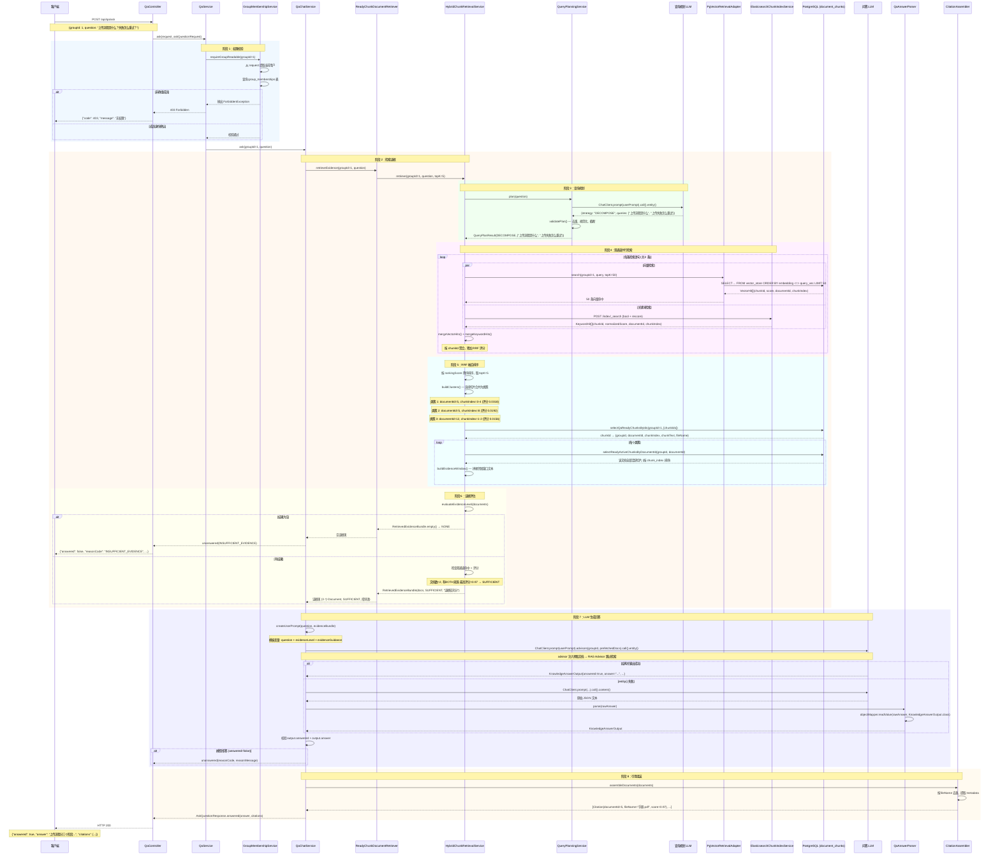

---
type: adr
version: v3
tags: [asklens, v3, design, qa, rrf, hybrid-search, citations]
status: published
related:
  - "[[V3.0-项目文档]]"
  - "[[V2.0-设计决策]]"
  - "[[V2.0-项目文档]]"
  - "[[RAG-核心原理图]]"
  - "[[V4.0-设计决策]]"
  - "[[assistant-module-guide]]"
  - "[[Home]]"
---

# AskLens V3.0 设计决策

> 本文档是 [V3.0-项目文档.md](V3.0-项目文档.md) 第五章"核心设计决策"的详细展开，
> 逐一阐述 V3.0 知识问答（QA）模块中每一项架构决策的**问题背景、解决方案、实现细节和工程权衡**。
>
> 返回主文档：[V3.0-项目文档.md](V3.0-项目文档.md)

**相关文档**：[[V3.0-项目文档]] · [[V2.0-设计决策#Load：向量写入与 ES 索引同步]] · [[RAG-核心原理图#4. 检索增强：混合检索引擎]] · [[RAG-核心原理图#5. 问答生成：RAG Prompt → LLM → 引用]] · [[V4.0-设计决策]] · [[Home]]

---

## 5.0 问答接口全流程

### 流程概览

`POST /api/qa/ask` 是 V3.0 的核心入口。一个用户问题从 HTTP 请求到 JSON 响应，经历以下 8 个阶段：

```
Client → Controller → 权限校验 → 查询规划 → 双通道检索 → RRF 融合 → 证据评估 → LLM 生成 → 引用组装 → Client
```

每个阶段的输出直接决定下一阶段的输入，任何阶段的失败都有明确的兜底策略。

**Mermaid Live Editor**（https://mermaid.live/）

### 完整时序图



### 逐阶段详解

#### 阶段 1：权限校验（QaService）

```
QaService.ask(request, askQuestionRequest)
    → GroupMembershipService.requireGroupReadable(groupId)
        → CurrentUserService.getRequiredCurrentUser(request)  // 从 JWT 提取用户
        → GroupMembershipMapper.selectActiveMembershipRole(userId, groupId)  // 查询角色
        → 角色为空 → 抛出 ForbiddenException → 403
        → 角色非空 (MEMBER/MANAGER/OWNER) → 通过
```

权限校验是同步阻塞的——失败直接返回 403，不执行后续任何逻辑。校验通过后用户身份不再向下传递（检索和生成只依赖 groupId），避免用户信息泄漏到 LLM 上下文。

#### 阶段 2：检索入口（QaChatService → ReadyChunkDocumentRetriever）

```java
// QaChatService.ask() 第 1 步
RetrievedEvidenceBundle evidenceBundle = documentRetriever.retrieveEvidence(groupId, question);
```

`ReadyChunkDocumentRetriever` 是 Spring AI 的 `DocumentRetriever` 实现，这里走的是**业务侧直接调用**路径（`retrieveEvidence()`），不经过 RAG Advisor。它委托 `HybridChunkRetrievalService.retrieve()` 执行完整检索。

#### 阶段 3：查询规划（QueryPlanningService）

查询规划发生在 `HybridChunkRetrievalService.retrieve()` 的第一步，**先于任何检索操作**。这是设计决策 [5.1](#51-llm-驱动的查询规划) 的核心内容。

```java
// HybridChunkRetrievalService.retrieve() 第 1 步
QueryPlanResult queryPlan = queryPlanningService.plan(normalizedQuestion);
```

LLM 返回的策略直接决定了后续检索语句的数量和形式。例如问题"上传流程是什么？失败怎么重试？"被 LLM 判断为 DECOMPOSE，分解为两条检索语句分别检索。

#### 阶段 4：双通道并行检索（HybridChunkRetrievalService）

这是设计决策 [5.2](#52-rrf-双通道融合排序) 的实现核心。每条规划后的检索语句都独立触发一次双通道检索：

```java
for (String plannedQuery : queryPlan.queries()) {     // 遍历每条检索语句
    mergeVectorHits(candidates, groupId, plannedQuery);   // 向量通道 (PgVector)
    mergeKeywordHits(candidates, groupId, plannedQuery);  // 关键词通道 (Elasticsearch)
}
```

**向量通道**：`PgVectorRetrievalAdapter.search(groupId, query, 50)`  
→ PGvector 执行 `SELECT ... FROM vector_store WHERE metadata->>'groupId' = ? ORDER BY embedding <=> query_embedding LIMIT 50`  
→ 返回 `VectorHit[](chunkId, score, documentId, chunkIndex)`

**关键词通道**：`ElasticsearchChunkIndexService.search(groupId, query, 50)`  
→ ES 执行 `bool` 查询（groupId 过滤 + 多字段匹配） + `rescore` 精排  
→ 返回 `KeywordHit[](chunkId, normalizedScore, documentId, chunkIndex)`

每个命中通过 `mergeXxxHit()` 累加 RRF 评分。同一个 chunkId 在多个检索语句或多个通道中被命中时，RRF 分数自然累积。

#### 阶段 5：RRF 融合排序 + 类簇聚合 + 窗口扩展

这是设计决策 [5.2](#52-rrf-双通道融合排序) 和 [5.3](#53-类簇聚合与邻居窗口扩展) 的组合。

**排序**：所有候选按 `rankingScore` 降序，取前 `topK=5`：
```java
List<RetrievalCandidate> rankedCandidates = candidates.values().stream()
    .sorted(Comparator.comparingDouble(RetrievalCandidate::rankingScore).reversed())
    .limit(validTopK)
    .toList();
```

**聚类**：连续同文档切片合并为一个 `RetrievalCluster`——例如 chunkIndex 3 和 4 来自同一文档且连续，合并为一个类簇。

**加载**：批量查询数据库获取切片文本：
```java
// 第一步：按 chunkId 批量加载（仅命中切片的元数据）
List<Map<String, Object>> rows = documentChunkMapper.selectQaReadyChunksByIds(groupId, chunkIds);

// 第二步：按 documentId 加载全部活跃切片（用于窗口扩展，结果缓存）
List<DocumentChunkEntity> chunks = chunkWindowCache.computeIfAbsent(
    documentId,
    id -> documentChunkMapper.selectReadyActiveChunksByDocumentId(groupId, id)
);
```

**窗口拼接**：`buildEvidenceWindow()` 按 `[expandedStartChunkIndex, expandedEndChunkIndex]` 范围从缓存中取切片文本，拼接为一段带文件名前缀的完整证据文本：
```
文件名：AskLens使用手册.pdf
[切片 2 的文本]
[切片 3 的文本]  ← 命中切片
[切片 4 的文本]
```

#### 阶段 6：证据评估（evaluateEvidenceLevel）

这是设计决策 [5.4](#54-证据充分度四级评估) 的核心。

```java
EvidenceLevel level = evaluateEvidenceLevel(documents);
// 输入：3 个 Document（来自 2 个不同文档，含 BOTH 来源，最高评分 0.97）
// 输出：SUFFICIENT
```

评估发生在 LLM 调用**之前**。结果为空时，直接短路返回拒答——这是 NONE 等级的优化。

评估完成后，构建 `RetrievedEvidenceBundle`，包含文档列表、证据等级和指导语，一并返回给 `QaChatService`。

#### 阶段 7：LLM 生成回答（QaChatService）

这是设计决策 [5.5](#55-结构化输出与回退解析) 和 [5.6](#56-预取文档避免重复检索) 的组合。

**Prompt 构造**：
```java
Prompt userPrompt = qaUserPromptTemplate.create(Map.of(
    "question", "上传流程是什么？失败怎么重试？",
    "evidenceLevel", "SUFFICIENT",
    "evidenceGuidance", "当前证据较充分，可以正常回答，但仍然不得超出证据进行臆测。"
));
```

**预取注入**（[5.6](#56-预取文档避免重复检索)）：
```java
qaChatClient.prompt(userPrompt)
    .advisors(advisor -> advisor
        .param("groupId", groupId)
        .param("qaRetrievedDocuments", evidenceBundle.documents())  // ← 预取文档
    )
    .call()
    .entity(KnowledgeAnswerOutput.class);
```

此时 Spring AI 的 RAG Advisor 被触发 → `ReadyChunkDocumentRetriever.retrieve()` → `readPrefetchedDocuments()` 命中 → 返回预取文档 → 跳过重复检索。

RAG Advisor 将证据文档注入 LLM 上下文（通过 `rag-context.st` 模板包装），LLM 看到的是：
```
上传流程是什么？失败怎么重试？

以下是可用证据。每条证据都有 evidenceId。
你只能基于这些证据回答，不能超出证据范围进行臆测。

---------------------
E1 文件名：AskLens使用手册.pdf
[切片 2-4 的拼接文本]

E2 文件名：系统架构设计.md
[切片 7-9 的拼接文本]
---------------------
```

**主路径**：`entity(KnowledgeAnswerOutput.class)` → Spring AI 内部 `ObjectMapper` 反序列化 JSON。

**回退路径**（[5.5](#55-结构化输出与回退解析)）：entity() 失败 → 重新调用 `.content()` 获取原始字符串 → `QaAnswerParser.parse()` 用独立 `ObjectMapper` 解析 → 仍失败则返回 `null` → `unanswered(FORMAT_ERROR)`。

#### 阶段 8：引用组装（CitationAssembler）

```java
List<Citation> citations = citationAssembler.assembleDocuments(documents);
```

从每个 `Document` 的 metadata 中提取 `documentId`、`chunkId`、`chunkIndex`、`fileName`、`score`。按 `fileName` 去重（保留每个文件的第一次命中），保持插入顺序。去重策略避免了同一文档的多个切片产生重复引用条目。

### 各阶段对应的设计决策

```
阶段 1: 权限校验        → (复用 V2.0 群组权限体系，无新增决策)
阶段 2: 检索入口        → 5.6 预取文档避免重复检索
阶段 3: 查询规划        → 5.1 LLM 驱动的查询规划
阶段 4: 双通道并行检索  → 5.2 RRF 双通道融合排序
阶段 5: RRF 融合 + 聚类 → 5.2 RRF 双通道融合排序 + 5.3 类簇聚合与邻居窗口扩展
阶段 6: 证据评估        → 5.4 证据充分度四级评估
阶段 7: LLM 生成回答    → 5.5 结构化输出与回退解析 + 5.6 预取文档
阶段 8: 引用组装        → (工程实现细节，无独立设计决策)
```

### 关键数据流

以下对象在阶段之间传递，构成了流程的数据骨架：

| 对象 | 产生于 | 消费于 | 内容 |
|------|--------|--------|------|
| `AskQuestionRequest` | HTTP 请求体 | `QaController` → `QaService` | `{groupId, question}` |
| `QueryPlanResult` | `QueryPlanningService` | `HybridChunkRetrievalService` | `{strategy, queries[]}` |
| `RetrievalCandidate` (Map) | 双通道 merge | RRF 排序 + 聚类 | chunkId → `{vectorScore, keywordScore, rankingScore}` |
| `RetrievalCluster` (List) | `buildClusters()` | `buildEvidenceWindow()` | `{documentId, startChunkIndex, endChunkIndex, primaryCandidate}` |
| `RetrievedEvidenceBundle` | `evaluateEvidenceLevel()` | `QaChatService` | `{documents[], evidenceLevel, evidenceGuidance}` |
| `KnowledgeAnswerOutput` | LLM (entity 或 content+parse) | `QaChatService` 校验 | `{answered, answer, reasonCode, reasonMessage}` |
| `AskQuestionResponse` | `QaChatService` | `QaController` → 客户端 | `{answered, answer?, reasonCode?, reasonMessage?, citations[]}` |

### 异常路径汇总

| 失败点 | 触发条件 | 处理方式 | HTTP 响应 |
|--------|---------|---------|-----------|
| 权限校验 | 用户不是群组成员 | 抛出 `ForbiddenException` | 403 |
| 查询规划 | LLM 调用失败/返回无效 | 回退 `DIRECT` 策略，用原始问题检索 | 正常流程（降级） |
| 双通道检索 | ES 不可用 | 返回空列表，WARN 日志 | 仅向量结果（降级） |
| 证据为空 | 双通道检索均无命中 | 跳过 LLM 调用，直接拒答 | 200 + `answered=false, INSUFFICIENT_EVIDENCE` |
| entity() 失败 | LLM 输出非标准 JSON | 回退 `content()` + `QaAnswerParser` | 正常流程（降级） |
| 回退解析失败 | 两次尝试均无法解析 | 返回格式错误拒答 | 200 + `answered=false, ANSWER_FORMAT_ERROR` |
| 模型主动拒答 | LLM 判断证据不足以回答 | 透传 reasonCode/reasonMessage | 200 + `answered=false` |
| 引用组装 | metadata 字段缺失 | `readLong()`/`readInteger()` 返回 null | 200 + 部分引用字段为 null |

---

## 5.1 LLM 驱动的查询规划

### 为什么需要查询规划

用户向知识库提出的问题存在三种典型形态：

| 问题类型 | 示例 | 直接检索的问题 |
|---------|------|-------------|
| 清晰可检索 | "pgvector 写入失败" | 分词后可直接检索 |
| 口语化/模糊 | "请问上传流程是什么" | 含礼貌前缀"请问"和模糊指示词"是什么"，检索噪声大 |
| 复合问题 | "上传流程是什么，切片后如何入库" | 包含两个独立子问题，一个检索语句无法覆盖 |

对于后两种形态，直接用原始问题检索会导致召回质量显著下降。而 V2.0 的 `QuestionQueryRewriteService` 规则重写（去除礼貌前缀、按标点拆分）只能处理简单的格式清洗，无法理解语义层面的复合/模糊问题。

### 解决方案

引入一次**轻量级的 LLM 调用**——在正式检索之前，让大模型分析问题并输出检索策略：

- **DIRECT**：问题已适合检索，不做改动。
- **REWRITE**：问题口语化或表达冗余，改写为简洁的检索语句。**原始问题同时保留**作为检索语句之一，避免改写失败导致全盘皆输。
- **DECOMPOSE**：问题包含多个独立子问题，拆分为多条检索语句（最多 3 条）。

```java
// QueryPlanningService.java
public QueryPlanResult plan(String question) {
    try {
        Prompt planPrompt = queryPlanningUserPromptTemplate.create(Map.of("question", question));
        QueryPlanResult rawResult = queryPlanningChatClient.prompt(planPrompt)
                .call()
                .entity(QueryPlanResult.class);
        return validatePlan(rawResult, question);
    } catch (RuntimeException exception) {
        log.warn("Query planning failed, fallback to direct query");
        return QueryPlanResult.fallback(question);  // DIRECT 兜底
    }
}
```

### 策略校验与安全兜底

`validatePlan()` 对 LLM 的输出做了多层防御：

1. **空值检查**：策略或检索语句为 null → 回退 DIRECT
2. **空列表检查**：所有检索语句被规范化后为空 → 回退 DIRECT
3. **DIRECT 策略强制**：即使 LLM 返回 DIRECT，也只使用原始问题（忽略 `queries` 字段）
4. **REWRITE 策略合并**：`[原始问题] + [改写问题]` → 确保原始问题不丢失
5. **DECOMPOSE 截断**：最多 3 条，超出截断
6. **去重与规范化**：`normalizeQueries()` 将所有查询语句压缩空白 → trim → 去重

```java
// 策略校验的核心逻辑
List<String> finalQueries = switch (rawResult.strategy()) {
    case DIRECT    -> List.of(originalQuestion);       // 强制只用原始问题
    case REWRITE   -> buildRewriteQueries(originalQuestion, normalizedQueries);
    case DECOMPOSE -> limitQueries(normalizedQueries); // 最多 3 条
};
```

### 检索过程：每检索语句独立双通道检索

每条规划后的检索语句都独立执行一次完整的双通道检索（向量 + 关键词）：

```java
// HybridChunkRetrievalService.java
for (String plannedQuery : queryPlan.queries()) {
    mergeVectorHits(candidates, groupId, plannedQuery);   // 向量通道
    mergeKeywordHits(candidates, groupId, plannedQuery);  // 关键词通道
}
```

多次检索的命中结果通过 RRF 评分累加到同一个候选集合中——如果某个切片在不同检索语句下都被命中，它的 RRF 分数会累积，排名自然上升。

### 为什么用 LLM 而不是纯规则

| 对比维度 | 规则方式 | LLM 方式 |
|---------|---------|---------|
| 处理口语化改写 | 固定正则 → 只能删除前缀，无法语义改写 | 可以理解语义后重述 |
| 复合问题拆分 | 按标点切分 → 可能拆出无意义片段 | 按语义边界拆分，每个子问题独立可检索 |
| 扩展性 | 每新增一种问题模式需要新增规则 | 通过调整 Prompt 即可适应新模式 |
| 成本 | 零额外调用 | 一次轻量 LLM 调用（~100ms） |
| 故障影响 | 无（规则不会出错） | LLM 不可用时回退 DIRECT，用户体验无损 |

**取舍**：接受一次额外的 LLM 调用开销（约 100ms，占整体问答时延的 5-10%），换取对口语化和复合问题的更好检索效果。失败时自动回退 DIRECT，保证基本可用性。

### Prompt 设计

查询规划使用独立的 `ChatClient`（`queryPlanningChatClient`），不装载 RAG Advisor 和系统提示词——这确保规划 LLM 只关注问题分析，不被检索上下文干扰。

Prompt（`prompts/query-planning/user.st`）包含 3 组完整示例（各对应一种策略），采用 few-shot 引导而非指令约束。示例由浅入深：先展示最简的 DIRECT，再展示 REWRITE 改写，最后展示 DECOMPOSE 拆分。

---

## 5.2 RRF 双通道融合排序

### 为什么需要融合排序

V3.0 的检索同时使用两个通道：

- **向量语义检索**（PgVector）：通过 `cosine_distance` 匹配语义相似度，返回余弦距离转 score。
- **关键词全文检索**（Elasticsearch）：通过 BM25 + 两阶段打分 + 归一化，返回 `[0, 1]` 的归一化分数。

两个通道返回的分数**不可比**：向量返回的是余弦距离（越小越好），关键词返回的是归一化 BM25 分数（越大越好，且分布与向量分数完全不同）。无法简单加权相加。

### 为什么选 RRF 而非其他方案

| 方案 | 优点 | 缺点 |
|------|------|------|
| Min-Max 归一化 | 简单 | 需要知道分数分布的先验范围，单次查询的 min/max 不稳定 |
| 加权求和 | 可以调节通道权重 | 依赖分数可比性，权重需要大量实验调优 |
| 学习排序（LTR） | 理论最优 | 需要训练数据和特征工程，离线成本高 |
| **RRF** | 无需分数归一化，仅依赖排名，无超参调优（k=60 是通用推荐值） | 只考虑排名忽略分数的绝对值差异 |

RRF（Reciprocal Rank Fusion）的核心思想：**不看分数，看排名**。一个切片在向量通道排第 1、在关键词通道排第 5，其 RRF 分数为 `1/(60+1) + 1/(60+5) = 0.0164 + 0.0154 = 0.0318`。

### 实现：按 chunkId 聚合，跨查询累加 RRF 评分

```java
// RetrievalCandidate.java — RRF 分数累加
void mergeVectorHit(VectorHit hit, int rank) {
    this.vectorMatched = true;
    this.vectorScore = Math.max(this.vectorScore, hit.score());
    this.rankingScore += 1.0 / (RRF_K + Math.max(rank, 1));  // RRF 公式
}

void mergeKeywordHit(KeywordHit hit, int rank) {
    this.keywordMatched = true;
    this.keywordScore = Math.max(this.keywordScore, hit.normalizedScore());
    this.rankingScore += 1.0 / (RRF_K + Math.max(rank, 1));
}
```

关键设计：
- **以 chunkId 为聚合键**：同一个切片在两个通道中都被命中时，RRF 分数累加 → 双通道命中的切片自然获得更高排名。
- **跨检索查询累加**：REWRITE/DECOMPOSE 策略生成多条检索语句，每条语句独立执行双通道检索，同一切片的 RRF 分数在所有查询的结果中累加。
- **各通道原始分数保留最大值**：`vectorScore = max(vectorScore, hit.score())`，用于后续的检索来源判断和评分展示。

### RRF 常数 k=60 的选择

`k=60` 是经典的 RRF 推荐值。k 控制排名平滑程度：
- k 越小 → 排名靠前的结果权重越大，但排名靠后的结果被过度压制
- k 越大 → 所有结果的权重趋于均匀
- k=60 在实践中被证明是一个稳健的默认值，无需针对不同数据集调优

```java
private static final int RRF_K = 60;
```

### 检索来源标记

每个候选切片在融合后排时会被标记为三种来源之一：

```java
String source() {
    if (vectorMatched && keywordMatched) return "BOTH";    // 双通道验证——最高可信
    return vectorMatched ? "VECTOR" : "KEYWORD";          // 单通道命中
}
```

`BOTH` 来源标记在后续的证据充分度评估中是关键指标——同时获得向量和关键词两路验证的切片被认为更可信。

---

## 5.3 类簇聚合与邻居窗口扩展

### 为什么需要类簇和窗口扩展

检索返回的切片是独立的——相邻文本可能被切成多个切片，而单个切片的上下文可能不足以支撑模型回答问题。

例如，某文档的第 3-5 个切片都在讨论同一个主题（比如"上传流程"），但它们分别命中了检索。如果只给模型命中得分最高的第 4 个切片（约 240 tokens），模型看到的是一段**被截断的文本**，可能缺失前提或结论。

### 解决方案：类簇聚合

将同一文档中**连续**的命中切片合并为一个类簇（Cluster）：

```java
// 类簇构建逻辑
for (RetrievalCandidate candidate : sortedByChunkIndex) {
    if (currentCluster == null || !currentCluster.isContinuousWith(candidate)) {
        currentCluster = new RetrievalCluster(candidate);  // 不连续 → 新类簇
        clusters.add(currentCluster);
        continue;
    }
    currentCluster.add(candidate);  // 连续 → 加入当前类簇
}
```

连续性判断：`candidate.chunkIndex() == cluster.endChunkIndex() + 1`。

每个类簇追踪：
- `primaryCandidate`：评分最高的切片（如果评分相同，选 chunkIndex 更小的）
- `startChunkIndex` / `endChunkIndex`：切片范围
- `hasVectorSource` / `hasKeywordSource`：在哪个通道被命中

### 邻居窗口扩展

类簇形成后，向前后各扩展 `neighborWindow`（默认 1）个切片：

```java
int expandedStartChunkIndex(int neighborWindow) {
    return Math.max(0, startChunkIndex - neighborWindow);
}

int expandedEndChunkIndex(int neighborWindow) {
    return endChunkIndex + neighborWindow;
}
```

扩展后的窗口包含了命中切片及其**紧邻的上下文切片**，然后从数据库加载该文档在窗口范围内的全部活跃切片，拼接为一段完整文本。

### 完整上下文拼接

```java
// buildEvidenceWindow — 从缓存中加载切片并按 chunkIndex 范围拼接文本
List<DocumentChunkEntity> chunks = chunkWindowCache.computeIfAbsent(
    documentId,
    id -> documentChunkMapper.selectReadyActiveChunksByDocumentId(groupId, id)
);
for (DocumentChunkEntity chunk : chunks) {
    if (chunk.getChunkIndex() >= startIndex && chunk.getChunkIndex() <= endIndex
            && StringUtils.hasText(chunk.getChunkText())) {
        builder.append(chunk.getChunkText().trim()).append("\n");
    }
}
```

`chunkWindowCache` 以 `documentId` 为键缓存了每个文档的全部活跃切片——同一文档的多个证据单元共享一次数据库查询。

### 权衡

**收益**：提供给 LLM 的是包含完整上下文的文本片段，而非孤立的命中切片。模型可以看到前提、主体和结论，回答质量显著提升。

**代价**：窗口扩展增加了注入 LLM 上下文的 token 量。假设每个切片约 240 tokens，扩展 1 个邻居意味着每个证据单元增加约 480 tokens（前后各一个），5 个证据单元约增加 2400 tokens。对于上下文窗口充裕的现代 LLM 来说可忽略。

---

## 5.4 证据充分度四级评估

### 为什么需要证据评估

检索结果的质量是变化的：有时检索到多个高相关文档，有时只有一个勉强相关的片段。如果直接把检索结果喂给 LLM，模型可能：

1. **基于弱证据编造**：只有一个低相关性片段时，LLM 可能"脑补"缺失的信息，生成看似合理但实际错误的回答。
2. **过度自信**：把部分证据当成完整信息给出确定结论。
3. **浪费计算资源**：检索结果为空时仍调用 LLM 生成拒答，不如直接拒答。

### 解决方案：检索与生成之间的质量闸门

在检索完成后、调用 LLM 前，评估证据的充分程度，分级决定后续行为：

```
检索结果 → evaluateEvidenceLevel() → EvidenceLevel
    │
    ├── NONE  → 直接拒答（不调用 LLM）
    ├── WEAK  → 调用 LLM，Prompt 要求标注"依据有限"
    ├── PARTIAL → 调用 LLM，Prompt 要求说明覆盖不足
    └── SUFFICIENT → 调用 LLM，正常回答（禁止臆测）
```

### 评估规则

```java
private EvidenceLevel evaluateEvidenceLevel(List<Document> documents) {
    // 1. 空结果 → NONE
    if (documents.isEmpty()) return EvidenceLevel.NONE;

    // 2. 检查是否有双通道命中
    boolean hasBothSource = documents.stream()
            .anyMatch(doc -> "BOTH".equals(doc.getMetadata().get("retrievalSource")));
    boolean hasVectorEvidence = documents.stream()
            .anyMatch(doc -> "VECTOR".equals(...) || "BOTH".equals(...));

    // 3. 取最高 RRF 评分
    double topScore = documents.stream()
            .map(doc -> doc.getMetadata().get("hybridScore"))
            .filter(Double.class::isInstance).map(Double.class::cast)
            .max(Double::compareTo).orElse(0.0);

    // 4. 分级判断
    if (documents.size() >= 2 && (hasBothSource || (hasVectorEvidence && topScore >= 0.95)))
        return EvidenceLevel.SUFFICIENT;
    if (hasBothSource || documents.size() >= 2)
        return EvidenceLevel.PARTIAL;
    return EvidenceLevel.WEAK;
}
```

| 条件 | 等级 | 语义 |
|------|------|------|
| 结果为空 | `NONE` | 知识库中无相关信息 |
| 文档数 < 2 且仅单通道命中 | `WEAK` | 有少量相关材料但依据薄弱 |
| 双通道命中 或 文档数 ≥ 2（不满足 SUFFICIENT 条件） | `PARTIAL` | 有相关材料但仅覆盖问题的一部分 |
| 文档数 ≥ 2 且 (双通道命中 或 向量最高分 ≥ 0.95) | `SUFFICIENT` | 多份材料交叉验证，证据充分 |

### NONE 等级的短路优化

当证据为空时，`QaChatService` 直接返回拒答，**不调用 LLM**：

```java
if (documents.isEmpty()) {
    return AskQuestionResponse.unanswered(INSUFFICIENT_CODE, INSUFFICIENT_MESSAGE, List.of());
}
```

这节省了一次不必要的 LLM 调用（约 1-2 秒时延 + token 消耗）。

### 证据指导语注入

每个证据等级对应不同的 Prompt 指导语，在构造用户提示词时注入：

```java
private String buildEvidenceGuidance(EvidenceLevel level) {
    return switch (level) {
        case NONE       -> "当前没有可用证据，必须直接拒答。";
        case WEAK       -> "当前证据相关性有限，只能谨慎回答，必须明确说明依据有限，不能给出确定性结论。";
        case PARTIAL    -> "当前证据只覆盖部分问题，只能回答证据明确支持的部分，未覆盖部分必须明确说明不足。";
        case SUFFICIENT -> "当前证据较充分，可以正常回答，但仍然不得超出证据进行臆测。";
    };
}
```

### 为什么不是简单的"有/无"二分

二分判断（有证据就答、无证据就拒）无法反映检索质量。一个勉强命中的弱证据和多个高相关文档交叉验证的强证据，对 LLM 的风险完全不同。四级评估让 Prompt 随着证据质量动态调整约束强度，引导模型在不同信息条件下采用不同的作答策略。

---

## 5.5 结构化输出与回退解析

### 为什么需要结构化输出

大模型生成的自由文本难以程序化判断"模型是否在回答问题"和"模型为什么拒答"。如果模型输出"抱歉，我无法回答这个问题"，用正则匹配关键词不仅脆弱，而且无法区分"证据不足拒答"和"格式错误拒答"。

### 解决方案：要求 LLM 输出 JSON

通过系统提示词要求模型输出固定结构的 JSON：

```json
{
  "answered": true,
  "answer": "回答正文",
  "reasonCode": "拒答原因码",
  "reasonMessage": "拒答原因说明"
}
```

Java 侧使用 `@JsonIgnoreProperties(ignoreUnknown = true)` 的 record 接收：

```java
@JsonIgnoreProperties(ignoreUnknown = true)
public record KnowledgeAnswerOutput(
    boolean answered,
    String answer,
    String reasonCode,
    String reasonMessage
) {}
```

`ignoreUnknown = true` 是关键——即使 LLM 多返回了未声明的字段，反序列化也不会失败。这是对 LLM 输出不稳定的容错设计。

### 主路径：entity() 方式

Spring AI 的 `ChatClient.entity()` 方法直接使用内部配置的 `ObjectMapper` 反序列化 LLM 的 JSON 输出：

```java
return qaChatClient.prompt(userPrompt)
        .advisors(advisor -> advisor
                .param("groupId", groupId)
                .param(ReadyChunkDocumentRetriever.PREFETCHED_DOCUMENTS_CONTEXT_KEY, 
                       evidenceBundle.documents()))
        .call()
        .entity(KnowledgeAnswerOutput.class);  // 自动 JSON → record
```

### 回退路径：raw content + Jackson 解析

`entity()` 可能在以下场景失败（Spring AI 内部抛出 `RuntimeException`）：
- LLM 输出了非标准 JSON（如前后有 Markdown 代码块符号 ` ```json `）
- LLM 输出为空
- JSON 结构不符合 record 定义（但 `ignoreUnknown=true` 已降低此风险）

回退时，重新调用 LLM 获取原始文本，然后用 `QaAnswerParser`（独立 Jackson `ObjectMapper`）尝试解析：

```java
private KnowledgeAnswerOutput parseFallbackAnswer(Long groupId, String question, 
        RetrievedEvidenceBundle evidenceBundle) {
    try {
        String rawAnswer = qaChatClient.prompt(userPrompt)
                .advisors(...)
                .call()
                .content();  // 获取原始字符串
        return answerParser.parse(rawAnswer);  // Jackson 解析
    } catch (RuntimeException exception) {
        log.error("QA raw answer fallback failed");
        return null;  // 两次尝试都失败 → 返回 FORMAT_ERROR 拒答
    }
}
```

### 失败处理链条

```
entity() 成功 → KnowledgeAnswerOutput → 校验字段 → 返回
    ↓ 失败
content() + QaAnswerParser → KnowledgeAnswerOutput → 校验字段 → 返回
    ↓ 失败
返回 unanswered(FORMAT_ERROR) → 用户看到"模型返回格式错误"
```

### 为什么不做更多次重试

结构化输出失败通常意味着模型在本次调用中处于不稳定状态（如输出了非 JSON 文本）。同一模型再试一次可能结果类似。两次尝试已覆盖了最常见的"LLM 没完全遵循 JSON 指令"场景（entity() 严格模式 + raw content 宽松模式），更多重试只会增加时延而成功率提升有限。

---

## 5.6 预取文档避免重复检索

### 为什么会有重复检索的问题

QA 模块的架构中有两个"检索触发点"：

1. **显式检索**：`QaChatService.ask()` 第 1 步调用 `documentRetriever.retrieveEvidence()`，获取证据并进行证据评估。
2. **隐式检索**：`qaChatClient` 装配了 `RetrievalAugmentationAdvisor`，其内部的 `DocumentRetriever.retrieve()` 会在每次 `.call()` 时自动执行检索并注入上下文。

如果不加干预，同一个请求中检索会执行**两次**：第一次在 `QaChatService` 中显式调用，第二次在 Spring AI 的 RAG Advisor 中被隐式触发。两次检索消耗双倍的向量计算 + ES 查询 + DB 查询。

### 解决方案：上下文预取

`ReadyChunkDocumentRetriever` 实现了 Spring AI 的 `DocumentRetriever` 接口。在 `retrieve()` 方法中，它优先检查查询上下文中是否已有预取的文档列表：

```java
@Override
public List<Document> retrieve(Query query) {
    List<Document> prefetchedDocuments = readPrefetchedDocuments(validQuery);
    if (prefetchedDocuments != null) {
        return prefetchedDocuments;  // 直接返回预取结果，跳过检索
    }
    return retrieve(groupId, query.text());  // 无预取 → 执行实际检索
}
```

### 预取数据的注入时机

`QaChatService` 在证据评估之后、调用 LLM 之前，通过 Advisor 参数将预取文档注入上下文：

```java
qaChatClient.prompt(userPrompt)
        .advisors(advisor -> advisor
                .param("groupId", groupId)
                .param(
                    ReadyChunkDocumentRetriever.PREFETCHED_DOCUMENTS_CONTEXT_KEY,  // "qaRetrievedDocuments"
                    evidenceBundle.documents()  // 已检索的文档列表
                ))
        .call()
        .entity(KnowledgeAnswerOutput.class);
```

### 流程对比

```
# 无预取优化：
QaChatService → retrieveEvidence() → 检索一次
             → qaChatClient.call()
                 → RAG Advisor → DocumentRetriever.retrieve() → 又检索一次！（浪费）

# 有预取优化：
QaChatService → retrieveEvidence() → 检索一次（结果存入变量）
             → qaChatClient.call()
                 → advisor.param("qaRetrievedDocuments", documents)
                 → RAG Advisor → DocumentRetriever.retrieve()
                     → readPrefetchedDocuments() → 命中！直接返回（跳过检索）
```

### 设计细节：防御性校验

`readPrefetchedDocuments()` 包含了类型校验，防止错误类型的对象被放入上下文：

```java
private List<Document> readPrefetchedDocuments(Query query) {
    Object documents = query.context().get(PREFETCHED_DOCUMENTS_CONTEXT_KEY);
    if (documents == null) return null;  // 无预取 → 正常检索
    if (!(documents instanceof List<?> documentList))
        throw new BusinessException("检索上下文中的预取证据格式非法");
    for (Object document : documentList) {
        if (!(document instanceof Document))
            throw new BusinessException("检索上下文中的预取证据格式非法");
    }
    return List.copyOf((List<Document>) documentList);  // 不可变副本
}
```

### 权衡

**收益**：消除了一次完整的双通道检索（向量 + 关键词 + RRF 融合 + 窗口扩展），节省约 200-500ms 的重复计算。

**代价**：`QaChatService` 需要感知"预取文档"这一内部优化机制——通过 Advisor 参数传递预取文档。这增加了 `QaChatService` 和 `ReadyChunkDocumentRetriever` 之间的耦合（共享 `PREFETCHED_DOCUMENTS_CONTEXT_KEY` 常量）。但在两个组件都属于 QA 模块、由同一团队维护的背景下，这种模块内耦合是可接受的。

### 为什么不直接在 Advisor 中做证据评估

一个替代方案是将证据评估逻辑移到 RAG Advisor 内部，这样就不需要"先检索一次再告诉 Advisor 用结果"。但 Spring AI 的 `RetrievalAugmentationAdvisor` 是一个通用抽象，其职责仅限于"检索并注入上下文"，将业务级的证据评估逻辑放入其中会违反单一职责原则。当前方案保持了 Advisor 专注于检索，`QaChatService` 专注于业务编排，代价是一次额外的参数传递。

---

> 返回主文档：[V3.0-项目文档.md](V3.0-项目文档.md)
