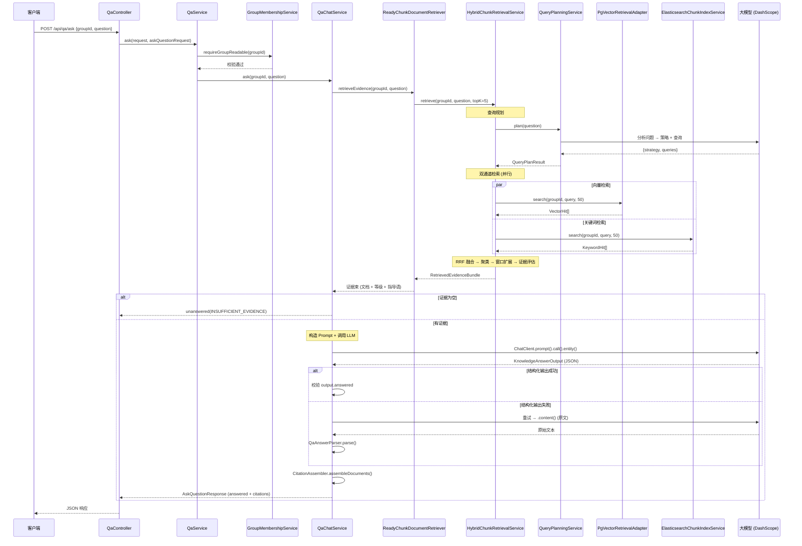

---
type: doc
version: v3
tags: [asklens, v3, qa, rag, hybrid-search, rrf]
status: published
related:
  - "[[V3.0-设计决策]]"
  - "[[V2.0-项目文档]]"
  - "[[V2.0-设计决策]]"
  - "[[V4.0-项目文档]]"
  - "[[RAG-核心原理图]]"
  - "[[assistant-module-guide]]"
  - "[[Home]]"
---

# AskLens 项目文档 V3.0

> AskLens 是一个 **RAG 知识库平台** 的教学项目，从零搭建，逐步迭代。
> V3.0 在 V2.0（文档上传 + ETL 摄入 + 双路检索）的基础上，打通了最后一道环节——**知识问答**，至此平台形成完整闭环：**文档上传 → 自动解析索引 → 混合检索 → AI 生成回答**。

**相关文档**：[[V3.0-设计决策]] · [[V2.0-项目文档]] · [[V2.0-设计决策#3. 异步执行与重试机制]] · [[RAG-核心原理图#4. 检索增强：混合检索引擎]] · [[V4.0-项目文档]] · [[assistant-module-guide]] · [[Home]]

---

## 一、项目概述

### 1.1 V3.0 定位

V2.0 完成了"把文档变成可检索的知识"这条链路：用户可以上传文档，系统自动解析、切片、向量化并建立关键词索引，最终提供向量语义检索和关键词全文检索两路召回能力。

V3.0 在这些检索基础设施之上，构建了**面向终端用户的知识问答（QA）模块**。用户以自然语言提问，系统自动完成查询规划 → 混合检索 → 证据评估 → 大模型生成回答 → 引用溯源的全流程。这意味着 AskLens 从一个"文档管理 + 检索平台"升级为真正的 **RAG 知识库问答系统**。

V3.0 的核心创新集中在检索侧：**RRF 双通道融合**让向量和关键词两路结果协同互补，**LLM 查询规划**让检索更智能，**证据充分度评估**在检索与生成之间建立了质量闸门。

### 1.2 V3.0 新增功能清单

| 模块 | 功能 | 状态 |
|------|------|------|
| 知识问答 | 自然语言提问接口（`POST /api/qa/ask`） | 完成 |
| 知识问答 | 群组权限校验（仅群组成员可提问） | 完成 |
| 查询规划 | LLM 驱动的查询策略选择（DIRECT / REWRITE / DECOMPOSE） | 完成 |
| 查询规划 | 多查询并行检索（最多 3 条检索语句） | 完成 |
| 查询规划 | 查询规划失败自动回退（DIRECT 策略兜底） | 完成 |
| 混合检索 | RRF（Reciprocal Rank Fusion）双通道融合排序 | 完成 |
| 混合检索 | 类簇聚合（同文档连续切片合并为证据单元） | 完成 |
| 混合检索 | 邻居窗口扩展（向前后各扩展 1 个切片补充上下文） | 完成 |
| 证据评估 | 四级证据充分度评估（NONE / WEAK / PARTIAL / SUFFICIENT） | 完成 |
| 证据评估 | 证据不足自动拒答（不浪费 LLM 调用） | 完成 |
| 证据评估 | 按证据等级分级回答（WEAK 标注"依据有限"，PARTIAL 标注覆盖不足） | 完成 |
| 回答生成 | 大模型结构化 JSON 输出（answered / answer / reasonCode / reasonMessage） | 完成 |
| 回答生成 | 结构化输出失败自动回退（原文 JSON 解析） | 完成 |
| 回答生成 | 引用溯源（返回支撑回答的文档名、切片、相关性评分） | 完成 |
| 性能优化 | 预取文档缓存（避免 Spring AI RAG Advisor 内的重复检索） | 完成 |

---

## 二、技术栈

### 2.1 完整技术栈

| 层次 | 技术 | 版本 | 说明 |
|------|------|------|------|
| 语言 | Java | 21 | Record 语法、虚拟线程 |
| 框架 | Spring Boot | 3.5.0 | Spring MVC（非 WebFlux） |
| 构建 | Maven + mvnw | 3.9.14 | Maven Wrapper |
| 数据库 | PostgreSQL | 16+ | 含 pgvector 扩展 |
| ORM | MyBatis-Plus | 3.5.15 | LambdaQueryWrapper + XML 自定义 SQL |
| API 文档 | Knife4j + SpringDoc | 4.5.0 | `/doc.html` |
| 认证 | JJWT | 0.12.6 | JWT Bearer Token |
| 密码 | Spring Security Crypto | — | BCrypt |
| AI 对话 | Spring AI Alibaba | 1.1.2.0 | DashScope 原生 Chat |
| AI 嵌入 | Spring AI | 1.1.2 | OpenAI-compatible Embedding 客户端 |
| 对象存储 | MinIO | — | `@ConditionalOnProperty` 按需启用 |
| 向量存储 | PGvector | — | HNSW 索引，COSINE_DISTANCE，512 维 |
| 关键词检索 | Elasticsearch | 8.x | IK 中文分词器，JDK HttpClient 直连 |
| 文档解析 | Apache PDFBox / POI | — | PDF / DOCX 解析 |
| 重试 | Spring Retry | — | `@Retryable` + `@Recover` |

> V3.0 **未引入任何新的第三方依赖**。QA 模块完全复用 V2.0 的技术栈，所有新增能力通过组合现有基础设施实现。

### 2.2 未新增依赖的理由

V3.0 的 QA 模块本质是**检索能力 + LLM 调用能力 + Prompt 工程**的组合编排，不涉及新的外部系统：

- **检索层**：复用 V2.0 的 `PgVectorRetrievalAdapter`（向量检索）和 `ElasticsearchChunkIndexService`（关键词检索），无需引入新的检索引擎。
- **生成层**：复用 Spring AI Alibaba 的 `ChatClient`，通过精心设计的 Prompt 模板控制输出格式，无需引入 LangChain 等额外编排框架。
- **融合排序**：RRF 算法仅需简单数学运算（`1/(k+rank)`），无需引入学习排序框架。
- **查询规划**：复用现有的 `ChatClient.Builder` 构建独立 `ChatClient` 实例，与问答 Client 隔离配置。

```
Spring AI ChatClient.Builder
    ├── qaChatClient           ← V3.0 新增（系统提示词 + RAG Advisor）
    ├── queryPlanningChatClient ← V3.0 新增（查询规划，无 Advisor）
    └── (现有 ChatClient 实例，如有)
```

---

## 三、项目结构

### 3.1 完整目录树（V3.0 新增部分）

```
AskLens-backend/src/main/java/com/asklens/
├── auth/                          # V1.0 — 认证授权
├── user/                          # V1.0 — 用户管理
├── group/                         # V1.0 — 群组成员
├── common/                        # V1.0 — 共享基础设施
├── engine/                        # V2.0 — 检索引擎 + 对象存储
│   ├── elasticsearch/
│   │   └── ElasticsearchChunkIndexService.java  # 关键词检索（QA 复用）
│   ├── pgvector/
│   │   └── PgVectorRetrievalAdapter.java        # 向量检索（QA 复用）
│   └── storage/                   # MinIO 对象存储
├── document/                      # V2.0 — 文档管理
├── ingestion/                     # V2.0 — ETL 摄入
│
├── qa/                            # ─── V3.0 新增：知识问答模块 ───
│   ├── config/
│   │   ├── QaChatClientConfiguration.java       # 问答 ChatClient + RAG Advisor 配置
│   │   └── QueryPlanningConfiguration.java      # 查询规划 ChatClient 配置
│   ├── controller/
│   │   └── QaController.java                    # POST /api/qa/ask
│   ├── model/
│   │   ├── EvidenceLevel.java                   # 证据充分度枚举（NONE/WEAK/PARTIAL/SUFFICIENT）
│   │   ├── KnowledgeAnswerOutput.java           # LLM 结构化输出接收 record
│   │   ├── QueryPlanResult.java                 # 查询规划结果 record
│   │   ├── QueryPlanStrategy.java               # 查询策略枚举（DIRECT/REWRITE/DECOMPOSE）
│   │   ├── dto/
│   │   │   └── AskQuestionRequest.java          # 提问请求 DTO
│   │   └── vo/
│   │       └── AskQuestionResponse.java         # 提问响应 VO（含 Citation 嵌套 record）
│   ├── rag/
│   │   ├── HybridChunkRetrievalService.java     # 核心：RRF 混合检索引擎
│   │   ├── ReadyChunkDocumentRetriever.java     # Spring AI DocumentRetriever 适配器
│   │   ├── RetrievedEvidenceBundle.java         # 检索证据束 record
│   │   └── QuestionQueryRewriteService.java     # 规则查询重写（备用）
│   ├── service/
│   │   ├── QaService.java                       # QA 入口服务（权限 + 委托）
│   │   ├── QaChatService.java                   # RAG 问答编排服务
│   │   └── QueryPlanningService.java            # LLM 查询规划服务
│   └── support/
│       ├── CitationAssembler.java               # 引用来源组装器
│       └── QaAnswerParser.java                  # 回退 JSON 解析器
│
└── AskLensBackendApplication.java    # @SpringBootApplication

AskLens-backend/src/main/resources/
├── prompts/
│   ├── qa/                         # ─── V3.0 新增：QA Prompt 模板 ───
│   │   ├── system.st               # 系统提示词（角色定义 + 输出格式约束）
│   │   ├── user.st                 # 用户提示词（问题 + 证据 + 回答策略）
│   │   └── rag-context.st          # RAG 上下文包装（证据注入模板）
│   └── query-planning/             # ─── V3.0 新增：查询规划 Prompt 模板 ───
│       └── user.st                 # 查询规划提示词（策略选择 + 示例）
└── mappers/
    └── ingestion/
        └── DocumentChunkMapper.xml # V3.0 新增 3 条 QA 专用 SQL
```

### 3.2 模块层次说明

QA 模块遵循与 V2.0 相同的分层架构：

```
controller (QaController)
    ↓ 校验输入 + 提取用户身份
service (QaService)
    ↓ 权限校验 + 编排
service (QaChatService)
    ↓ 检索证据 + 调用 LLM + 组装响应
rag (HybridChunkRetrievalService)
    ↓ 查询规划 + 双通道检索 + RRF 融合 + 证据评估
config (QaChatClientConfiguration / QueryPlanningConfiguration)
    ↓ Bean 装配
```

---

## 四、数据库设计

### 4.1 概述

**V3.0 未新增任何数据库表。** QA 模块完全复用在 V2.0 中建立的 `document_chunks` 表和已有索引。

检索阶段需要从 `document_chunks` 中读取切片的文本和元数据，同时 JOIN `documents` 表做安全过滤（只检索 `status='READY'` 且 `deleted=false` 的文档）。V3.0 在 `DocumentChunkMapper.xml` 中新增了 3 条 SQL 查询以支持这些检索需求。

### 4.2 复用的数据表

以下 V2.0 表被 QA 模块检索路径直接访问：

| 表名 | QA 模块中的角色 |
|------|----------------|
| `document_chunks` | 检索的最小单元——存储切片文本，按 chunkId 或 documentId 查询 |
| `documents` | 安全过滤层——确保只检索 READY 状态、未删除的文档 |
| `group_memberships` | 权限校验层——确保提问者属于目标群组 |

### 4.3 QA 专用 SQL 查询

**`selectQaReadyChunksByIds`**（按 chunkId 批量加载）：

```sql
SELECT chunks.group_id          AS groupId,
       chunks.id                AS chunkId,
       chunks.document_id       AS documentId,
       chunks.chunk_index       AS chunkIndex,
       chunks.chunk_text        AS chunkText,
       documents.file_name      AS fileName
FROM document_chunks chunks
JOIN documents documents
  ON documents.id = chunks.document_id
 AND documents.group_id = chunks.group_id
WHERE chunks.group_id = #{groupId}
  AND documents.status = 'READY'
  AND documents.deleted = false
  AND chunks.id IN (#{chunkIds})
```

设计要点：
- `groupId` 作为 WHERE 条件的第一道防线，防止跨群组数据泄露。
- JOIN `documents` 过滤 `status='READY'` 和 `deleted=false`——即使向量/ES 索引中残留了已删除文档的 chunkId，SQL 层也会过滤掉，形成第二道防线。
- 返回 `fileName` 供引用溯源使用。

**`selectReadyActiveChunksByDocumentId`**（邻居窗口扩展）：

```sql
SELECT chunks.id, chunks.document_id, chunks.group_id,
       chunks.chunk_index, chunks.chunk_text, ...
FROM document_chunks chunks
JOIN documents documents
  ON documents.id = chunks.document_id
 AND documents.group_id = chunks.group_id
WHERE chunks.group_id = #{groupId}
  AND chunks.document_id = #{documentId}
  AND documents.status = 'READY'
  AND documents.deleted = false
ORDER BY chunks.chunk_index ASC, chunks.id ASC
```

设计要点：
- 按 `chunk_index` 排序加载文档的**全部**活跃切片——窗口扩展需要访问邻近切片的文本。
- 结果缓存于 `chunkWindowCache`（以 `documentId` 为键的 Map），同一文档的多个证据单元共享一次查询结果。

### 4.4 索引利用说明

QA 检索路径主要依赖以下已有索引：

| 索引 | 所在表 | QA 查询利用情况 |
|------|--------|---------------|
| `idx_chunks_document_id` | `document_chunks` | `selectReadyActiveChunksByDocumentId` 的 JOIN 条件 |
| `idx_chunks_group_id` | `document_chunks` | 所有 QA 查询的 `WHERE group_id = ?` 条件 |
| `idx_documents_group_deleted` | `documents` | JOIN 时过滤 group_id + deleted=false |
| `idx_documents_status_deleted` | `documents` | JOIN 时过滤 status='READY' + deleted=false |

---

## 五、核心设计决策

V3.0 的完整问答流程与 6 项核心设计决策详见 [V3.0-设计决策.md](V3.0-设计决策.md)，以下为各决策要点摘要：

| # | 决策 | 解决的问题 | 详情链接 |
|---|------|-----------|---------|
| 5.0 | 问答接口全流程 | 8 阶段端到端流程概览 | [V3.0-设计决策.md#50-问答接口全流程](V3.0-设计决策.md#50-问答接口全流程) |
| 5.1 | LLM 驱动的查询规划 | 用户问题口语化/复杂，直接检索效果差 | [V3.0-设计决策.md#51-llm-驱动的查询规划](V3.0-设计决策.md#51-llm-驱动的查询规划) |
| 5.2 | RRF 双通道融合排序 | 向量和关键词两路分数不可比，需统一排序 | [V3.0-设计决策.md#52-rrf-双通道融合排序](V3.0-设计决策.md#52-rrf-双通道融合排序) |
| 5.3 | 类簇聚合与邻居窗口扩展 | 单切片上下文不完整，需扩展阅读窗口 | [V3.0-设计决策.md#53-类簇聚合与邻居窗口扩展](V3.0-设计决策.md#53-类簇聚合与邻居窗口扩展) |
| 5.4 | 证据充分度四级评估 | 检索质量参差不齐，LLM 可能基于弱证据编造 | [V3.0-设计决策.md#54-证据充分度四级评估](V3.0-设计决策.md#54-证据充分度四级评估) |
| 5.5 | 结构化输出与回退解析 | LLM 输出格式不稳定，需鲁棒解析 | [V3.0-设计决策.md#55-结构化输出与回退解析](V3.0-设计决策.md#55-结构化输出与回退解析) |
| 5.6 | 预取文档避免重复检索 | Spring AI RAG Advisor 机制导致同一请求检索两次 | [V3.0-设计决策.md#56-预取文档避免重复检索](V3.0-设计决策.md#56-预取文档避免重复检索) |

---

## 六、API 接口文档

### 6.1 知识问答

| 方法 | 路径 | 认证 | 权限 | 说明 |
|------|------|------|------|------|
| POST | `/api/qa/ask` | Bearer JWT | 群组成员（MEMBER+） | 在指定群组知识库中提问 |

**请求示例**：

```
POST /api/qa/ask
Content-Type: application/json
Authorization: Bearer <access_token>

{
    "groupId": 1,
    "question": "文档上传流程是什么？上传失败后如何重试？"
}
```

**请求字段说明**：

| 字段 | 类型 | 约束 | 说明 |
|------|------|------|------|
| groupId | Long | `@NotNull` `@Positive` | 目标群组 ID，限定知识库范围 |
| question | String | `@NotBlank` `@Size(max=2000)` | 用户问题，最大 2000 字符 |

**应答成功 — 模型能够回答**：

```json
{
    "answered": true,
    "answer": "文档上传流程分为三个阶段：初始化、分片上传、完成合并。首先调用 /upload/init 接口初始化上传会话，系统会通过 SHA-256 检查文件是否已存在（秒传检测）。然后按 10MB 大小分片调用 /upload/chunks 上传，最后调用 /upload/{uploadId}/complete 触发合并和异步 ETL 处理。如果上传后处理失败，可以使用 /api/documents/{documentId}/retry-ingestion 接口重新触发处理。",
    "citations": [
        {
            "documentId": 1,
            "chunkId": 15,
            "chunkIndex": 3,
            "fileName": "AskLens使用手册.pdf",
            "score": 0.97,
            "snippet": null
        },
        {
            "documentId": 2,
            "chunkId": 42,
            "chunkIndex": 7,
            "fileName": "系统架构设计.md",
            "score": 0.89,
            "snippet": null
        }
    ]
}
```

**应答成功 — 模型拒答（证据不足）**：

```json
{
    "answered": false,
    "reasonCode": "INSUFFICIENT_EVIDENCE",
    "reasonMessage": "检索到的有效证据不足，暂不回答。",
    "citations": []
}
```

**应答成功 — 模型拒答（回答格式错误）**：

```json
{
    "answered": false,
    "reasonCode": "ANSWER_FORMAT_ERROR",
    "reasonMessage": "模型返回格式错误，无法解析回答。",
    "citations": []
}
```

### 6.2 响应字段说明

| 字段 | 类型 | 说明 |
|------|------|------|
| answered | boolean | 是否成功生成回答 |
| answer | String | 回答正文（仅 `answered=true` 时返回） |
| reasonCode | String | 拒答原因编码（`INSUFFICIENT_EVIDENCE` / `ANSWER_FORMAT_ERROR`） |
| reasonMessage | String | 拒答原因描述 |
| citations | Citation[] | 引用来源列表 |

**Citation 对象**：

| 字段 | 类型 | 说明 |
|------|------|------|
| documentId | Long | 来源文档 ID |
| chunkId | Long | 来源切片 ID |
| chunkIndex | Integer | 切片在文档中的序号（从 0 开始） |
| fileName | String | 来源文件名 |
| score | double | 检索相关性评分（RRF 融合评分） |
| snippet | String | 文本摘要（保留字段，当前未使用） |

### 6.3 权限控制汇总

| 操作 | 权限级别 | 校验方式 |
|------|---------|---------|
| 在群组中提问 | 群组成员（MEMBER, MANAGER, OWNER） | `GroupMembershipService.requireGroupReadable(groupId)` |

### 6.4 完整的请求处理流程



---

## 七、关键配置说明

### 7.1 QA ChatClient 配置

QA 模块注册了**两个独立的 ChatClient Bean**，分别面向不同任务：

**`qaChatClient`**（回答生成，`QaChatClientConfiguration`）：

```java
@Bean
public ChatClient qaChatClient(
        ChatClient.Builder chatClientBuilder,
        @Qualifier("qaSystemPromptTemplate") PromptTemplate qaSystemPromptTemplate,
        @Qualifier("qaRetrievalAdvisor") RetrievalAugmentationAdvisor qaRetrievalAdvisor
) {
    return chatClientBuilder
            .defaultSystem(qaSystemPromptTemplate.getTemplate())  // 系统提示词：角色 + JSON 输出约束
            .defaultAdvisors(qaRetrievalAdvisor)                  // RAG Advisor：自动检索 + 上下文注入
            .build();
}
```

**`queryPlanningChatClient`**（查询规划，`QueryPlanningConfiguration`）：

```java
@Bean("queryPlanningChatClient")
public ChatClient queryPlanningChatClient(ChatClient.Builder chatClientBuilder) {
    return chatClientBuilder.build();  // 无系统提示词，无 Advisor —— 轻量纯 LLM 调用
}
```

两个 Client 共用同一个 `ChatClient.Builder`（继承全局 LLM 配置），但在职责上完全隔离：问答 Client 装载了系统提示词和 RAG 检索 Advisor，查询规划 Client 则是纯净的 LLM 调用接口。

### 7.2 Prompt 模板

**QA 系统提示词**（`prompts/qa/system.st`）：

定义了模型的角色（"只能依据给定证据回答"）、输出格式（"严格输出 JSON"）和 6 条行为规则。核心约束包括：禁止输出 Markdown、禁止外部知识、禁止编造字段、严格遵循 `evidenceLevel` 策略。

**QA 用户提示词**（`prompts/qa/user.st`）：

模板变量 `{question}`、`{evidenceLevel}`、`{evidenceGuidance}` 在运行时由 `QaChatService.createUserPrompt()` 填充。证据指导语随证据等级变化——`NONE` 时强制拒答，`WEAK` 时要求标注"依据有限"，`SUFFICIENT` 时允许正常回答但仍禁止臆测。

**查询规划提示词**（`prompts/query-planning/user.st`）：

包含 3 组示例（REWRITE / DECOMPOSE / DIRECT），引导 LLM 输出 `{strategy, queries}` JSON。`{question}` 变量由 `QueryPlanningService` 在运行时填充。

### 7.3 检索参数

QA 模块的检索参数以常量形式硬编码在 `HybridChunkRetrievalService` 中，无需外部配置：

| 参数 | 值 | 说明 |
|------|----|------|
| `CHANNEL_TOP_K` | 50 | 每个检索通道返回的最大候选数——足够覆盖相关切片 |
| `RRF_K` | 60 | RRF 融合平滑参数——经典推荐值，避免排名靠后的结果权重被过度压制 |
| `DEFAULT_TOP_K` | 5 | 最终返回给 LLM 的证据单元数——平衡上下文长度与证据覆盖 |
| `DEFAULT_NEIGHBOR_WINDOW` | 1 | 邻居窗口扩展宽度——向前后各取 1 个切片补充上下文 |

---

## 八、枚举扩展

### 8.1 V3.0 新增枚举

| 枚举 | 值 | 用途 |
|------|----|------|
| `EvidenceLevel` | `NONE`, `WEAK`, `PARTIAL`, `SUFFICIENT` | 评估检索证据对回答的支撑程度，决定回答策略 |
| `QueryPlanStrategy` | `DIRECT`, `REWRITE`, `DECOMPOSE` | LLM 选择的查询策略，决定如何生成检索语句 |

### 8.2 证据等级的状态转换

```
检索结果 → 证据评估
    │
    ├─ 结果为空 ───────────────────────→ NONE      （直接拒答，不调用 LLM）
    │
    ├─ 仅单通道命中 + 文档数 < 2 ────→ WEAK      （谨慎回答，标注"依据有限"）
    │
    ├─ 双通道命中 OR 文档数 ≥ 2 ──────→ PARTIAL   （回答证据覆盖部分，标注局限）
    │
    └─ 文档数 ≥ 2 AND (双通道命中 OR 最高评分 ≥ 0.95) → SUFFICIENT （正常回答，禁止臆测）
```

评估逻辑有两道门槛：
1. **文档数量门槛**：至少 2 个不同文档的切片命中才可能达到 `PARTIAL` 或 `SUFFICIENT`——单文档证据即使高相关也可能是文档本身的偏向性。
2. **双通道交叉验证**：向量和关键词两路同时命中（来源标记为 `BOTH`）的切片具有更高可信度。当只有单通道命中时，`SUFFICIENT` 等级额外要求最高 RRF 评分 ≥ 0.95。

### 8.3 查询策略的决策流程

```
用户问题
    ↓
QueryPlanningService.plan(question)
    ↓ LLM 分析
    ├─ DIRECT：问题清晰，直接可检索 → queries = [原始问题]
    ├─ REWRITE：问题口语化/模糊 → queries = [原始问题] + [改写后的问题]
    └─ DECOMPOSE：问题包含多个子问题 → queries = [子问题1, 子问题2, 子问题3]
    ↓ 失败回退
    └─ 任何异常 → QueryPlanResult.fallback(question) = DIRECT
```

`REWRITE` 策略的结果包含原始问题——即使改写后的问题检索效果不佳，原始问题仍可提供兜底。`DECOMPOSE` 策略最多生成 3 条子问题，超过的被截断。

---

## 九、运行指南

### 9.1 环境要求

V3.0 的运行环境与 V2.0 完全一致，无新增中间件：

| 组件 | 版本要求 | 说明 |
|------|---------|------|
| JDK | 21 | Record 语法、虚拟线程 |
| PostgreSQL | 16+ | 含 pgvector 扩展 |
| MinIO | latest | 对象存储 |
| Elasticsearch | 8.x | 需安装 IK 分词器插件 |
| DashScope API Key | — | LLM Chat + Embedding 共用 |

### 9.2 中间件初始化

与 V2.0 相同，参见 [V2.0-项目文档.md §九](V2.0-项目文档.md#九运行指南)。

### 9.3 编译与启动

```bash
# 设置 JDK 21
export JAVA_HOME="D:\Develop\DevelopTool\StudyEnvironment\PhpWebStudy-Data\app\openjdk-21.0.9"

# 编译
cd AskLens-backend && ./mvnw clean compile

# 启动（local 环境，默认端口 10001）
./mvnw spring-boot:run
```

### 9.4 API 文档

启动后访问：`http://localhost:10001/doc.html`

QA 接口位于"知识问答"分组下。

### 9.5 多环境配置对照

| 配置项 | local | dev |
|--------|-------|-----|
| 服务端口 | 10001 | 10008 |
| PostgreSQL | 192.168.200.130:5432 | 10.10.14.14:5432 |
| MinIO | 192.168.200.130:9000 | 10.10.14.14:9000 |
| Elasticsearch | 192.168.200.130:9200 | — |
| LLM API Key | `local-dev-sk-...` (DashScope) | （视部署环境） |

---

## 十、后续版本规划

| 版本 | 计划内容 |
|------|---------|
| V3.1 | Rerank 精排（bge-reranker-v2-m3，提升检索精度）、更多文档格式（XLSX、PPTX、HTML、图片 OCR）、ELK 日志采集 |
| V3.2 | 对话模式（多轮对话 + 对话历史管理）、消息队列迁移（RabbitMQ 替换 DB 轮询）、前端管理控制台（Vue3 + TS） |
| V3.3 | Agent 模式（工具调用：文档搜索 / 群组管理 / 系统状态查询）、多模态检索（图片 + 文本混合检索） |
