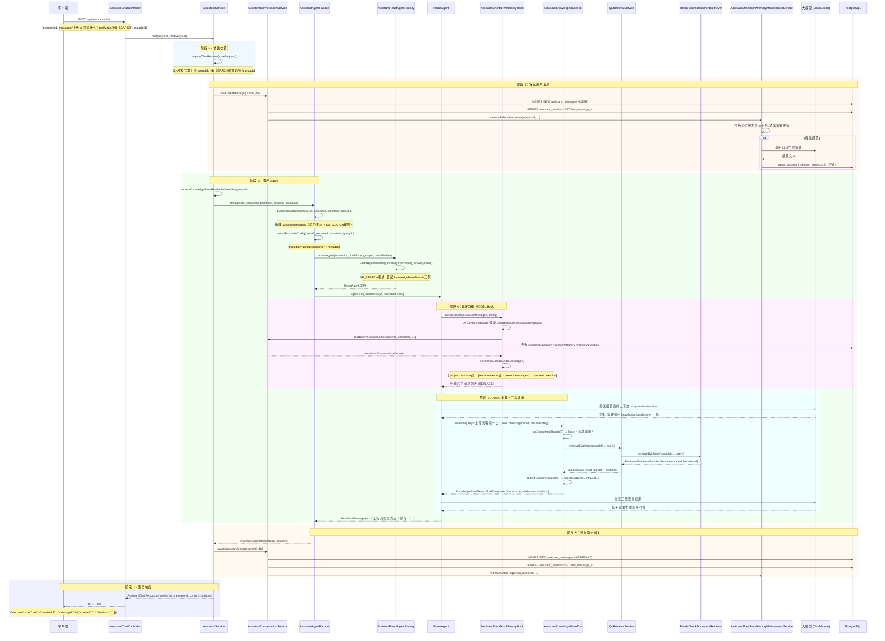

# Argus V4.0 设计决策

> 本文档是 [V4.0-项目文档.md](V4.0-项目文档.md) 第五章"核心设计决策"的详细展开，
> 逐一阐述 V4.0 AI 助手（Assistant）模块中每一项架构决策的**问题背景、解决方案、实现细节和工程权衡**。
>
> 返回主文档：[V4.0-项目文档.md](V4.0-项目文档.md)

---

## 4.0 助手对话全流程

### 流程概览

`POST /api/assistant/chat` 和 `POST /api/assistant/chat/stream` 是 V4.0 的核心入口。一条用户消息从 HTTP 请求到响应，经历以下 7 个阶段：

```
Client → Controller → 参数校验 → 保存用户消息 → 构建 instruction + RunnableConfig → Agent 执行 → 保存助手回复 → 返回响应
```

流式模式在 Agent 执行阶段额外插入 SSE 事件推送（start → delta × N → done）。

### 完整时序图（同步聊天，KB_SEARCH 模式）



### 逐阶段详解

#### 阶段 1：参数校验（AssistantService）

```java
private AssistantChatRequest requireChatRequest(AssistantChatRequest chatRequest) {
    if (chatRequest == null) throw new BusinessException("聊天请求不能为空");
    if (chatRequest.toolMode() == AssistantToolMode.CHAT && chatRequest.groupId() != null)
        throw new BusinessException("CHAT 模式不允许传 groupId");
    if (chatRequest.toolMode() == AssistantToolMode.KB_SEARCH && chatRequest.groupId() == null)
        throw new BusinessException("KB_SEARCH 模式必须传 groupId");
    return chatRequest;
}
```

CHAT 和 KB_SEARCH 对 `groupId` 有互斥的约束——这是第一道防线，在请求进入业务逻辑前就拦截参数错误。

#### 阶段 2：保存用户消息 + 触发短期记忆维护

用户消息**先落库，再调模型**。这样做的目的是让 `BEFORE_MODEL Hook` 在重建上下文时能看到刚发送的用户消息（通过 `loadRecentMessages` 从数据库加载）。

消息保存后立即触发 `maintainBeforeResponse`——在模型看到上下文之前，确保 compact summary 和 session memory 已经包含了最新的消息。

#### 阶段 3：构建 instruction + RunnableConfig

`AssistantPromptContextBuilder.buildChatInstruction()` 动态生成最外层 system instruction：
- 基础部分：角色定义、基本原则、回答要求、信息不足处理、表达风格、错误预防、优先级
- 动态部分：`sessionId`、`toolMode`、可选的 `groupId`
- KB_SEARCH 模式追加：6 条知识库检索规则（单次调用、基于证据回答、重复调用检测等）

`AssistantRunnableConfigFactory.create()` 构建 `RunnableConfig`：
- `threadId`：格式 `user:{userId}:session:{sessionId}`，用于 MemorySaver 的检查点隔离
- `metadata`：`{userId, sessionId, toolMode, groupId}`，供 Hook 在运行时读取

#### 阶段 4：BEFORE_MODEL Hook 上下文组装

这是设计决策 [4.3](#43-before_model-hook-上下文组装) 的核心。

Hook 在每次模型调用前被触发，从 RunnableConfig 的 metadata 中提取参数，加载数据库中的上下文，重新组装消息列表：

```
[system: compact summary] → [system: session memory] → [历史消息1] → [历史消息2] → ... → [工具观察] → [当前用户问题]
```

注意这里是 **REPLACE 模式**（`UpdatePolicy.REPLACE`），不是追加——Hook 完全接管了消息列表的构建。

#### 阶段 5：Agent 推理 + 工具调用

CHAT 模式下，Agent 没有工具，直接基于上下文和模型知识生成回答。

KB_SEARCH 模式下，Agent 装配了 `knowledgeBaseSearch` 工具。模型看到 system instruction 中的"当前轮次最多调用一次"规则后，自主决定是否调用工具。

工具调用通过 `QaRetrievalService` 走 V3.0 的完整检索链路（内部委托 `ReadyChunkDocumentRetriever` → `HybridChunkRetrievalService` → 查询规划 + 双通道检索 + RRF 融合 + 证据评估）。

#### 阶段 6：保存助手回复 + 触发短期记忆维护

Agent 返回后，助手回复落库。`maintainAfterResponse` 再次检查是否需要更新摘要——这次包含了助手刚生成的回复内容。

#### 阶段 7：返回响应

同步聊天返回 `AssistantChatResponse`（含 messageId、完整回复文本、引用列表）。

流式聊天在阶段 3-6 之间插入 SSE 事件推送（设计决策 [4.4](#44-sse-流式聊天与-delta-去重)）。

### 异常路径汇总

| 失败点 | 触发条件 | 处理方式 | HTTP 响应 |
|--------|---------|---------|-----------|
| 参数校验 | CHAT 模式传 groupId / KB_SEARCH 缺 groupId | 抛出 `BusinessException` | 400 |
| 权限校验 | 用户不是群组成员（KB_SEARCH 模式） | 抛出 `ForbiddenException` | 403 |
| 会话不存在 | sessionId 不属于当前用户 | 抛出 `BusinessException("会话不存在")` | 400 |
| Agent 调用失败 | `GraphRunnerException` | 抛出 `BusinessException("助手调用失败")` | 400 |
| Agent 返回空 | `assistantMessage == null \|\| text.isBlank()` | 抛出 `BusinessException("助手返回内容为空")` | 400 |
| SSE 发送失败 | 客户端断开连接 | `closed.set(true)`，停止推送 | SSE 连接关闭 |
| 短期记忆写回失败 | 乐观锁冲突（`updatedRows != 1`） | 抛出 `BusinessException("短期记忆写回失败")` | 400（事务回滚） |

### 关键数据流

| 对象 | 产生于 | 消费于 | 内容 |
|------|--------|--------|------|
| `AssistantChatRequest` | HTTP 请求体 | `AssistantService` | `{sessionId, message, toolMode, groupId}` |
| `RunnableConfig` | `AssistantRunnableConfigFactory` | `ReactAgent` → `Hook` | `{threadId, metadata{userId, sessionId, toolMode, groupId}}` |
| `AssistantConversationContext` | `AssistantConversationService` | `AssistantShortTermMemoryHook` | `{summaryText, compactSummary, sessionMemory, recentMessages}` |
| `AssistantAgentResult` | `AssistantAgentFacade` | `AssistantService` | `{reply, citations}` |
| `AssistantChatResponse` | `AssistantService` | Controller → 客户端 | `{sessionId, messageId, content, toolMode, groupId, citations}` |

---

## 4.1 ReactAgent 统一对话引擎

### 为什么选择 ReactAgent

V4.0 需要支持两种模式——纯对话（CHAT）和知识库检索（KB_SEARCH）——它们共享相同的对话管理基础设施（上下文记忆、消息持久化、流式输出），差异仅在于是否装配检索工具和 system prompt 的行为约束不同。

如果将两种模式分别实现（例如 CHAT 用普通 ChatClient，KB_SEARCH 用 Agent），会导致：
- 对话历史管理逻辑重复
- BEFORE_MODEL Hook 需要适配两套调用路径
- 流式输出处理需要两套实现

### 解决方案：CHAT 也走 Agent 运行时

即使是纯对话模式，也使用 ReactAgent 图执行引擎——只是不装配任何工具：

```java
// AssistantReactAgentFactory.createAgent()
ReactAgent.Builder builder = ReactAgent.builder()
        .name("assistant_chat_agent")
        .model(chatModel)
        .instruction(instruction)
        .hooks(assistantShortTermMemoryHook)
        .compileConfig(CompileConfig.builder()
                .recursionLimit(AGENT_RECURSION_LIMIT)  // 10
                .build())
        .saver(new MemorySaver());

if (toolMode == AssistantToolMode.KB_SEARCH) {
    builder.methodTools(assistantKnowledgeBaseTool)
            .toolContext(Map.of(
                    GROUP_ID_CONTEXT_KEY, groupId,
                    RESULT_HOLDER_CONTEXT_KEY, resultHolder
            ));
}
return builder.build();
```

CHAT 模式下 Agent 图的执行路径：
```
START → agent(模型推理) → END
```

KB_SEARCH 模式下 Agent 图的执行路径：
```
START → agent(模型推理) → tools(知识库检索) → agent(基于证据生成回答) → END
```

### 关键设计选择

**递归上限 = 10**：KB_SEARCH 模式至少需要 3 步（决策 → 调工具 → 生成回答），10 次递归为"模型反复调用工具"或"多轮推理"等复杂场景预留了足够的空间。过小（如 3）可能导致图在最终回答前被截断，过大浪费计算资源。

**MemorySaver**：用于图运行态的 checkpoint 保存——这是 Agent 框架内部的状态管理，不是业务层面的记忆。MemorySaver 只在单次 JVM 进程内有效，不持久化。业务的长期记忆由 `assistant_session_contexts` 表管理。

**toolContext 传递 groupId**：`ToolContext` 是 Spring AI 的工具上下文机制。`groupId` 不从 `RunnableConfig.metadata` 读取是因为工具执行发生在图节点内部，不经过 Hook——`ToolContext` 是唯一能传递业务参数到工具方法的通道。

### 权衡

**收益**：两种模式共用同一套 Hook、流式处理、错误处理逻辑，代码复用度高。新增工具模式只需在 `createAgent()` 中追加 `methodTools()` 调用。

**代价**：CHAT 模式下 ReactAgent 图的执行有微小开销（图节点的调度、MemorySaver 的 checkpoint 写入），相比直接调用 `ChatClient` 多了约几毫秒。但这个开销在 LLM 调用时延（数秒级别）面前可忽略。

---

## 4.2 短期记忆三级压缩策略

### 为什么需要多级压缩

多轮对话面临的核心矛盾：**LLM 的上下文窗口有限，但对话历史无限增长**。

简单的滑动窗口（只保留最近 N 条消息）在长对话中会丢失早期的关键信息（如用户一开始设定的偏好、之前确认的事实）。而 LLM 摘要虽然能压缩历史，但摘要质量随被压缩的消息量增加而下降。

### 解决方案：三级渐进压缩

```
消息层:  [msg1] [msg2] [msg3] ... [msg9] [msg10]  ← 原始消息（数据库全量存储）
           │                        │
           │ 超过阈值时触发          │ 始终保留最近 N 条
           ▼                        ▼
摘要层:  [summary_text]            [msg8] [msg9] [msg10]  ← 早期消息的简明摘要
           │
           │ 更精细的压缩
           ▼
记忆层:  [session_memory]  ← LLM 增量摘要（保留关键事实和决策）
           │
           │ 超过总 token 阈值时触发
           ▼
压缩层:  [compact_summary] ← 更精炼的压缩（丢弃冗余细节）
```

**第一级：summary_text（会话摘要）**

由 `AssistantSessionSummaryService` 管理。当会话消息数超过 20 条或 token 估算超过 8000 时触发。规则是：保留最近 N 条原始消息，将更早的消息压缩为 `"- 用户：xxx\n- 助手：xxx"` 格式的简明摘要（上限 2000 字符）。

摘要可复用——如果摘要的更新时间晚于会话的最后消息时间，且未超过 7 天，则直接复用。

**第二级：session_memory（会话记忆）**

由 `AssistantShortTermMemoryMaintenanceService` 管理。基于增量阈值触发：每当新增 4 条消息或新增 token 超过 1200 时，调用 LLM 基于"现有会话记忆 + 新增消息"生成更新后的会话记忆。

这是一个**增量更新**过程——不是每次重新摘要全部历史，而是让 LLM 将新消息"合并"到已有记忆中。Prompt 模板 `session-memory-update.st` 引导 LLM 保留关键事实、用户偏好、重要决策，丢弃临时性的寒暄和重复内容。

**第三级：compact_summary（紧凑摘要）**

当会话总 token 超过 6500 且满足增量阈值（6 条消息或 1800 token）时触发。这是在 session_memory 仍然过大时的进一步压缩——基于"现有 compact summary + session memory + 待压缩消息"生成更精炼的版本。

Prompt 模板 `session-compact-summary.st` 引导 LLM 从 session memory 中提取最核心的信息，丢弃次要细节。

### 上下文组装时的使用顺序

在 `BEFORE_MODEL Hook` 中，三级压缩的产物按以下顺序注入消息列表：

```java
addSystemMemory(messages, "compact summary", conversationContext.compactSummary());
addSystemMemory(messages, "session memory", conversationContext.sessionMemory());
appendRecentMessages(messages, conversationContext.recentMessages(), currentQuestion);
```

即：**compact summary 最先、session memory 其次、最近原始消息最后**。这确保了模型先看到压缩后的全局状态，再看到最近的对话细节——模型可以结合两者理解上下文。

### 乐观锁并发控制

`assistant_session_contexts` 表的更新使用版本号乐观锁：

```sql
UPDATE assistant_session_contexts
SET session_memory = ..., context_version = #{context.contextVersion}, updated_at = ...
WHERE session_id = #{context.sessionId}
  AND context_version = #{expectedVersion}
```

如果两个并发请求同时触发记忆更新，只有一个会成功（`updatedRows == 1`）。失败的请求抛出 `BusinessException`，事务回滚——此时消息已保存（同一事务内），但记忆维护被放弃。下一次请求会基于最新的消息重新触发维护。

### 为什么是字符数/4 的粗略估算

精确的 token 计数需要调用 tokenizer（如 tiktoken），但 Java 生态缺少成熟的 tokenizer 库。引入 Python 侧车或 HTTP 调用外部 tokenizer 会增加复杂度和延迟。

`字符数 / 4` 是一个保守估计——英文约 4 字符/token，中文约 1.5 字符/token。取 4 作为除数意味着对中文场景会低估实际 token 数（更早触发压缩），这是一个安全的偏向：宁可提前压缩，也不冒超出上下文窗口的风险。

### 运行时压缩（最后防线）

`AssistantShortTermMemoryHook` 还有一个硬编码的运行时压缩阈值（50000 token）。当估算 token 超过此值时，`runtimeCompact()` 直接截断消息列表，只保留末尾 3 条消息。这是一个逃生舱——正常流程不应触发（6500 的 compact summary 阈值远低于 50000），但如果前面的压缩机制全部失效，这个硬截断能防止上下文窗口溢出。

---

## 4.3 BEFORE_MODEL Hook 上下文组装

### 为什么需要 Hook

ReactAgent 的模型调用由框架内部触发。框架只知道当前图的 state（前序节点输出），不知道业务层的会话上下文（数据库中存储的 compact summary、session memory、recent messages）。

需要一个机制在**每次模型调用之前**，将业务层的上下文注入到模型看到的消息列表中。

### 解决方案：MessagesModelHook + BEFORE_MODEL

Spring AI Alibaba Agent Framework 提供了 `MessagesModelHook` 抽象——在模型调用前（`BEFORE_MODEL`）和调用后（`AFTER_MODEL`）拦截消息列表，可以修改、替换或追加消息。

`AssistantShortTermMemoryHook` 注册为 `@HookPositions({HookPosition.BEFORE_MODEL})`：

```java
@Override
public AgentCommand beforeModel(List<Message> previousMessages, RunnableConfig config) {
    // 1. 从 config.metadata 提取参数
    Long userId = metadataAsLong(config, "userId").orElse(null);
    Long sessionId = metadataAsLong(config, "sessionId").orElse(null);
    AssistantToolMode toolMode = metadataAsToolMode(config, "toolMode").orElse(null);

    // 2. 提取当前用户问题（previousMessages 中最后一条 UserMessage）
    String currentQuestion = extractCurrentQuestion(previousMessages);

    // 3. 加载数据库中的上下文
    List<Message> assembledMessages = assembleBeforeModelMessages(
            userId, sessionId, toolMode, groupId, currentQuestion, previousMessages
    );

    // 4. 返回 REPLACE 模式——完全替换原消息列表
    return new AgentCommand(assembledMessages, UpdatePolicy.REPLACE);
}
```

### 消息组装顺序

```java
public List<Message> assembleBeforeModelMessages(...) {
    List<Message> messages = new ArrayList<>();

    // 1. 紧凑摘要（作为系统消息）
    addSystemMemory(messages, "compact summary", conversationContext.compactSummary());

    // 2. 会话记忆（作为系统消息）
    addSystemMemory(messages, "session memory", conversationContext.sessionMemory());

    // 3. 最近对话历史（数据库中的原始消息）
    appendRecentMessages(messages, conversationContext.recentMessages(), currentQuestion);

    // 4. 运行时工具消息（Agent 图执行过程中产生的 ToolResponseMessage）
    appendRuntimeToolMessages(messages, runtimeMessages);

    // 5. 当前用户问题
    messages.add(new UserMessage(currentQuestion));

    return messages;
}
```

### 当前问题去重

`appendRecentMessages()` 中有一个去重逻辑——如果最近消息列表中的最后一条 USER 消息的内容与当前问题完全相同（字符串比较），则跳过该条消息。因为当前问题会在消息列表末尾重新追加，避免重复喂给模型：

```java
boolean isCurrentQuestionEcho = index == lastIndex
        && recentMessage.role() == AssistantMessageRole.USER
        && currentQuestion.equals(recentMessage.content().trim());
if (isCurrentQuestionEcho) {
    continue;
}
```

### 历史消息格式化

注入上下文的历史消息会被加上前缀标记，让模型能区分不同来源：

```java
// 用户历史消息
"[历史消息 | 模式：CHAT]\n用户输入的文本"

// 助手历史消息
"[历史消息 | 模式：KB_SEARCH]\n助手回复的文本"

// 工具观察
"[工具观察]\n工具返回的JSON结果"
```

### 为什么是 REPLACE 而非 APPEND

Agent 框架传给 Hook 的 `previousMessages` 包含图节点自动管理的消息（用户输入、工具调用结果等）。如果使用 APPEND 模式，这些图节点消息会和业务上下文消息混在一起，导致消息列表冗余和顺序混乱。

REPLACE 模式意味着 Hook 完全接管消息列表的构建——所有模型应该看到的信息都由 Hook 从数据库和 runtime 参数中组装，不依赖图节点的默认消息管理。

### RunnableConfig 的元数据传递

Hook 如何知道当前是哪个用户、哪个会话？通过 `RunnableConfig` 的 metadata：

```java
// AssistantRunnableConfigFactory.create()
RunnableConfig.Builder builder = RunnableConfig.builder()
        .threadId("user:%d:session:%d".formatted(userId, sessionId))
        .addMetadata("userId", userId)
        .addMetadata("sessionId", sessionId)
        .addMetadata("toolMode", toolMode == null ? null : toolMode.name());
```

`RunnableConfig` 伴随整个图执行过程，所有节点（包括 Hook）都可以读取。这是 Agent 框架中跨节点传递业务上下文的唯一机制。

---

## 4.4 SSE 流式聊天与 Delta 去重

### 为什么需要 Delta 去重

Spring AI Alibaba Agent Framework 的流式实现通过 Reactor `Flux<NodeOutput>` 推送图节点输出。在 `AGENT_MODEL_STREAMING` 阶段，框架会推送模型生成的文本。

但在某些模型后端（如 DashScope）下，流式节点的 `message.getText()` 返回的不是**增量 delta**，而是**截至当前的全文**——即每次推送的都是"从开头到当前位置的完整文本"。如果直接透传给前端，前端会看到重复的前缀。

### 解决方案：前缀减法

```java
private String normalizeStreamingDelta(String candidateText, String accumulatedReply) {
    if (candidateText == null || candidateText.isBlank()) {
        return "";
    }
    if (accumulatedReply.isEmpty()) {
        return candidateText;  // 第一条 delta，直接使用
    }
    // 如果 candidateText 包含已累计的前缀，裁掉前缀得到增量
    if (candidateText.startsWith(accumulatedReply)) {
        return candidateText.substring(accumulatedReply.length());
    }
    return candidateText;  // 回退：如果前缀不匹配，直接返回（可能是模型重新开始输出）
}
```

`accumulatedReply` 是一个 `StringBuilder`，在整次流式调用中持续累积——每次收到新文本，裁掉已累积的前缀，只将真正的增量交给 `deltaConsumer`。

### 流式处理的两种输出类型

```java
private void handleStreamingOutput(NodeOutput output, Consumer<String> deltaConsumer, StringBuilder finalReply) {
    if (!(output instanceof StreamingOutput streamingOutput)) return;

    OutputType type = streamingOutput.getOutputType();
    Message message = streamingOutput.message();
    if (!(message instanceof AssistantMessage assistantMessage)) return;

    if (type == OutputType.AGENT_MODEL_STREAMING) {
        // 正常流式路径：模型边生成边推送
        String delta = normalizeStreamingDelta(assistantMessage.getText(), finalReply.toString());
        finalReply.append(delta);
        deltaConsumer.accept(delta);
    }

    if (type == OutputType.AGENT_MODEL_FINISHED
            && !assistantMessage.hasToolCalls()
            && finalReply.isEmpty()) {
        // 兜底：某些模型不走 streaming 通道，直接在 finished 节点返回全文
        String fullText = assistantMessage.getText();
        finalReply.append(fullText);
        deltaConsumer.accept(fullText);
    }
}
```

`AGENT_MODEL_FINISHED` 兜底路径处理的是模型不走逐字流式输出的情况——此时 `finalReply` 为空，需要将完整文本作为一次性 delta 发送。

### 为什么用 SSE 而非 WebSocket

SSE 是单向的（服务器 → 客户端），非常适合"模型逐字输出给前端"的场景。WebSocket 是双向的，但在当前需求中客户端不需要在流式过程中向服务器发送数据（用户输入在 HTTP 请求体中一次性传递）。

SSE 的优势：
- 实现简单——Spring MVC 原生支持 `SseEmitter`，无需额外依赖。
- 客户端处理简单——浏览器 `EventSource` API 或 fetch + ReadableStream。
- 自动重连——浏览器 `EventSource` 在连接断开时自动重连。

### CachedThreadPool 的选择

SSE 推送在线程池中执行，避免阻塞 Tomcat 的请求处理线程：

```java
private final ExecutorService sseExecutor = Executors.newCachedThreadPool();
```

选择 CachedThreadPool 而非 FixedThreadPool 的理由：SSE 连接的生命周期不确定（可能持续数秒到数分钟），如果使用固定大小线程池，长时间占用线程会导致其他 SSE 请求排队。CachedThreadPool 在连接数较少时开销低，连接数增加时自动扩容。

`@PreDestroy` 方法确保应用关闭时线程池被正确关闭。

---

## 4.5 工具式知识库检索与单次调用约束

### 为什么需要单次调用约束

Agent 拥有自主决策权——它可以选择调用工具、不调用工具，或者在收到工具结果后再次调用工具。

如果不加约束，Agent 可能在收到第一次检索结果后，认为"证据不够"而再次调用工具（也许换个 query）。这在某些场景下是合理的，但在 V4.0 的上下文中：

1. **检索已经做了**——通过 `QaRetrievalService.retrieveEvidence()`（内部委托 `ReadyChunkDocumentRetriever`）执行了完整的查询规划 + 双通道检索 + RRF 融合 + 证据评估，这已经是一次高质量的检索。
2. **重复调用浪费资源**——每次检索触发向量计算 + ES 查询 + LLM 证据评估，时延和成本都不低。
3. **容易陷入循环**——Agent 可能在"检索 → 不满意 → 换 query 再检索"的循环中消耗递归上限，最终仍拿不到比第一次更好的结果。

### 解决方案：状态持有器 + System Prompt 双重约束

**状态持有器（`AssistantKnowledgeBaseToolResultHolder`）**：

```java
public void recordCitations(List<Citation> citations) {
    this.citations = citations == null ? List.of() : List.copyOf(citations);
    this.searchState = KnowledgeBaseSearchState.COMPLETED;
}

public boolean hasCompletedSearch() {
    return searchState == KnowledgeBaseSearchState.COMPLETED;
}
```

工具在第一次检索成功后标记 `COMPLETED`。后续调用检测到此状态后返回 `DUPLICATE_TOOL_CALL`：

```java
if (resultHolder.hasCompletedSearch()) {
    return new KnowledgeBaseSearchToolResponse(
            false,
            "DUPLICATE_TOOL_CALL",
            "本轮已经完成过一次知识库检索，请基于上一条工具返回的 evidences 直接给出最终回答，不要再次调用工具。",
            null,
            "本轮知识库检索结果已经返回，必须停止继续调用工具并生成最终回答。",
            List.of(),
            resultHolder.currentCitations()  // 返回第一次检索的引用
    );
}
```

注意这里不是抛异常，而是返回一个带有错误信息的正常响应——让 Agent 看到"你已经检索过了，请基于现有证据回答"。

**System Prompt 配合**：

```
## 知识库检索模式
1. 当前轮次最多调用一次 knowledgeBaseSearch 工具检索证据。
2. 调用工具并收到返回结果后，必须立即基于该次工具返回的 evidences 生成最终回答，不得再次调用工具。
...
5. 如果工具返回 reasonCode=DUPLICATE_TOOL_CALL，说明你已经重复调用工具，必须停止调用并基于上一条工具结果回答。
```

System Prompt 的规则 1-2 是**预防性约束**（让 Agent 从一开始就倾向于只调用一次），规则 5 是**响应性约束**（万一 Agent 还是调用了第二次，告诉它如何应对）。两者配合降低了 Agent 重复调用的概率。

### 为什么不在工具层抛异常阻止

如果工具直接抛异常，Agent 框架会将异常信息返回给模型，模型的响应不可控——它可能会向用户输出错误信息，而不是基于已有证据生成回答。

返回结构化的 `DUPLICATE_TOOL_CALL` 响应，让 Agent "看到"这是一个需要调整行为的信号，比直接中断工具调用更优雅。

### 引用列表的跨步骤传递

`AssistantKnowledgeBaseToolResultHolder` 还有一个职责：记录检索引用，供 `AssistantAgentFacade` 读取并组装最终响应。

Agent 图执行过程中，工具返回的 `KnowledgeBaseSearchToolResponse` 包含了 `citations`。但 Agent 图执行完毕后，`Agent.call()` 只返回 `AssistantMessage`（文本回复），不包含引用列表。因此需要一个**跨图步骤的持有器**来传递引用：

```
知识库工具调用 → recordCitations(citations) → resultHolder
                                                      ↓
Agent 图执行完毕 → facade.chat() → resultHolder.currentCitations() → AssistantAgentResult
```

---

## 4.6 会话自动命名

### 为什么需要自动命名

创建会话时的默认标题是"新会话"。如果用户创建了多个会话且不手动重命名，会话列表会显示一排"新会话"，无法区分。

### 解决方案：首条消息的前 24 字符作为标题

当会话中的**第一条用户消息**落库后，`AssistantConversationService.saveMessage()` 检测到 `messageCount == 1`（这是该会话的第一条消息），触发 `autoRenameSessionIfNeeded()`：

```java
if (role == AssistantMessageRole.USER) {
    Long messageCount = assistantMessageMapper.countBySessionId(session.getId());
    if (messageCount != null && messageCount == 1L) {
        assistantSessionService.autoRenameSessionIfNeeded(userId, session.getId(), safeDto.content());
    }
}
```

`autoRenameSessionIfNeeded()` 的逻辑：

```java
public void autoRenameSessionIfNeeded(Long currentUserId, Long sessionId, String firstUserMessage) {
    // 1. 仅当标题仍为默认值时执行
    if (!DEFAULT_SESSION_TITLE.equals(session.getTitle())) return;

    // 2. 提取前 24 字符
    String generatedTitle = generateSessionTitle(firstUserMessage);

    // 3. 如果生成的标题与当前标题相同或为空，不更新
    if (generatedTitle == null || DEFAULT_SESSION_TITLE.equals(generatedTitle)) return;

    // 4. 更新标题
    int updatedRows = assistantSessionMapper.updateTitle(sessionId, currentUserId, generatedTitle, now);
}
```

标题生成的规则：
- 合并连续空白字符、替换换行符为空格
- 取前 24 个字符，不足 24 字符取全部
- 规范化后为空则保持"新会话"

### 为什么是 24 字符

24 个中文字符约 72 个英文字符宽度——在移动端列表项中大致占 2-3 行，足够区分不同会话的主题，同时不会过长。

### 为什么不使用 LLM 生成标题

LLM 可以生成更好的标题（例如"上传流程与重试机制"），但代价是一次额外的 LLM 调用。在用户发送第一条消息时，模型回答还没有开始生成（此时消息刚落库，模型还没调用），插入一次 LLM 标题生成调用会增加用户感知延迟。

简单的前 24 字符截取在大多数情况下已经足够——用户的第一条消息通常是对主题的简短描述。

---

> 返回主文档：[V4.0-项目文档.md](V4.0-项目文档.md)
