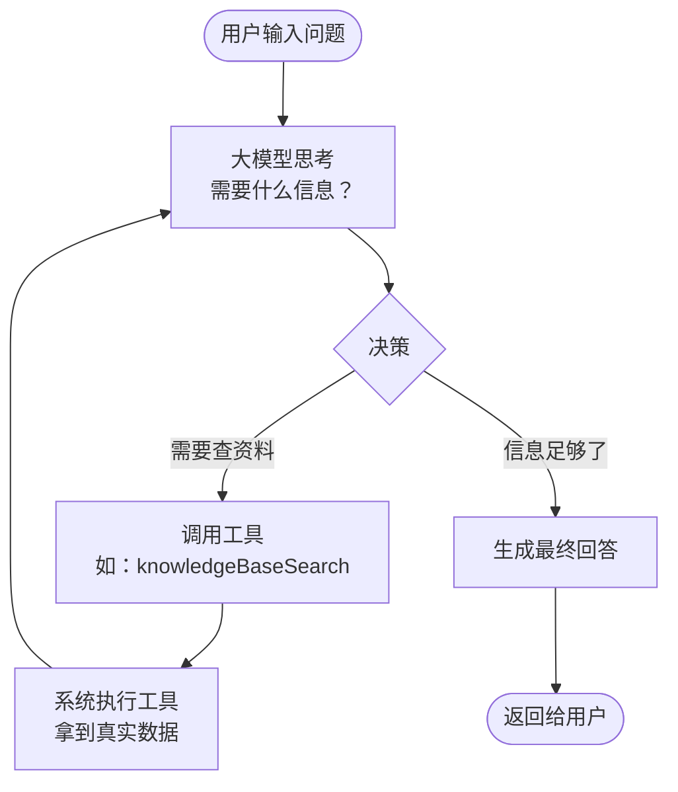
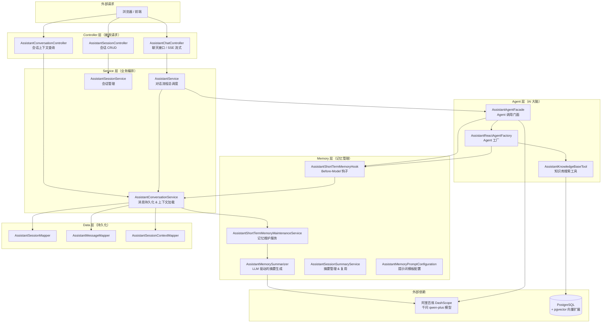
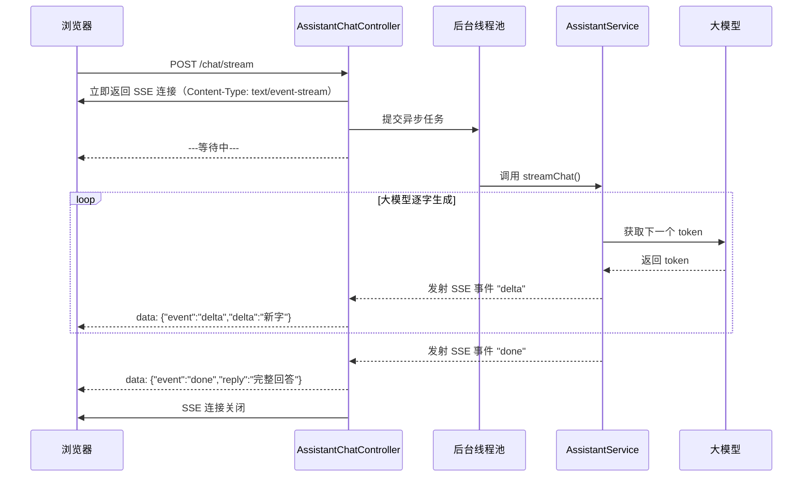
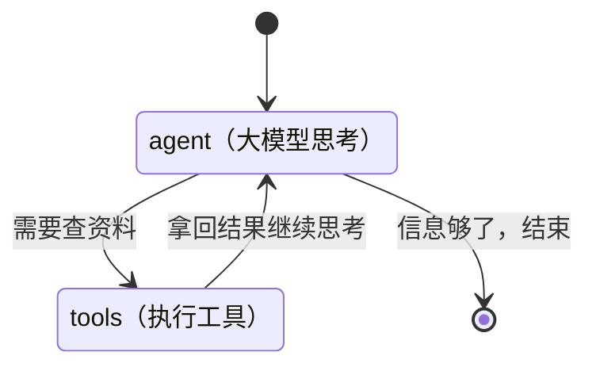
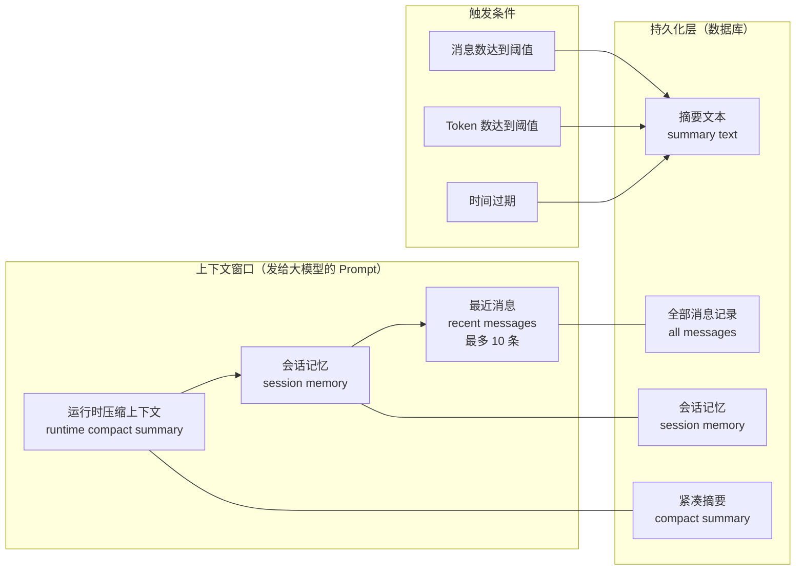
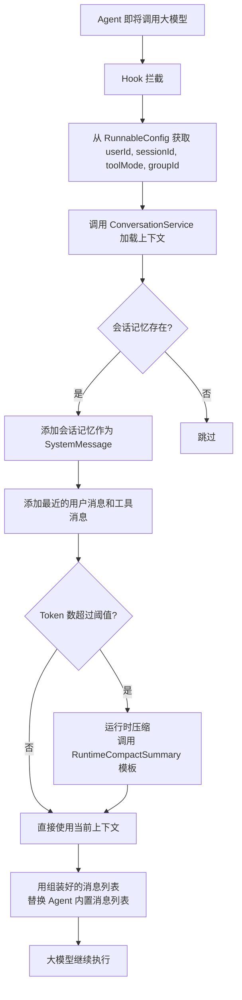
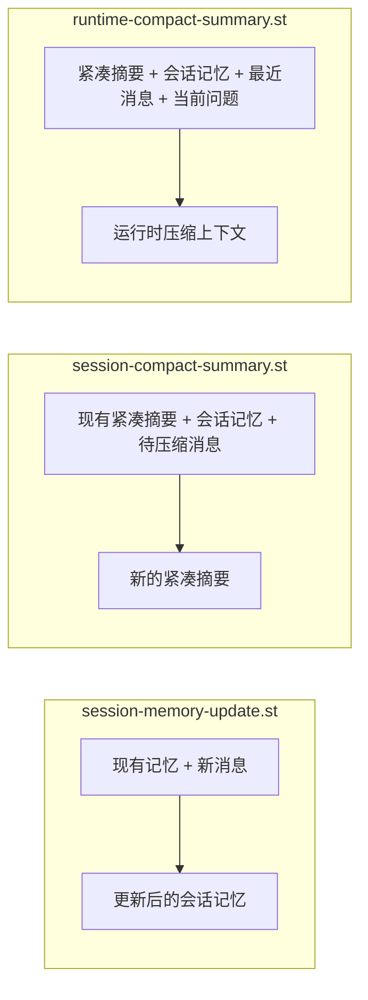
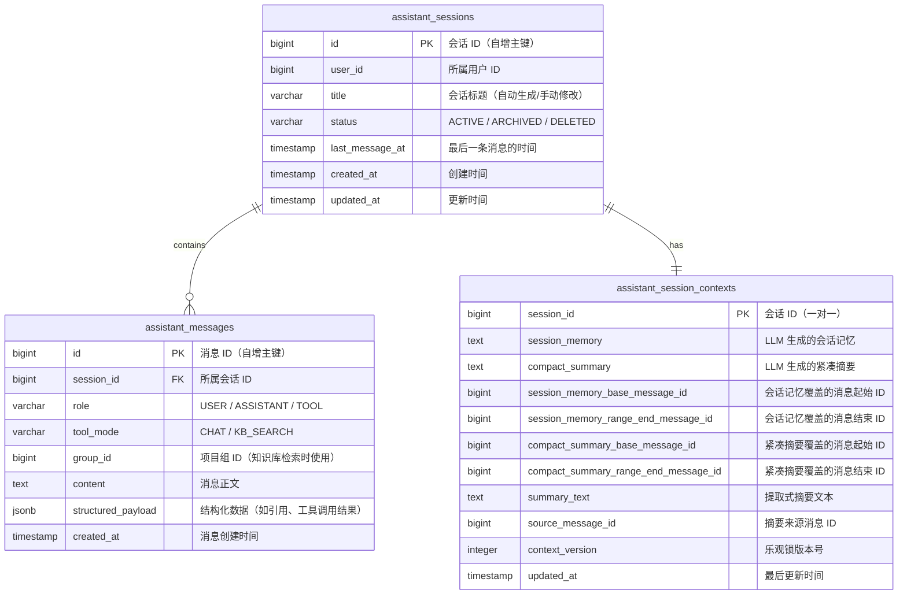
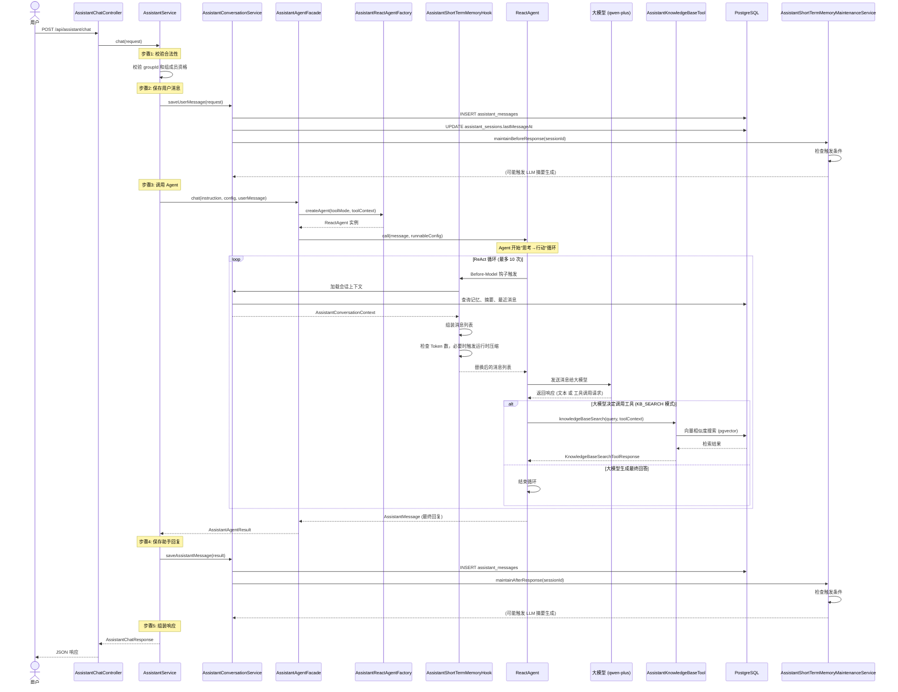
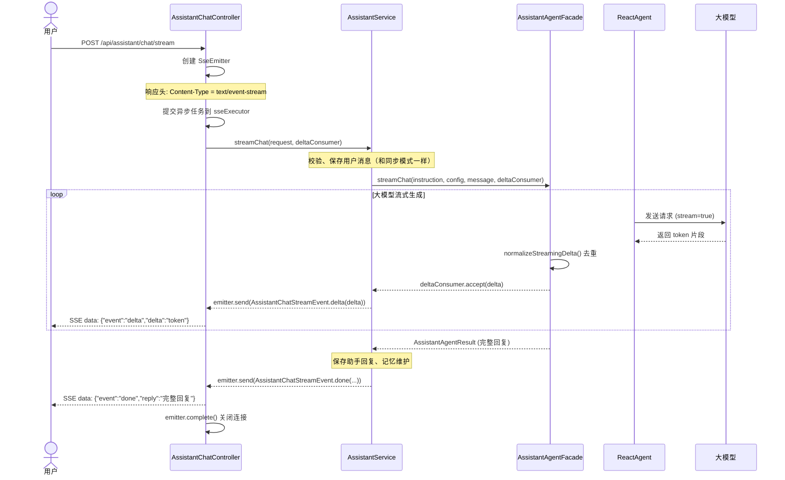

# AskLens 助手模块深度解析：从 Spring AI 初学者到理解 Agent 架构

> 适用读者：有 Java / Spring Boot 基础，但初次接触 Spring AI 和 AI Agent 概念的开发者。
>
> 本文档基于项目 `assistant` 模块的实际代码，结合 Spring AI 与 Spring AI Alibaba 最新官方文档编写。
>
> 撰写时间：2026 年 5 月

---

## 目录

1. [引子：用聊天框调用大模型，到底发生了什么](#1-引子用聊天框调用大模型到底发生了什么)
2. [基础概念：Spring AI 给了我们什么](#2-基础概念spring-ai-给了我们什么)
3. [从简单对话到 Agent：为什么需要"代理"](#3-从简单对话到-agent为什么需要代理)
4. [项目整体架构：一张图看懂所有角色](#4-项目整体架构一张图看懂所有角色)
5. [入口层：Controller 如何接收请求](#5-入口层controller-如何接收请求)
6. [编排层：Service 如何串联整个流程](#6-编排层service-如何串联整个流程)
7. [Agent 核心：ReactAgent 如何工作](#7-agent-核心reactagent-如何工作)
8. [工具调用：让大模型能"动手"](#8-工具调用让大模型能动手)
9. [记忆系统：会话上下文如何管理](#9-记忆系统会话上下文如何管理)
10. [数据层：会话、消息、上下文如何持久化](#10-数据层会话消息上下文如何持久化)
11. [完整请求链路：一次聊天的全景图](#11-完整请求链路一次聊天的全景图)
12. [配置文件解析：连接大模型的桥梁](#12-配置文件解析连接大模型的桥梁)
13. [总结与学习建议](#13-总结与学习建议)

---

## 1. 引子：用聊天框调用大模型，到底发生了什么

想象你打开一个 AI 聊天页面，输入"帮我查一下项目知识库里关于登录流程的文档"，然后 AI 回复了你。从你点击"发送"到看到回复的那几秒钟，背后发生了什么？

最简化的版本是这样的：

```
用户输入文字 → 发送到远程大模型 API → 大模型生成回复 → 返回给用户
```

但真实的生产级应用远比这复杂。让我们逐步展开：

**首先，大模型是"无状态"的。** 它不记得你上一句话说了什么。如果你先告诉它"我叫小明"，下一句问"我叫什么名字？"，它根本不知道。所以你需要把历史对话每次都一起发给它。

**其次，大模型的知识有截止日期。** 你项目里的文档、代码、数据库里的数据，它一概不知。如果你想让 AI 回答关于你项目的问题，你需要先找到相关资料，然后把资料和问题一起发给它。这就是 RAG（检索增强生成）的核心思路。

**第三，大模型不能"动手"。** 它只能生成文字，不能查数据库、不能调 API、不能读文件。但如果你给大模型配上一套"工具"，让它需要什么数据时自己调用工具去取，那它就从"只会说话的机器人"变成了"能动手的代理"。这就是 Agent 的核心思路。

**Spring AI 就是帮你在 Java/Spring Boot 项目里优雅地完成以上所有事情的一套框架。**

---

## 2. 基础概念：Spring AI 给了我们什么

在正式深入代码之前，我们必须理解 Spring AI 提供的三个核心抽象。这三个概念像积木一样，后面的所有复杂功能都是由它们组合搭建而成的。

### 2.1 ChatModel：与大模型对话的"插座"

`ChatModel` 是 Spring AI 最底层的接口。你可以把它理解为"万能插座"——不管是 OpenAI 的 GPT、阿里百炼的千问（Qwen）、还是本地的 Ollama 模型，只要你有一根对应的"插头"（适配器），你都可以用同一套代码调用。

```java
// 不管是哪个厂商的模型，调用方式都是一样的
@Autowired
private ChatModel chatModel;

String answer = chatModel.call("你好，世界！");
```

在你的项目中，通过配置文件指定了使用阿里 DashScope 的千问模型（`qwen-plus`），Spring AI 在启动时就会自动创建对应的 `ChatModel` 实现，然后注入到需要它的地方。

### 2.2 ChatClient：让对话变得更像"对话"

`ChatModel.call()` 虽然简单，但每次只能发一条消息。真实场景中，我们需要：
- 携带历史对话记录
- 设置系统提示词（system prompt，定义 AI 的角色和行为）
- 挂载工具（tools，让 AI 能调用）
- 挂载顾问（advisors，在请求前后自动处理一些事情）

`ChatClient` 就是做了这些事情的高级封装。你可以把它想象成"对话管家"：

```java
ChatClient client = ChatClient.builder(chatModel)
    .defaultSystem("你是一个专业的 Java 技术顾问，回答要简洁准确。")
    .build();

// 每次调用时，可以动态添加工具、顾问等
String reply = client.prompt()
    .user("Spring Boot 3 有哪些新特性？")
    .call()
    .content();
```

在你的项目中，`AssistantMemorySummarizer` 就使用了 `ChatClient` 来让大模型帮你做"会话摘要"——这个我们后面会详细讲。

### 2.3 PromptTemplate：让提示词像"邮件合并"一样高效

当你需要多次使用同一个提示词模板，只是每次填入的内容不同时，`PromptTemplate` 就派上了用场。它使用 StringTemplate 语法（`{变量名}` 来标记占位）：

```java
// 定义一个模板
PromptTemplate template = new PromptTemplate("请将以下文字翻译成{language}：\n{text}");

// 每次使用时填充不同的值
Prompt prompt1 = template.create(Map.of("language", "英文", "text", "你好世界"));
Prompt prompt2 = template.create(Map.of("language", "日文", "text", "早上好"));
```

在你的项目中，`AssistantMemoryPromptConfiguration` 注册了三个提示词模板 Bean，分别用于**更新会话记忆**、**生成紧凑摘要**和**运行时压缩上下文**——这些都是短时记忆系统的核心，后面会详细展开。

---

## 3. 从简单对话到 Agent：为什么需要"代理"

### 3.1 大模型的"手"和"脑"

大模型很强，但有一个致命缺陷：**它只能生成文本，不能执行操作**。

比如你问它"项目知识库里有没有关于用户登录的文档？"，它只能瞎编（幻觉），因为它根本访问不了你的知识库。

但如果你给它一个"工具"——一个能去知识库里搜索的方法——并告诉它"当你需要查资料的时候，调用这个工具就行"，那么大模型就变成了一个有"手"也有"脑"的智能体（Agent）。

这就是 **Function Calling**（函数调用，也叫 Tool Calling）的核心思想：

```
用户："查一下登录流程"
  ↓
大模型意识到："我需要查知识库"
  ↓
大模型生成工具调用请求："请调用 knowledgeBaseSearch('登录流程')"
  ↓
系统执行 knowledgeBaseSearch，拿到真实数据
  ↓
把数据返回给大模型
  ↓
大模型基于真实数据组织回答
  ↓
返回给用户
```

### 3.2 ReactAgent：思考→行动→观察→再思考的循环

在 Spring AI Alibaba 中，`ReactAgent` 是实现这一循环的核心类。"ReAct" 这个名字来自论文中的概念：**Re**asoning + **Act**ing = ReAct，即"推理 + 行动"。

它的执行过程可以用以下循环来描述：



这个循环会一直执行，直到大模型认为信息足够了，或者达到了最大循环次数（你的项目中设置的是 `recursionLimit=10`，即最多 10 轮"思考→行动→观察"循环）。

### 3.3 你的项目中的两种模式

你的系统设计了两种工具模式（`AssistantToolMode`）：

| 模式 | 枚举值 | 含义 |
|------|--------|------|
| 纯聊天 | `CHAT` | 大模型只负责回答问题，不调用任何工具 |
| 知识库检索 | `KB_SEARCH` | 大模型可以调用 `knowledgeBaseSearch` 工具来搜索项目知识库 |

这两种模式在创建 `ReactAgent` 时就决定了——`AssistantReactAgentFactory` 会根据模式决定是否把 `AssistantKnowledgeBaseTool` 挂载到 Agent 上。

---

## 4. 项目整体架构：一张图看懂所有角色

在深入每个类的细节之前，先用一张图看清整个 assistant 模块的分层架构和调用关系：



从这张图你可以看到清晰的分层：**Controller → Service → Agent/Memory → Data**。每一层只依赖下一层，不会跨层调用。

---

## 5. 入口层：Controller 如何接收请求

Controller 层是系统的"前台"，负责接收 HTTP 请求并返回响应。有三个控制器：

### 5.1 AssistantChatController —— 聊天接口

路径：`/api/assistant/chat` 和 `/api/assistant/chat/stream`

```
POST /api/assistant/chat              → 一次性返回完整回复（同步模式）
POST /api/assistant/chat/stream       → 逐字流式返回回复（SSE 模式，前端模拟打字效果）
```

这个控制器本身很简单，它的工作就是把请求数据（`AssistantChatRequest`）交给 `AssistantService` 处理。

**同步聊天**：控制器收到请求 → 调用 `assistantService.chat()` → 拿到完整回复 → 包装成 JSON 返回。

**流式聊天（SSE）**：稍微复杂一些，因为需要"一边生成一边返回"：



关键代码位置：`AssistantChatController.java:46-90`

`SseEmitter` 是 Spring MVC 提供的 SSE（Server-Sent Events）基础设施，它允许服务器在 HTTP 连接上持续推送数据。控制器创建了一个 `SseEmitter` 实例，然后把它交给 `AssistantService.streamChat()` 方法。每当大模型生成一个新的片段（delta），服务层就通过 `AssistantStreamEventEmitter.emit()` 回调发送一个 SSE 事件给浏览器。这种设计的巧妙之处在于：控制器不需要知道大模型怎么生成内容，只需要知道"有内容来了就推送给前端"。

### 5.2 AssistantSessionController —— 会话 CRUD

路径：`/api/assistant/sessions`

提供标准的 RESTful 接口来管理聊天会话：

```
POST   /api/assistant/sessions        → 创建新会话（可以带首条消息）
GET    /api/assistant/sessions        → 列出当前用户的所有会话
GET    /api/assistant/sessions/{id}   → 查看某个会话的详细信息
PATCH  /api/assistant/sessions/{id}   → 修改会话标题
DELETE /api/assistant/sessions/{id}   → 软删除会话
```

### 5.3 AssistantConversationController —— 会话上下文

路径：`/api/assistant/sessions/{sessionId}/context`

```
GET /api/assistant/sessions/{id}/context → 获取会话的摘要 + 最近消息
```

这个接口主要用于调试和查看"系统到底记住了什么"，方便开发者理解短时记忆系统的工作状态。

---

## 6. 编排层：Service 如何串联整个流程

如果说 Controller 是"前台"，那 Service 就是"调度中心"。它不亲自干体力活（调 Agent、写数据库），而是把各个组件串联起来，保证流程正确。

### 6.1 AssistantService —— 对话流程总调度

这是整个模块中最重要的一个类。它的 `chat()` 方法定义了**一次完整的对话需要经历的所有步骤**：

```mermaid
flowchart TD
    A[收到 AssistantChatRequest] --> B[步骤1: 校验请求]
    B --> B1{工具模式是 KB_SEARCH?}
    B1 -->|是| B2[必须有 groupId,<br/>且用户必须是该组成员]
    B1 -->|否| C
    B2 --> C[步骤2: 保存用户消息到数据库]
    C --> D[步骤3: 记忆维护 - 前置处理]
    D --> E[步骤4: 调用 Agent 生成回复]
    E --> F{Agent 回复是否为空?}
    F -->|是| G[返回 "服务正忙" 兜底回复]
    F -->|否| H[步骤5: 保存助手回复到数据库]
    H --> I[步骤6: 记忆维护 - 后置处理]
    I --> J[步骤7: 组装响应返回给 Controller]
```

**为什么要把流程拆成这样？** 因为每一步都有它存在的理由：

- **步骤1（校验）**：知识库检索模式需要有 `groupId`（指定在哪个项目组的范围内搜索），而且要确保用户有权访问该组的内容。这不是"限制用户"，而是"保护数据安全"。

- **步骤2（保存用户消息）**：必须在调用 Agent 之前保存。因为 Agent 在内部也会访问数据库来获取历史消息（通过短时记忆钩子），如果用户消息还没入库，Agent 就看不到它。

- **步骤3（前置记忆维护）**：在用户消息入库后、Agent 回复生成前，判断是否需要触发 LLM 摘要生成。这一步是"异步准备上下文"。

- **步骤4（调用 Agent）**：核心步骤，交付给 `AssistantAgentFacade` 处理。Agent 内部发生了什么，我们在第 7 章详细展开。

- **步骤5（保存助手回复）**：Agent 回复入库后，成为下一次对话的历史上下文。

- **步骤6（后置记忆维护）**：同样的摘要逻辑，但在回复入库后触发，让摘要能覆盖最新一轮的完整对话。

### 6.2 AssistantConversationService —— 消息与上下文管理

这个类是"消息管家"，负责所有和消息有关的数据操作：

| 方法 | 作用 |
|------|------|
| `saveUserMessage()` | 保存用户消息，同时更新会话的 `lastMessageAt`，如果是首条消息则自动生成会话标题 |
| `saveAssistantMessage()` | 保存助手消息，同时触发后置记忆维护 |
| `loadRecentMessages()` | 加载最近的 N 条消息（用于构建 Agent 的上下文窗口） |
| `loadConversationContext()` | 加载完整的对话上下文（摘要 + 紧凑摘要 + 会话记忆 + 最近消息） |

需要注意的一点：**"自动生成会话标题"**——当用户发送第一条消息时，系统会截取消息的前几个字作为会话标题（最多 24 个字符，多余的用 `...` 替代）。这比让用户手动命名要方便得多。

### 6.3 AssistantSessionService —— 会话管理

标准的 CRUD 服务，值得注意的设计是**软删除**——删除会话时不是物理删除数据，而是将状态标记为 `DELETED`，这样数据和引用关系不会丢失。

---

## 7. Agent 核心：ReactAgent 如何工作

这一章是全文的核心。前面都是铺垫，现在我们终于可以拆解 Agent 内部发生了什么。

### 7.1 概念准备：图（Graph）与状态（State）

在理解 `ReactAgent` 之前，我们先要理解 Spring AI Alibaba 底层的"图执行引擎"（Graph State Machine）。

你可以把 Agent 的执行过程想象成一张**流程图**。这张图有：

- **节点（Node）**：每一步要做什么，比如"调用大模型思考"是一个节点，"执行工具"是另一个节点。
- **边（Edge）**：节点之间的连线，定义流程走向。比如"大模型决定需要调工具 → 走到执行工具节点"，"工具执行完了 → 走回大模型思考节点"。
- **状态（State）**：一个袋子，保存整个流程中产生的数据，比如用户输入、模型输出、工具调用结果、消息历史等。袋子跟着流程走，每个节点都能往里放东西、从里面拿东西。



### 7.2 ReactAgent 的构建过程

你的项目中，`AssistantReactAgentFactory.createAgent()` 方法负责创建 Agent。让我们逐行看懂它在做什么：

```java
ReactAgent agent = ReactAgent.builder()
    .name("assistant")
    .model(chatModel)                  // ① 指定用哪个大模型
    .description("AskLens AI 助手")
    .instruction(instruction)          // ② 系统指令（定义角色和行为规范）
    .compileConfig(CompileConfig.builder()
        .recursionLimit(10)            // ③ 最多 10 轮"思考→行动"循环
        .build())
    .saver(new MemorySaver())          // ④ 图执行过程中的检查点存储
    .hooks(List.of(                    // ⑤ 钩子：在每个节点执行前后插入自定义逻辑
        assistantShortTermMemoryHook
    ))
    // 如果是 KB_SEARCH 模式，挂载知识库搜索工具
    .methodTools(assistantKnowledgeBaseTool)
    .toolContext(Map.of(...))
    .build();
```

让我们逐条解释每个配置的含义：

---

**① `.model(chatModel)` —— 指定大模型**

`chatModel` 是一个 `ChatModel` 类型的 Bean，由 Spring 根据配置文件自动创建。你的项目用的是阿里百炼的千问（`qwen-plus`）模型。`ReactAgent` 内部会多次调用这个模型：每次"思考"的时候调一次，每次拿到工具执行结果后"再思考"的时候再调一次。

---

**② `.instruction(instruction)` —— 系统指令**

这是传给大模型的"角色说明书"。你的项目中的指令由 `AssistantPromptContextBuilder` 动态构建，包含：

- **角色定义**："你是一个专业的 AI 助手"
- **回答原则**：诚实、准确、承认不知道的、不编造
- **格式要求**：使用 Markdown 结构、学术论文格式引用文献
- **工作模式**：当前是纯聊天还是知识库检索，对于 KB_SEARCH 模式，还包含"引用格式要求"和"不知道就说不知道"的约束

这个指令不是写死的，而是每次对话前实时构建的——因为会话信息（sessionId、userId、工具模式、groupId）每次都可能不同。

---

**③ `.compileConfig(CompileConfig.builder().recursionLimit(10).build())` —— 循环限制**

`recursionLimit(10)` 意味着 Agent 的"思考→行动→观察"循环最多执行 10 次。比如：
- 第 1 次：大模型决定要查知识库 → 调用 `knowledgeBaseSearch` → 拿到结果
- 第 2 次：大模型看了结果觉得不够 → 换个关键词再查一次
- 第 3 次：大模型觉得够了 → 组织最终回答

如果到了第 10 次大模型还在说要调工具，系统就会强制停止，防止死循环。这是一个**安全阀**。

---

**④ `.saver(new MemorySaver())` —— 检查点存储**

`MemorySaver` 是图执行引擎的"快照机"。在 Agent 执行过程中，每经过一个节点，图引擎就会保存一次状态快照（checkpoint）。这有什么用呢？

- **断点续传**：如果执行到一半出错了，可以从上一个检查点恢复，不用从头开始。
- **状态查询**：可以查看 Agent 在每一步的中间状态（包括模型输出的原始数据）。
- **人工介入**：可以在某个节点暂停，等待人类审批后再继续（你当前项目还没用到这个功能，但 Spring AI Alibaba 支持）。

注意，`MemorySaver` 是**内存级**的存储，服务重启就没了。生产环境应该换用 Redis 或数据库实现的 Saver。但在当前阶段，它足够用了——因为你有自己的数据库做消息持久化，`MemorySaver` 只负责单次图执行内的状态管理。

---

**⑤ `.hooks(List.of(assistantShortTermMemoryHook))` —— 钩子**

这是整个记忆系统**最关键的切入点**。`AssistantShortTermMemoryHook` 是一个 `MessagesModelHook`，它通过 `@HookPositions({HookPosition.BEFORE_MODEL})` 声明了自己在**每次调用大模型之前**执行。

每次 Agent 要调用大模型时，这个钩子就会注入，然后做以下事情：
1. 从数据库加载会话记忆、紧凑摘要、最近消息
2. 把这些内容组装成一个消息列表
3. 用组装好的列表**替换**默认的消息列表（因为 Agent 内部的 `MemorySaver` 只记得当前图执行周期内的消息，记不住上一次对话的内容）
4. 如果内容太长，触发运行时压缩

这就解决了一个核心问题：**大模型本身是无状态的，但通过钩子，每次调用前我们都把历史上下文注入进去，让它"看起来"记住了之前聊过什么。** 这个设计的精妙之处会在第 9 章详细剖析。

---

### 7.3 AssistantAgentFacade —— 对 Agent 调用的封装

`ReactAgent` 的方法签名比较复杂，而且直接暴露给 Service 层会耦合太多细节。`AssistantAgentFacade` 的作用就是把这些复杂度封装起来，对外只暴露两个简单的方法：

```java
// 同步调用
AssistantAgentResult chat(String instruction, RunnableConfig config, String userMessage, ...)

// 流式调用
AssistantAgentResult streamChat(String instruction, RunnableConfig config,
    String userMessage, Consumer<String> deltaConsumer, ...)
```

Facade 内部需要处理的细节包括：

- **创建 Agent**：调用 `AssistantReactAgentFactory.createAgent()`
- **构建指令**：调用 `AssistantPromptContextBuilder.buildChatInstruction()`
- **调用 Agent**：`agent.call(message, config)` 或 `agent.stream(message, config)`
- **处理流式输出的去重**：Spring AI Alibaba 的流式节点偶尔会返回累积文本（完整文本）而不是纯增量（只有新 token），Facade 通过 `normalizeStreamingDelta()` 方法去重——比较本次文本和上一次的文本，提取出真正新增的部分。

---

## 8. 工具调用：让大模型能"动手"

### 8.1 工具是怎么定义的

在 Spring AI 中，定义一个工具非常简单——只需要在方法上加 `@Tool` 注解，参数上加 `@ToolParam` 注解：

```java
@Component
public class AssistantKnowledgeBaseTool {

    @Tool(name = "knowledgeBaseSearch", description = """
        在指定知识库中执行语义搜索。
        当你需要查找关于某个主题的信息、文档内容或参考资料时使用此工具。
        输入是一个自然语言查询字符串。
        返回匹配到的文档片段、相关性分数和引用信息。
        """)
    public KnowledgeBaseSearchToolResponse search(
            @ToolParam(description = "在知识库中搜索的自然语言查询") String query,
            ToolContext toolContext) {
        // 从 toolContext 中获取 groupId 和 resultHolder
        Long groupId = (Long) toolContext.getContext().get("groupId");
        // ... 执行检索逻辑 ...
    }
}
```

**`@Tool` 注解做了什么？** 当 Spring AI 扫描到这个注解时，它会：
1. 读取方法的参数和返回类型，自动生成一个 JSON Schema（描述这个工具需要什么参数、返回什么结果）
2. 把这个 JSON Schema 附在给大模型的请求里
3. 大模型看到这个 Schema 后，就知道"哦，我可以调用 `knowledgeBaseSearch`，传入一个 `query` 参数"

**`@ToolParam` 的作用是什么？** 它给参数添加了自然语言描述，这个描述也会进入 JSON Schema。大模型就是靠这些描述来决定"这个参数应该填什么值"的。比如 `description = "在知识库中搜索的自然语言查询"` 告诉大模型：你应该把用户想要搜索的内容转成自然语言，填到这个参数里。

---

### 8.2 工具是如何被执行和传递上下文的

有一个关键问题：大模型不知道 `groupId`（项目组的 ID），这个信息只有你的系统知道。那你该怎么告诉工具"要在哪个项目组的知识库范围内搜索"呢？

答案是通过 `ToolContext`。在创建 Agent 时，你通过 `.toolContext(Map.of("groupId", groupId, "resultHolder", resultHolder))` 把上下文数据注入进去。Spring AI 会在内部自动把这些数据带到每一次工具调用的上下文中。工具方法通过参数 `ToolContext toolContext` 来获取。

这是一个非常优雅的设计：**业务上下文（groupId、sessionId 等）不需要出现在给大模型的 Prompt 里，大模型也不知道这些隐私数据。上下文在 Java 侧悄悄传递，只在工具真正执行时才被使用。**

---

### 8.3 为什么需要 AssistantKnowledgeBaseToolResultHolder

你的项目中有个特殊的设计：`AssistantKnowledgeBaseToolResultHolder`。它不是 Spring Bean，而是一个普通的可变对象，在 `AssistantAgentFacade` 的方法内部创建。

它的作用是：在一次 Agent 执行过程中，**防止重复调用工具**。

想象一下：Agent 循环里，大模型第一次决定调用 `knowledgeBaseSearch`，拿到了 5 条相关文档。但在同一轮对话中，如果大模型又决定再搜一次（而且用的是同样的关键词），工具就能通过 `resultHolder.hasCompletedSearch()` 检测到"已经搜过了"，直接返回缓存结果（citations），省去一次向量检索。

它的状态很简单：

```
NOT_STARTED → COMPLETED（第一次搜索成功后）
```

这个模式值得你在开发自己的工具时借鉴：**不是所有工具都需要在同一个 Agent 循环中被反复调用，尤其是那些有延迟和资源消耗的操作（如向量搜索、API 调用等）。**

---

## 9. 记忆系统：会话上下文如何管理

这是整个项目中最精巧、也最值得学习的设计。你的系统没有用 Spring AI 自带的 `ChatMemory` + `MessageChatMemoryAdvisor` 方案，而是**自己实现了一套更灵活、更可控的短时记忆系统**。为什么呢？因为 Spring AI 官方的 ChatMemory 是纯粹 JVM 内存级别的，会话一多就 OOM，重启就丢数据。而你的需求是：**所有历史消息都要持久化到 PostgreSQL，在每次模型调用前智能地选择哪些内容放入上下文窗口**。

### 9.1 记忆系统的三级结构

你的短时记忆系统设计了一个"三级缓存"结构：



让我们逐层解释这三级各是什么：

**① 最近消息（Recent Messages）—— "短期记忆"**

这是最直接的一层：取最近 N 条消息（你的项目默认取 10 条），原封不动地放进发给大模型的上下文里。这 10 条消息包含完整的内容，让大模型知道"刚才在聊什么"。

为什么是 10 条？这是经验值——太少则丢失上下文，太多则浪费 Token。10 条消息通常涵盖了最近两三个话题的完整对话。

**② 会话记忆（Session Memory）—— "中期记忆"**

当会话中的消息越来越多，不可能把所有消息都发给大模型（会超出上下文长度限制，且成本太高）。于是系统定期调用大模型，把历史对话压缩成一段"会话记忆"：

> "用户正在开发一个 Spring Boot 项目，询问了关于数据库连接池的配置问题。已确认使用 HikariCP 作为连接池，最大连接数设置为 20。当前焦点：连接超时的处理方式。未决问题：min-idle 参数的最佳值是多少。"

这段记忆由 `AssistantMemorySummarizer` 通过调用 LLM 生成。它保留了**主线、已确认的事实、已做的决策、当前焦点问题、未解决的问题**，不保存"废话"。

**③ 紧凑摘要（Compact Summary）—— "长期压缩记忆"**

当会话记忆也越积越多时，系统再对它们进行二次压缩，生成"紧凑摘要"。这是最简洁的形式，只覆盖**用户目标、关键进展、关键结论和未解决问题**。

---

### 9.2 记忆的触发时机：何时生？何时用？

记忆不是每次对话都生成，而是有触发条件。`AssistantShortTermMemoryMaintenanceService` 中的配置：

| 配置项 | 默认值 | 含义 |
|--------|--------|------|
| `session-memory-message-trigger` | 4 | 每新增 4 条消息，触发一次会话记忆更新 |
| `session-memory-token-trigger` | 1200 | 或者消息总 Token 数超过 1200，触发更新 |
| `compact-message-trigger` | 6 | 每新增 6 条消息，触发紧凑摘要更新 |
| `compact-token-trigger` | 1800 | 或者消息总 Token 数超过 1800，触发更新 |

同时，`AssistantSessionSummaryService` 还有一个**摘要的提取式摘要**（非 LLM 生成，直接从消息文本截取），它的触发条件是：

| 配置项 | 默认值 | 含义 |
|--------|--------|------|
| `summary.message-threshold` | 20 | 消息数超过 20 条时触发 |
| `summary.token-threshold` | 8000 | Token 数超过 8000 时触发 |
| `summary.stale-days` | 7 | 摘要过期天数（7 天后重新生成） |

这里要区分两个概念：
- **提取式摘要**：直接从消息文本中截取前几行，不需要调大模型。成本低，但质量一般。
- **LLM 驱动的摘要**：调用大模型生成，质量高，但有成本和延迟。

你的系统混用了两者——提取式摘要作为"轻量级快照"，LLM 驱动摘要作为"深度总结"。

---

### 9.3 AssistantShortTermMemoryHook —— 组装上下文的核心

这是整个记忆系统的"心脏"，也是最复杂的一个类。它的执行时机是**每一次模型调用之前**（通过 `@HookPositions({HookPosition.BEFORE_MODEL})` 声明）。

它做的事情本质上就一件：**在 Agent 把消息发给大模型之前，拦截下来，用我们数据库里的历史上下文替换 Agent 内部的消息列表**。



**为什么不能用 Agent 自带的 MemorySaver？**

这是一个关键问题。`MemorySaver` 存储的是**图执行过程中的状态快照**，它是临时的、内存级别的、不跨会话的。当你开启一个新的 `chat()` 调用时，会创建新的 Agent 实例（因为每次都要根据 `toolMode` 决定是否挂载工具），前一次的状态就不存在了。

所以你的系统用"数据库持久化 + Hook 注入"的方式实现了跨调用、跨重启的上下文记忆。这是一个比 Spring AI 官方 `ChatMemory` 方案更健壮的设计——因为官方的 `InMemoryChatMemory` 完全在内存里，而你的方案数据永不丢失。

---

### 9.4 三个提示词模板的作用



这三个模板各司其职：

- **session-memory-update.st**：当达到触发条件（如新增 4 条消息）后，系统把现有会话记忆和新消息一起发给大模型，让它输出更新后的会话记忆。
- **session-compact-summary.st**：当紧凑摘要需要更新时，把现有的紧凑摘要、当前的会话记忆、以及需要压缩的消息一起发给大模型，生成新的紧凑摘要。
- **runtime-compact-summary.st**：**只在模型调用前那一刻使用**——如果上下文太长（超过 50000 Token），就把所有的摘要、会话记忆、最近消息和当前问题一起发给大模型，让它压缩成一段"本轮调用可直接使用的上下文"。这是一道"安全阀"，确保永远不会超出大模型的上下文窗口长度。

"运行时压缩"是一个聪明的设计：平时不压缩，只在必要时压缩；压缩用的是同一个大模型（因为它理解上下文），但用的是一个精简的 Prompt——这比你写代码截断消息要智能得多。

### 9.5 会话摘要的"复用"机制

`AssistantSessionSummaryService.loadReusableSummary()` 有一个很实用的设计：摘要不是每次请求都重新生成，而是**复用上一次生成的摘要**，直到它"过期"（默认 7 天）或 Token 数超出阈值。

这样的好处是：
- 节省大模型的调用成本（每次总结都要花钱）
- 减少延迟（调大模型可能需要 1-3 秒）
- 7 天后自动刷新，保证摘要不会过时

---

## 10. 数据层：会话、消息、上下文如何持久化

### 10.1 三张核心表



### 10.2 关键设计细节

**① `structured_payload` —— JSONB 列**

`assistant_messages` 表有一个 `structured_payload` 列，类型是 `JSONB`（PostgreSQL 原生 JSON 二进制格式）。它的作用是存储"无法用纯文本表达的附加数据"，比如知识库检索返回的引用列表、工具调用的结构化参数等。

这使得消息不仅包含"文字内容"，还能包含"可编程的结构化数据"——前端可以根据这些数据显示引用链接、图表、操作按钮等。

**② 乐观锁 —— `context_version`**

`assistant_session_contexts` 表使用 `context_version` 字段实现乐观锁。当短时记忆维护服务更新上下文时，SQL 是这样的：

```sql
UPDATE assistant_session_contexts
SET short_term_memory = #{shortTermMemory},
    context_version = context_version + 1
WHERE session_id = #{sessionId}
  AND context_version = #{expectedVersion}
```

如果两个请求同时更新同一条记录，只有一个会成功（`affected rows = 1`），另一个会失败（`affected rows = 0`，因为版本号已经变了）。失败的请求会重试，或者简单地跳过更新——因为另一次更新已经完成了目的。

为什么用乐观锁而不是悲观锁？因为这种场景下，冲突的概率很低（同一会话的两个维护操作几乎不会同时发生），乐观锁避免了不必要的锁开销。

**③ 软删除 —— `status` 列**

会话删除不是物理删除，而是将 `status` 变为 `DELETED`。所有查询都加了 `status <> 'DELETED'` 过滤条件。

---

## 11. 完整请求链路：一次聊天的全景图

我们现在把前面所有章节的内容串联起来，画出一次完整同步聊天的请求链路。

**同步聊天流程图：**



**流式聊天流程图：**



---

## 12. 配置文件解析：连接大模型的桥梁

你的项目在 `application-dev.yml` / `application-local.yml` 中配置了 Spring AI 的连接信息：

```yaml
spring:
  ai:
    model:
      chat: dashscope          # 使用阿里 DashScope 作为对话模型提供商
      embedding: openai         # 使用 OpenAI 兼容接口作为嵌入模型提供商
    dashscope:
      api-key: ${DASHSCOPE_API_KEY}  # API 密钥从环境变量读取
      chat:
        options:
          model: qwen-plus     # 使用千问 qwen-plus 模型
    openai:
      api-key: ${OPENAI_API_KEY}
      base-url: https://dashscope.aliyuncs.com/compatible-mode
      embedding:
        options:
          dimensions: 512      # 向量维度 512
          model: text-embedding-v3
          truncate: true
    vectorstore:
      pgvector:
        dimensions: 512
        index-type: hnsw        # HNSW 索引（高召回率近似最近邻）
        distance-type: cosine_distance  # 余弦距离
```

从这个配置可以看到几个重要的架构决策：

**① 对话模型和嵌入模型分开**

对话用的是阿里百炼的 `qwen-plus`，嵌入模型用的是 `text-embedding-v3`（通过阿里百炼的 OpenAI 兼容接口）。为什么不用同一个？因为千问的嵌入模型和 OpenAI 的嵌入模型在向量检索质量上有差异，OpenAI 的 `text-embedding-v3` 在中文语义搜索任务上表现更优。Spring AI 支持这种混合配置——你可以随时用最适合的模型来完成不同的任务。

**② 向量维度统一为 512**

嵌入模型输出 512 维向量，`pgvector` 的索引也配置为 512 维。这个数字不是随便选的——`text-embedding-v3` 支持多种维度，512 维是"在精度和速度之间的一个平衡点"。更高的维度（如 1536）精度更高但搜索更慢，更低的维度（如 256）更快但精度下降。

**③ HNSW + Cosine Distance**

HNSW（Hierarchical Navigable Small World）是一种高效的近似最近邻搜索算法，搜索速度是暴力搜索的几十到几百倍。配合余弦距离（`cosine_distance`），能很好地度量语义向量的相似性。

**④ 环境变量管理密钥**

密钥通过 `${DASHSCOPE_API_KEY}` 和 `${OPENAI_API_KEY}` 方式注入，不在源码中硬编码。这是安全最佳实践。

---

## 13. 总结与学习建议

### 13.1 核心概念回顾

| 概念 | 一句话解释 | 在你的项目中对应的类 |
|------|-----------|---------------------|
| **ChatModel** | 万用大模型插座 | 由 Spring AI 自动创建（`dashscope`） |
| **ChatClient** | 带会话管理的对话客户端 | `AssistantMemorySummarizer` 中用来调用 LLM 生成摘要 |
| **PromptTemplate** | 带占位符的提示词模板 | `AssistantMemoryPromptConfiguration` 中的三个 Bean |
| **ReactAgent** | "思考→行动"循环的自主代理 | `AssistantReactAgentFactory` 创建 |
| **@Tool + @ToolParam** | 给大模型挂载"手" | `AssistantKnowledgeBaseTool` |
| **ToolContext** | 工具调用的隐秘上下文通道 | 在 `AssistantReactAgentFactory` 中注入 `groupId` 和 `resultHolder` |
| **MessagesModelHook** | 模型调用前的拦截器 | `AssistantShortTermMemoryHook` |
| **RunnableConfig** | 携带会话元数据的配置对象 | `AssistantRunnableConfigFactory` 创建 |
| **MemorySaver** | 图执行过程中的快照存储 | 在 `AssistantReactAgentFactory` 中使用 |
| **SSE (Server-Sent Events)** | 服务端推送技术 | `AssistantChatController` 流式聊天 |

### 13.2 这个模块使用了哪些 Spring AI 官方机制，又自己做了哪些？

**使用了官方的：**
- `ChatModel` 抽象来做模型调用
- `ChatClient` 和 `PromptTemplate` 来做 LLM 驱动的摘要
- `ReactAgent` 作为 Agent 执行引擎
- `@Tool` 注解来声明工具
- `MessagesModelHook` 来做模型调用前拦截
- `MemorySaver` 来做图执行的状态快照

**自己实现了的：**
- **持久化会话记忆**：Spring AI 官方的 `ChatMemory` 是内存级的，不持久化。你的系统自己实现了"消息入库 → 定期摘要 → 上下文注入"的完整记忆链路。
- **三级记忆结构**（最近消息 + 会话记忆 + 紧凑摘要）：这比官方的"简单取最近 N 条消息"要精细得多。
- **乐观锁并发控制**：因为记忆更新可能发生于并发请求，官方的纯内存方案不存在并发问题。
- **运行时 Token 管理**：官方的做法是硬截断，你的做法是调大模型做智能压缩——显然后者保留的信息质量更高。

### 13.3 学习路线建议

如果你是初学者，建议按以下顺序学习 Spring AI：

1. **先跑一个最简单的例子**：用 `ChatModel.call("你好")` 调一次大模型，感受一下"在 Java 里调 API"是什么体验。
2. **学会使用 ChatClient**：添加 system prompt、传历史消息，理解 `Prompt` 和 `Message` 的区别。
3. **学会定义工具**：写一个简单的 `@Tool`（比如一个计算器），让大模型能调用它来"自己算"而不是"瞎猜"。
4. **理解 ReactAgent**：把 ChatModel 和 Tool 组合起来，观察 Agent 的"思考→行动"循环过程。
5. **搞懂本项目的记忆系统**：从 `AssistantShortTermMemoryHook` 开始读，顺着调用链一路追到数据库层，理解记忆是怎么生成、存储、加载和注入的。

### 13.4 关键文件索引

| 你要找的功能 | 去看哪个文件 |
|-------------|-------------|
| Agent 怎么创建和配置 | [AssistantReactAgentFactory.java](../AskLens-backend/src/main/java/com/argus/rag/assistant/agent/AssistantReactAgentFactory.java) |
| Agent 怎么被调用 | [AssistantAgentFacade.java](../AskLens-backend/src/main/java/com/argus/rag/assistant/agent/AssistantAgentFacade.java) |
| 工具怎么定义 | [AssistantKnowledgeBaseTool.java](../AskLens-backend/src/main/java/com/argus/rag/assistant/agent/AssistantKnowledgeBaseTool.java) |
| 一次对话的完整流程 | [AssistantService.java](../AskLens-backend/src/main/java/com/argus/rag/assistant/service/AssistantService.java) |
| 记忆怎么在模型调用前注入 | [AssistantShortTermMemoryHook.java](../AskLens-backend/src/main/java/com/argus/rag/assistant/memory/AssistantShortTermMemoryHook.java) |
| 记忆怎么生成和维护 | [AssistantShortTermMemoryMaintenanceService.java](../AskLens-backend/src/main/java/com/argus/rag/assistant/memory/AssistantShortTermMemoryMaintenanceService.java) |
| LLM 驱动摘要怎么生成 | [AssistantMemorySummarizer.java](../AskLens-backend/src/main/java/com/argus/rag/assistant/memory/AssistantMemorySummarizer.java) |
| 提示词模板长什么样 | [session-memory-update.st](../AskLens-backend/src/main/resources/prompts/assistant/session-memory-update.st) |
| 数据库怎么交互 | [AssistantMessageMapper.xml](../AskLens-backend/src/main/resources/mappers/assistant/AssistantMessageMapper.xml) |
| 系统指令怎么构建 | [AssistantPromptContextBuilder.java](../AskLens-backend/src/main/java/com/argus/rag/assistant/support/config/AssistantPromptContextBuilder.java) |

---

> 本文档基于项目 commit `c94fd59` 时刻的代码编写。Spring AI 与 Spring AI Alibaba 的 API 处于活跃发展中，如果你发现文档中的内容与最新官方文档有出入，请以官方文档为准。
>
> 官方文档链接：
> - [Spring AI Reference](https://docs.spring.io/spring-ai/reference/)
> - [Spring AI Alibaba](https://java2ai.com/)
